# Technical Specification

# 1. INTRODUCTION

## 1.1 EXECUTIVE SUMMARY

### 1.1.1 Project Overview

The sudoku-ggtwdb project, developed by Blitzy, represents an intended digital solution for Sudoku puzzle generation, gameplay, and management. This system aims to provide users with an engaging platform for solving Sudoku puzzles while offering various difficulty levels and interactive features.

### 1.1.2 Core Business Problem

Traditional Sudoku puzzle access is often limited to physical publications or basic digital implementations that lack comprehensive features. Users require a modern, flexible platform that combines puzzle generation capabilities with intuitive gameplay mechanics and progress tracking.

### 1.1.3 Key Stakeholders and Users

| Stakeholder Group | Primary Interest | Expected Usage |
| --- | --- | --- |
| Puzzle Enthusiasts | High-quality Sudoku puzzles with varying difficulty | Daily puzzle solving |
| Casual Gamers | Accessible entertainment with guided assistance | Occasional recreational use |
| Educational Institutions | Logic training and cognitive development tools | Structured learning activities |

### 1.1.4 Expected Business Impact

The system is positioned to deliver value through enhanced user engagement in puzzle-solving activities, providing a comprehensive digital Sudoku experience that can scale to serve diverse user needs and preferences.

## 1.2 SYSTEM OVERVIEW

### 1.2.1 Project Context

#### Business Context and Market Positioning

The sudoku-ggtwdb project enters a market where digital puzzle games continue to grow in popularity, particularly among users seeking cognitive challenges and relaxation activities. The system is designed to differentiate itself through robust puzzle generation algorithms and user-centric design principles.

#### Current System Limitationsggtwdb project enters a market where digital puzzle games continue to grow in popularity, particularly among users seeking cognitive challenges and relaxation activities. The system is designed to differentiate itself through robust puzzle generation algorithms and user-centric design principles.

#### Current System Limitations

As this project is in its initial development phase, it addresses the gap left by existing Sudoku implementations that often lack sophisticated puzzle generation, limited difficulty progression, or insufficient user interaction features.

#### Integration with Existing Enterprise Landscape

The system is designed as a standalone application with potential for future integration with broader gaming platforms or educational management systems, depending on deployment requirements and user adoption patterns.

### 1.2.2 High-Level Description

#### Primary System Capabilities

The intended system encompasses three core capability areas:

1. **Puzzle Generation Engine**: Algorithmic creation of valid Sudoku puzzles across multiple difficulty levels
2. **Interactive Gameplay Interface**: User-friendly puzzle-solving environment with validation and assistance features
3. **Progress Management**: User state persistence and achievement tracking capabilities

#### Major System Components

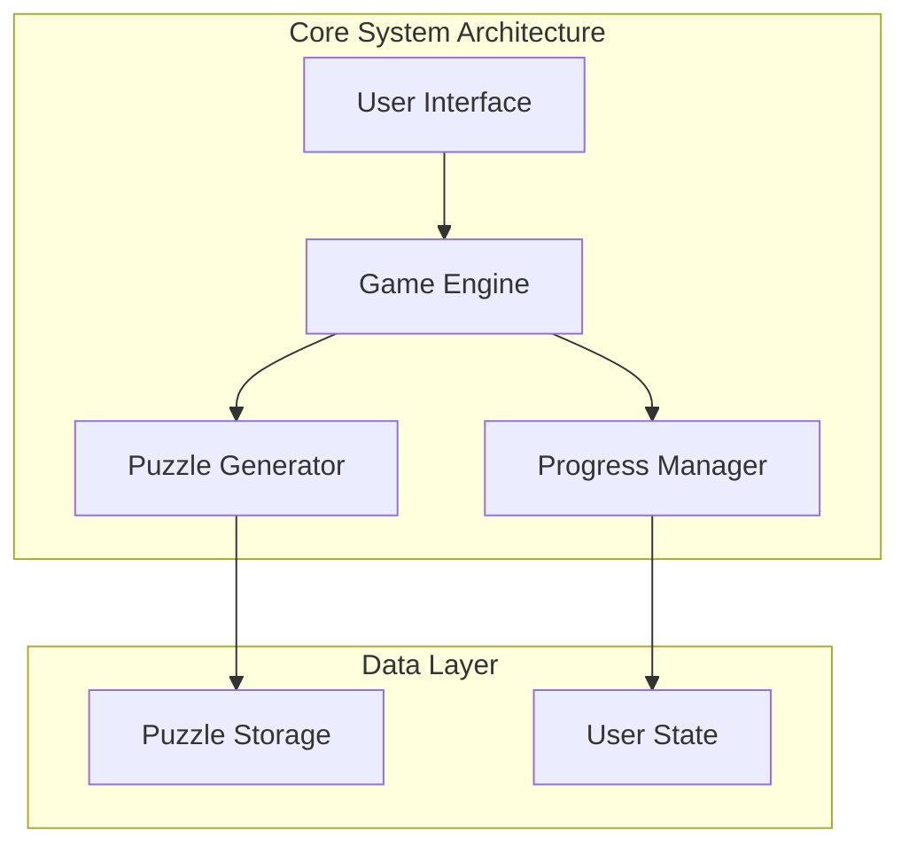
```mermaid
graph TB
subgraph "Core System Architecture"
    PG[Puzzle Generator]
    UI[User Interface]
    GE[Game Engine]
    PM[Progress Manager]
end

subgraph "Data Layer"
    PS[Puzzle Storage]
    US[User State]
end

UI --> GE
GE --> PG
GE --> PM
PM --> US
PG --> PS
```

#### Core Technical Approach

The system architecture emphasizes modular design with clear separation between puzzle generation logic, user interface components, and data management systems, enabling scalable development and maintainable codebase.

### 1.2.3 Success Criteria

#### Measurable Objectives

| Objective | Target Metric | Measurement Method |
| --- | --- | --- |
| Puzzle Quality | 100% solvable puzzles | Automated validation testing |
| User Engagement | Average session duration > 10 minutes | Analytics tracking |
| System Performance | Puzzle generation < 2 seconds | Performance monitoring |

#### Critical Success Factors

- Reliable puzzle generation algorithms that create engaging, solvable puzzles
- Intuitive user interface that accommodates both novice and expert players
- Robust validation system that ensures puzzle integrity and solution accuracy

#### Key Performance Indicators (KPIs)

- Puzzle generation success rate and speed metrics
- User retention and session frequency measurements
- System availability and response time benchmarks

## 1.3 SCOPE

### 1.3.1 In-Scope

#### Core Features and Functionalities

**Must-Have Capabilities:**

- Sudoku puzzle generation with multiple difficulty levels
- Interactive puzzle-solving interface with input validation
- Real-time solution checking and feedback mechanisms
- Basic user progress tracking and puzzle completion statistics

**Primary User Workflows:**

- New puzzle generation and selection based on difficulty preference
- Interactive puzzle solving with hint and validation support
- Progress saving and resumption of incomplete puzzles
- Completion celebration and performance feedback

**Essential Integrations:**

- Local data persistence for user progress and puzzle states
- Basic analytics for usage pattern tracking

#### Implementation Boundaries

| Boundary Type | Included Elements | Coverage Scope |
| --- | --- | --- |
| System Boundaries | Puzzle generation, gameplay, and basic progress tracking | Complete Sudoku gaming experience |
| User Groups | Individual puzzle solvers across skill levels | General consumer audience |
| Data Domains | Puzzle configurations, user progress, gameplay statistics | Core gaming data only |

### 1.3.2 Out-of-Scope

#### Explicitly Excluded Features

- **Multiplayer Functionality**: Competitive or collaborative puzzle solving between multiple users
- **Advanced Analytics**: Detailed behavioral analysis or machine learning-based recommendations
- **Social Features**: Sharing, leaderboards, or community interaction capabilities
- **Mobile Platform Optimization**: Native mobile application development (initial focus on web-based solution)

#### Future Phase Considerations

- Integration with external puzzle databases or content management systems
- Advanced difficulty customization and personalized puzzle generation
- Educational curriculum integration and classroom management features
- Cross-platform synchronization and cloud-based progress storage

#### Integration Points Not Covered

- Third-party authentication systems or social media integration
- Payment processing for premium features or content
- External advertising networks or monetization platforms

#### Unsupported Use Cases

- Enterprise-level deployment with advanced user management
- Offline-first mobile applications with full feature parity
- Real-time multiplayer competition or tournament management

#### References

- `README.md` - Project identification and basic repository information

# 2. PRODUCT REQUIREMENTS

## 2.1 FEATURE CATALOG

### 2.1.1 Puzzle Generation Features

#### Feature F-001: Multi-Difficulty Puzzle Generation

**Feature Metadata:**
- **Unique ID**: F-001
- **Feature Name**: Multi-Difficulty Puzzle Generation
- **Feature Category**: Core Engine
- **Priority Level**: Critical
- **Status**: Proposed

**Description:**
- **Overview**: Algorithmic creation of valid Sudoku puzzles across multiple difficulty levels (Easy, Medium, Hard, Expert)
- **Business Value**: Ensures engaging content for users across all skill levels, driving user retention and satisfaction
- **User Benefits**: Provides appropriate challenge level for puzzle enthusiasts and accessible entry points for casual gamers
- **Technical Context**: Central puzzle generation engine that creates mathematically valid, uniquely solvable puzzles with controlled complexity

**Dependencies:**
- **Prerequisite Features**: None (foundational feature)
- **System Dependencies**: Puzzle validation algorithms, random number generation
- **External Dependencies**: None
- **Integration Requirements**: Puzzle storage system, difficulty assessment algorithms

#### Feature F-002: Puzzle Validation System

**Feature Metadata:**
- **Unique ID**: F-002
- **Feature Name**: Puzzle Validation System
- **Feature Category**: Core Engine
- **Priority Level**: Critical
- **Status**: Proposed

**Description:**
- **Overview**: Automated validation system ensuring 100% solvable puzzle generation with unique solutions
- **Business Value**: Maintains system reliability and user trust through consistent puzzle quality
- **User Benefits**: Guarantees every puzzle can be completed, preventing user frustration
- **Technical Context**: Mathematical validation algorithms that verify puzzle solvability before delivery to users

**Dependencies:**
- **Prerequisite Features**: F-001 (Multi-Difficulty Puzzle Generation)
- **System Dependencies**: Solver algorithms, mathematical verification functions
- **External Dependencies**: None
- **Integration Requirements**: Puzzle generation pipeline, quality assurance testing framework

### 2.1.2 Interactive Gameplay Features

#### Feature F-003: Interactive Puzzle Interface

**Feature Metadata:**
- **Unique ID**: F-003
- **Feature Name**: Interactive Puzzle Interface
- **Feature Category**: User Interface
- **Priority Level**: Critical
- **Status**: Proposed

**Description:**
- **Overview**: User-friendly web-based interface for puzzle solving with intuitive input mechanisms
- **Business Value**: Provides accessible entry point for all user groups, maximizing market reach
- **User Benefits**: Seamless puzzle-solving experience with clear visual feedback and easy number entry
- **Technical Context**: Responsive web interface with grid-based input system and visual validation feedback

**Dependencies:**
- **Prerequisite Features**: F-001 (Multi-Difficulty Puzzle Generation)
- **System Dependencies**: Web browser compatibility, responsive design framework
- **External Dependencies**: Modern web browsers
- **Integration Requirements**: Game engine, validation system, progress management

#### Feature F-004: Real-Time Solution Validation

**Feature Metadata:**
- **Unique ID**: F-004
- **Feature Name**: Real-Time Solution Validation
- **Feature Category**: Gameplay
- **Priority Level**: High
- **Status**: Proposed

**Description:**
- **Overview**: Immediate feedback system that validates user inputs and provides real-time error detection
- **Business Value**: Enhances user experience through immediate guidance and error prevention
- **User Benefits**: Prevents user frustration by catching mistakes early and maintaining engagement flow
- **Technical Context**: Live validation engine that checks inputs against Sudoku rules and puzzle solution

**Dependencies:**
- **Prerequisite Features**: F-003 (Interactive Puzzle Interface), F-002 (Puzzle Validation System)
- **System Dependencies**: Validation algorithms, user interface update mechanisms
- **External Dependencies**: None
- **Integration Requirements**: Game engine, user interface components

#### Feature F-005: Hint and Assistance System

**Feature Metadata:**
- **Unique ID**: F-005
- **Feature Name**: Hint and Assistance System
- **Feature Category**: Gameplay Support
- **Priority Level**: Medium
- **Status**: Proposed

**Description:**
- **Overview**: Guided assistance features including strategic hints and next-move suggestions
- **Business Value**: Supports user engagement across skill levels, particularly benefiting educational use cases
- **User Benefits**: Enables learning progression and prevents abandonment of challenging puzzles
- **Technical Context**: AI-driven hint generation system that provides contextual assistance without revealing solutions

**Dependencies:**
- **Prerequisite Features**: F-003 (Interactive Puzzle Interface), F-004 (Real-Time Solution Validation)
- **System Dependencies**: Solving algorithms, hint generation logic
- **External Dependencies**: None
- **Integration Requirements**: Game engine, user interface, progress tracking

### 2.1.3 Progress Management Features

#### Feature F-006: Save and Resume Functionality

**Feature Metadata:**
- **Unique ID**: F-006
- **Feature Name**: Save and Resume Functionality
- **Feature Category**: Data Management
- **Priority Level**: High
- **Status**: Proposed

**Description:**
- **Overview**: Local persistence of puzzle progress allowing users to resume incomplete puzzles
- **Business Value**: Reduces user abandonment and supports flexible gameplay sessions
- **User Benefits**: Enables interrupted play sessions without losing progress, accommodating busy schedules
- **Technical Context**: Client-side data storage system maintaining puzzle state and user inputs

**Dependencies:**
- **Prerequisite Features**: F-003 (Interactive Puzzle Interface)
- **System Dependencies**: Local storage mechanisms, data serialization
- **External Dependencies**: Browser local storage capability
- **Integration Requirements**: Data persistence layer, puzzle state management

#### Feature F-007: Progress Tracking and Statistics

**Feature Metadata:**
- **Unique ID**: F-007
- **Feature Name**: Progress Tracking and Statistics
- **Feature Category**: Analytics
- **Priority Level**: Medium
- **Status**: Proposed

**Description:**
- **Overview**: Basic user progress tracking including completion rates, solving times, and difficulty progression
- **Business Value**: Provides engagement metrics and supports user retention strategies
- **User Benefits**: Personal achievement tracking and skill progression awareness
- **Technical Context**: Local analytics system capturing gameplay statistics and completion metrics

**Dependencies:**
- **Prerequisite Features**: F-003 (Interactive Puzzle Interface), F-006 (Save and Resume Functionality)
- **System Dependencies**: Data collection mechanisms, statistical calculation functions
- **External Dependencies**: None
- **Integration Requirements**: Data persistence layer, user interface dashboard

#### Feature F-008: Completion Celebration System

**Feature Metadata:**
- **Unique ID**: F-008
- **Feature Name**: Completion Celebration System
- **Feature Category**: User Experience
- **Priority Level**: Low
- **Status**: Proposed

**Description:**
- **Overview**: Visual and interactive feedback mechanisms for puzzle completion achievements
- **Business Value**: Enhances user satisfaction and encourages continued engagement
- **User Benefits**: Provides sense of accomplishment and positive reinforcement
- **Technical Context**: UI animation and feedback system triggered upon successful puzzle completion

**Dependencies:**
- **Prerequisite Features**: F-004 (Real-Time Solution Validation)
- **System Dependencies**: Animation framework, user interface components
- **External Dependencies**: None
- **Integration Requirements**: Game engine, user interface, completion detection system

## 2.2 FUNCTIONAL REQUIREMENTS TABLE

### 2.2.1 Puzzle Generation Requirements

| Requirement ID | Description | Acceptance Criteria | Priority | Complexity |
|----------------|-------------|-------------------|----------|------------|
| F-001-RQ-001 | Generate Easy difficulty puzzles | System creates puzzles with 40-45 given numbers, solvable using basic techniques | Must-Have | Medium |
| F-001-RQ-002 | Generate Medium difficulty puzzles | System creates puzzles with 30-35 given numbers, requiring intermediate solving strategies | Must-Have | Medium |
| F-001-RQ-003 | Generate Hard difficulty puzzles | System creates puzzles with 25-30 given numbers, requiring advanced logical deduction | Must-Have | High |
| F-001-RQ-004 | Generate Expert difficulty puzzles | System creates puzzles with 20-25 given numbers, requiring complex solving techniques | Should-Have | High |

**Technical Specifications:**
- **Input Parameters**: Difficulty level selection, randomization seed
- **Output/Response**: Valid 9x9 Sudoku grid with appropriate number of given cells
- **Performance Criteria**: Puzzle generation completed within 2 seconds
- **Data Requirements**: Puzzle configuration data, difficulty parameters

**Validation Rules:**
- **Business Rules**: Each puzzle must have exactly one unique solution
- **Data Validation**: Generated grid must conform to standard Sudoku rules
- **Security Requirements**: Input sanitization for difficulty parameters
- **Compliance Requirements**: Mathematical accuracy in puzzle generation algorithms

### 2.2.2 Interactive Gameplay Requirements

| Requirement ID | Description | Acceptance Criteria | Priority | Complexity |
|----------------|-------------|-------------------|----------|------------|
| F-003-RQ-001 | Display puzzle grid interface | 9x9 grid with clear cell boundaries and number input capability | Must-Have | Low |
| F-003-RQ-002 | Enable number input and editing | Users can enter/modify numbers 1-9 in empty cells using keyboard or click interface | Must-Have | Medium |
| F-003-RQ-003 | Provide visual feedback for inputs | Invalid entries highlighted in real-time with clear error indicators | Must-Have | Medium |
| F-004-RQ-001 | Validate moves against Sudoku rules | System immediately identifies conflicts in rows, columns, and 3x3 boxes | Must-Have | Medium |

**Technical Specifications:**
- **Input Parameters**: User number selections, cell coordinates
- **Output/Response**: Updated grid display with validation feedback
- **Performance Criteria**: Real-time validation with <100ms response time
- **Data Requirements**: Current puzzle state, validation rules, user input history

**Validation Rules:**
- **Business Rules**: Standard Sudoku constraints (no duplicates in rows/columns/boxes)
- **Data Validation**: Input range validation (1-9 only), cell availability checking
- **Security Requirements**: Input sanitization and bounds checking
- **Compliance Requirements**: Accessibility standards for user interface elements

### 2.2.3 Progress Management Requirements

| Requirement ID | Description | Acceptance Criteria | Priority | Complexity |
|----------------|-------------|-------------------|----------|------------|
| F-006-RQ-001 | Save puzzle progress automatically | System saves current state every 30 seconds or after each valid input | Must-Have | Low |
| F-006-RQ-002 | Restore incomplete puzzles on return | Users can resume exactly where they left off with all inputs preserved | Must-Have | Medium |
| F-007-RQ-001 | Track completion statistics | System records solve times, difficulty levels completed, and success rates | Should-Have | Low |
| F-007-RQ-002 | Display progress dashboard | Users can view personal statistics and achievement progress | Could-Have | Medium |

**Technical Specifications:**
- **Input Parameters**: Puzzle state data, user interaction timestamps
- **Output/Response**: Confirmation of save operations, statistics display
- **Performance Criteria**: Save operations complete within 500ms
- **Data Requirements**: Puzzle state serialization, user progress metadata

**Validation Rules:**
- **Business Rules**: Progress data integrity maintained across sessions
- **Data Validation**: State data completeness and format validation
- **Security Requirements**: Local data protection and privacy compliance
- **Compliance Requirements**: Data retention and user privacy standards

## 2.3 FEATURE RELATIONSHIPS

### 2.3.1 Feature Dependencies Map

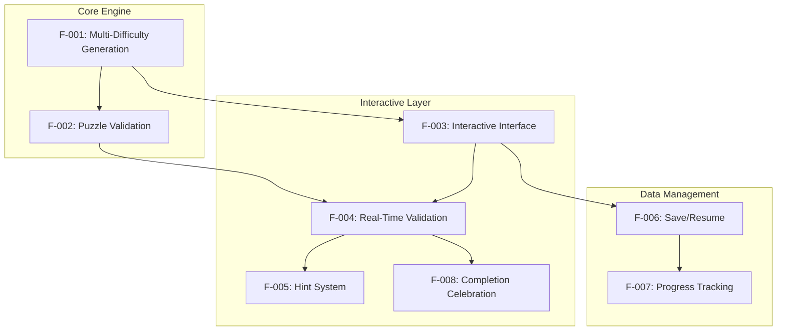
```mermaid
graph TB
subgraph "Core Engine"
    F001[F-001: Multi-Difficulty Generation]
    F002[F-002: Puzzle Validation]
end

subgraph "Interactive Layer"
    F003[F-003: Interactive Interface]
    F004[F-004: Real-Time Validation]
    F005[F-005: Hint System]
    F008[F-008: Completion Celebration]
end

subgraph "Data Management"
    F006[F-006: Save/Resume]
    F007[F-007: Progress Tracking]
end

F001 --> F002
F001 --> F003
F002 --> F004
F003 --> F004
F003 --> F006
F004 --> F005
F004 --> F008
F006 --> F007
```

### 2.3.2 Integration Points

#### Critical Integration Points:

- **Puzzle Generation ↔ Interface**: F-001 provides puzzle data to F-003 for user presentation
- **Validation ↔ Interface**: F-002 and F-004 work together to ensure puzzle integrity and user input validation
- **Interface ↔ Progress**: F-003 integrates with F-006 for seamless save/resume functionality

#### Shared Components:

- **Validation Engine**: Shared by F-002 (puzzle validation) and F-004 (real-time validation)
- **Data Persistence Layer**: Common storage system for F-006 (save/resume) and F-007 (statistics)
- **User Interface Framework**: Foundation for F-003, F-005, and F-008

#### Common Services:

- **State Management Service**: Coordinates puzzle state across features
- **Performance Monitoring**: Tracks system performance metrics across all features
- **Error Handling**: Centralized error management for all user-facing features

### 2.3.3 Feature Interaction Matrix

| Feature | F-001 | F-002 | F-003 | F-004 | F-005 | F-006 | F-007 | F-008 |
|---------|-------|-------|-------|-------|-------|-------|-------|-------|
| F-001 | - | High | High | Medium | Low | Low | Low | None |
| F-002 | High | - | Medium | High | Medium | None | None | None |
| F-003 | High | Medium | - | High | High | High | Medium | Medium |
| F-004 | Medium | High | High | - | High | Medium | Medium | High |
| F-005 | Low | Medium | High | High | - | None | Low | None |
| F-006 | Low | None | High | Medium | None | - | High | None |
| F-007 | Low | None | Medium | Medium | Low | High | - | None |
| F-008 | None | None | Medium | High | None | None | None | - |

## 2.4 IMPLEMENTATION CONSIDERATIONS

### 2.4.1 Technical Constraints

#### System Architecture Constraints:

- **Web-Based Platform**: Initial implementation limited to browser-based solution
- **Client-Side Processing**: Puzzle generation and validation must operate efficiently in browser environment
- **Local Data Storage**: Progress persistence limited to browser local storage capabilities
- **Single-User Focus**: Architecture designed for individual user sessions without multi-user complexity

#### Performance Constraints:

- **Puzzle Generation Time**: Must complete within 2-second target for user experience
- **Real-Time Validation**: Input validation response time under 100ms for seamless interaction
- **Memory Usage**: Efficient puzzle state management to prevent browser performance degradation
- **Storage Limitations**: Local storage optimization for puzzle and progress data

### 2.4.2 Scalability Considerations

#### Immediate Scalability Requirements:

- **Puzzle Variety**: Generation algorithms must produce diverse puzzle sets to prevent repetition
- **Difficulty Progression**: Smooth scaling across Easy to Expert difficulty levels
- **Session Management**: Efficient handling of multiple concurrent puzzle sessions
- **Data Growth**: Progressive enhancement of storage efficiency as user data accumulates

#### Future Scalability Preparation:

- **Modular Architecture**: Component separation to support future feature additions
- **API Readiness**: Internal structure prepared for potential server-side integration
- **Cross-Platform Foundation**: Code organization supporting future mobile platform development
- **Multi-User Architecture**: Design patterns that can accommodate future multiplayer features

### 2.4.3 Security Implications

#### Data Security Requirements:

- **Local Data Protection**: Secure storage of user progress and puzzle states
- **Input Validation**: Comprehensive sanitization of user inputs to prevent injection attacks
- **State Integrity**: Protection against manipulation of puzzle solutions or progress data
- **Privacy Compliance**: Adherence to local data privacy regulations and user consent requirements

#### System Security Measures:

- **Client-Side Validation**: Robust input checking and bounds validation
- **Error Handling**: Secure error messages that don't expose system internals
- **Code Obfuscation**: Protection of puzzle generation algorithms from reverse engineering
- **Session Security**: Secure handling of puzzle state and user session data

### 2.4.4 Maintenance Requirements

#### Code Maintenance:

- **Algorithm Updates**: Regular enhancement of puzzle generation and validation algorithms
- **Browser Compatibility**: Ongoing testing and updates for web browser compatibility
- **Performance Optimization**: Continuous monitoring and improvement of system performance metrics
- **Bug Fix Procedures**: Systematic approach to identifying and resolving user-reported issues

#### Content Maintenance:

- **Puzzle Quality Assurance**: Regular validation of generated puzzle quality and solvability
- **Difficulty Calibration**: Ongoing refinement of difficulty level parameters based on user feedback
- **Feature Enhancement**: Iterative improvement of user interface and experience features
- **Documentation Updates**: Maintenance of technical documentation and user guides

### 2.4.5 Performance Requirements

#### Response Time Targets:

| Operation | Target Time | Critical Threshold |
|-----------|-------------|-------------------|
| Puzzle Generation | <2 seconds | 3 seconds |
| Input Validation | <100ms | 200ms |
| Save Operation | <500ms | 1 second |
| Interface Loading | <1 second | 2 seconds |

#### Resource Utilization:

- **Memory Usage**: Maximum 50MB browser memory allocation for puzzle operations
- **CPU Efficiency**: Puzzle generation algorithms optimized for single-threaded browser execution
- **Storage Optimization**: Compressed puzzle state storage to maximize local storage efficiency
- **Network Minimization**: Reduced external dependencies to ensure offline functionality

## 2.5 TRACEABILITY MATRIX

### 2.5.1 Requirements to Features Mapping

| Business Requirement | Feature ID | Implementation Priority | Validation Method |
|---------------------|------------|----------------------|-------------------|
| High-quality puzzle generation | F-001, F-002 | Critical | Automated testing of puzzle solvability |
| User-friendly interface | F-003, F-005 | Critical | User acceptance testing |
| Progress preservation | F-006, F-007 | High | Data persistence validation |
| Engaging user experience | F-004, F-008 | Medium | User engagement metrics |

### 2.5.2 Success Criteria to Requirements Mapping

| Success Criteria | Related Requirements | Measurement Approach |
|------------------|---------------------|---------------------|
| 100% solvable puzzles | F-001-RQ-001 through F-001-RQ-004 | Automated validation testing |
| Session duration >10 minutes | F-005-RQ-001, F-008-RQ-001 | Analytics tracking |
| Generation time <2 seconds | F-001-RQ-001 through F-001-RQ-004 | Performance monitoring |

#### References

#### Technical Specification Sections Analyzed:

- `1.1 EXECUTIVE SUMMARY` - Project overview, stakeholders, and business impact assessment
- `1.2 SYSTEM OVERVIEW` - System architecture, core capabilities, and success criteria definition  
- `1.3 SCOPE` - Feature boundaries, must-have capabilities, and explicitly excluded functionality

#### Repository Analysis:

- `README.md` - Project identification and basic repository information
- Repository structure analysis revealed planning-phase status with no implementation code

# 3. TECHNOLOGY STACK

## 3.1 PROGRAMMING LANGUAGES

### 3.1.1 Primary Development Languages

**TypeScript 5.2+**
- **Selection Rationale**: TypeScript elevates code quality and maintainability, serving as a staple for any project due to its robust type safety. Critical for the complex puzzle generation algorithms and game state management required by the system.
- **Application Areas**: All client-side logic including puzzle generation, validation algorithms, game state management, and user interface components
- **Constraints**: Must compile to ES2020+ for optimal browser compatibility while maintaining performance targets of <2-second puzzle generation
- **Dependencies**: TypeScript compiler integrated with build toolchain for static type checking and development-time error detection

**JavaScript (ES2020+)**
- **Selection Rationale**: Transpilation target for TypeScript, ensuring broad browser compatibility while leveraging modern language features
- **Application Areas**: Runtime execution environment for all puzzle logic and user interface interactions
- **Performance Considerations**: Optimized for single-threaded browser execution with efficient memory management for puzzle state storage

### 3.1.2 Markup and Styling Languages

**HTML5**
- **Selection Rationale**: Standard markup foundation providing semantic structure for the 9x9 Sudoku grid interface and accessibility features
- **Application Areas**: Document structure, grid layout foundation, form controls for user input
- **Accessibility Requirements**: ARIA labels and roles for screen reader compatibility and keyboard navigation support

**CSS3 with Modern Features**
- **Selection Rationale**: Advanced styling capabilities including CSS Grid for Sudoku board layout, CSS Custom Properties for theming, and Flexbox for responsive design
- **Application Areas**: Grid visualization, responsive design, visual feedback for validation states, animation support for completion celebrations

## 3.2 FRAMEWORKS & LIBRARIES

### 3.2.1 Core Frontend Framework

**React 18.3+**
- **Selection Rationale**: Building a Sudoku game in React.js covers essential concepts such as component-based architecture, state management, and user interaction handling. The framework's virtual DOM and component lifecycle methods support the real-time validation requirements (<100ms response time).
- **Architecture Pattern**: Component-based modular design aligning with system requirements for puzzle generator, user interface, game engine, and progress management components
- **State Management**: React hooks (useState, useEffect, useContext) for managing puzzle state, user inputs, and game progress without external state management dependencies
- **Performance Optimization**: Built-in memoization capabilities (React.memo, useMemo, useCallback) for optimizing expensive puzzle validation operations

### 3.2.2 Build and Development Tools

**Vite 5.0+**
- **Selection Rationale**: Modern and intuitive Sudoku web application built using React, TypeScript, and Vite. Superior build performance and development experience compared to traditional bundlers, supporting the rapid iteration needed for puzzle algorithm development.
- **Development Features**: Hot Module Replacement (HMR) for real-time development feedback, optimized development server for puzzle testing
- **Production Optimization**: Tree shaking, code splitting, and asset optimization to meet browser performance constraints
- **TypeScript Integration**: Native TypeScript support without additional configuration complexity

### 3.2.3 User Interface Libraries

**Material-UI (MUI) 5.14+**
- **Selection Rationale**: Features built-in solver and utilizes the Material-UI (MUI) library for seamless and stylish UI components with Material-UI integration ensuring a clean and attractive design. Comprehensive component library supporting grid layouts, input controls, and feedback mechanisms.
- **Component Applications**: Grid cells, number input controls, button interfaces, modal dialogs for settings and completion celebrations
- **Theming Support**: Customizable design system for consistent visual identity across puzzle interface components
- **Accessibility**: Built-in ARIA support and keyboard navigation compliance

**Alternative: TailwindCSS 3.3+**
- **Selection Rationale**: For styling, its utility-first approach speeds up UI development, making it a breeze to maintain consistency across projects. Lightweight alternative providing granular control over grid styling and responsive design.
- **Application Scope**: Utility-first styling approach for custom Sudoku grid layouts and responsive design patterns
- **Performance Benefits**: Minimal CSS bundle size critical for client-side performance constraints

## 3.3 OPEN SOURCE DEPENDENCIES

### 3.3.1 Sudoku Logic Libraries

**Primary: sudoku-core 3.0.3**
- **Selection Rationale**: A typescript Sudoku package for generating, solving (step-by-step or all), and analyzing Sudoku boards with ease. Perfect for building Sudoku games and integrating Sudoku functionality into your applications.
- **Feature Support**: Multi-difficulty puzzle generation (Easy, Medium, Hard, Expert), step-by-step solving for hint system implementation, board analysis for difficulty calibration
- **Performance Alignment**: Optimized algorithms supporting <2-second puzzle generation requirements
- **Integration Points**: Puzzle generation engine, validation system, hint generation system

**Fallback: sudoku-umd 1.0.1**
- **Selection Rationale**: UMD-friendly fork of sudoku library, making it UMD friendly for publishing in NPM. A Sudoku puzzle generator and solver JavaScript library.
- **Stability Considerations**: The npm package sudoku-umd was scanned for known vulnerabilities and missing license, and no issues were found. Thus the package was deemed as safe to use.
- **Application Scope**: Backup implementation for core puzzle logic with proven stability and security profile

### 3.3.2 Development Dependencies

**Testing Framework: Jest 29.7+ & React Testing Library 14.0+**
- **Application Areas**: Unit testing for puzzle generation algorithms, component testing for user interface interactions, integration testing for game flow validation
- **Coverage Requirements**: Minimum 85% code coverage for puzzle generation and validation logic, comprehensive testing for multi-difficulty puzzle creation

**Code Quality: ESLint 8.50+ & Prettier 3.0+**
- **Configuration**: TypeScript-specific rules, React hooks linting, import organization, consistent code formatting
- **Integration**: Pre-commit hooks for code quality enforcement, CI/CD pipeline integration for automated quality checks

**Type Checking: @typescript-eslint 6.7+**
- **Selection Rationale**: Replace plugin:@typescript-eslint/recommended to plugin:@typescript-eslint/recommended-type-checked or plugin:@typescript-eslint/strict-type-checked for enhanced type safety in puzzle logic implementation.

## 3.4 DATABASES & STORAGE

### 3.4.1 Primary Data Persistence

**Browser LocalStorage API**
- **Selection Rationale**: Aligns with technical constraints requiring client-side processing and local data storage capabilities. Provides synchronous access for real-time game state persistence.
- **Data Categories**: 
  - Puzzle state and user progress (current puzzle, cell values, completion status)
  - Game statistics (completion times, difficulty progression, hint usage)
  - User preferences (difficulty settings, interface customizations)
- **Storage Optimization**: JSON serialization with compression for efficient storage utilization within browser limitations (~10MB quota)
- **Performance Considerations**: Synchronous API supporting <500ms save operation requirements

### 3.4.2 Enhanced Storage Solutions

**IndexedDB (Secondary)**
- **Application Scope**: Extended storage for puzzle history, detailed statistics, and offline puzzle caching when LocalStorage approaches capacity limits
- **Implementation**: Asynchronous NoSQL database for complex queries on historical game data and advanced analytics
- **Fallback Strategy**: Graceful degradation to LocalStorage when IndexedDB is unavailable

**SessionStorage (Temporary)**
- **Application Areas**: Temporary storage for current session data, undo/redo functionality, unsaved puzzle progress during active gameplay
- **Data Lifecycle**: Session-scoped storage cleared on browser tab closure, preventing data accumulation

## 3.5 DEVELOPMENT & DEPLOYMENT

### 3.5.1 Development Environment

**Node.js 18.18+ & npm 9.8+**
- **Development Server**: Vite development server with hot reload for rapid puzzle algorithm iteration
- **Package Management**: npm for dependency management with lock files for reproducible builds
- **Script Automation**: npm scripts for build, test, lint, and type-checking operations

**Development Tools**
- **IDE Integration**: TypeScript language server support, ESLint integration, Prettier formatting
- **Debugging**: Browser DevTools integration, React Developer Tools for component inspection
- **Testing**: Jest test runner with watch mode for continuous testing during development

### 3.5.2 Build System

**Production Build Pipeline**
- **Build Tool**: Vite production build with tree shaking, minification, and asset optimization
- **Output Optimization**: Static asset generation for deployment to CDN or static hosting platforms
- **Performance Targets**: Bundle size optimization for fast loading, code splitting for efficient caching
- **Browser Compatibility**: ES2020 output with polyfills for broader browser support

### 3.5.2 Deployment Infrastructure

**Static Hosting Platforms**
- **Primary Options**: Netlify, Vercel, or GitHub Pages for static site deployment
- **Deployment Strategy**: Automated deployment from repository commits with build optimization and CDN distribution
- **Performance Features**: Global CDN for fast content delivery, automatic HTTPS, custom domain support

**CI/CD Pipeline (GitHub Actions)**
- **Build Automation**: Automated testing, linting, type checking, and build generation on pull requests
- **Quality Gates**: Required passing tests and code quality checks before deployment
- **Deployment Automation**: Automatic deployment to staging and production environments based on branch policies

## 3.6 INTEGRATION ARCHITECTURE

### 3.6.1 Component Integration Patterns

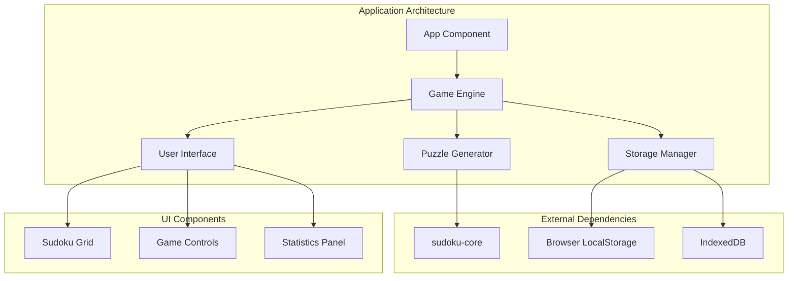
```mermaid
graph TB
subgraph "Application Architecture"
    App[App Component]
    GameEngine[Game Engine]
    PuzzleGen[Puzzle Generator]
    UI[User Interface]
    Storage[Storage Manager]
end

subgraph "External Dependencies"
    SudokuCore[sudoku-core]
    LocalStorage[Browser LocalStorage]
    IndexedDB[IndexedDB]
end

App --> GameEngine
GameEngine --> PuzzleGen
GameEngine --> UI
GameEngine --> Storage
PuzzleGen --> SudokuCore
Storage --> LocalStorage
Storage --> IndexedDB

subgraph "UI Components"
    Grid[Sudoku Grid]
    Controls[Game Controls]
    Stats[Statistics Panel]
end

UI --> Grid
UI --> Controls
UI --> Stats
```

### 3.6.2 Data Flow Architecture

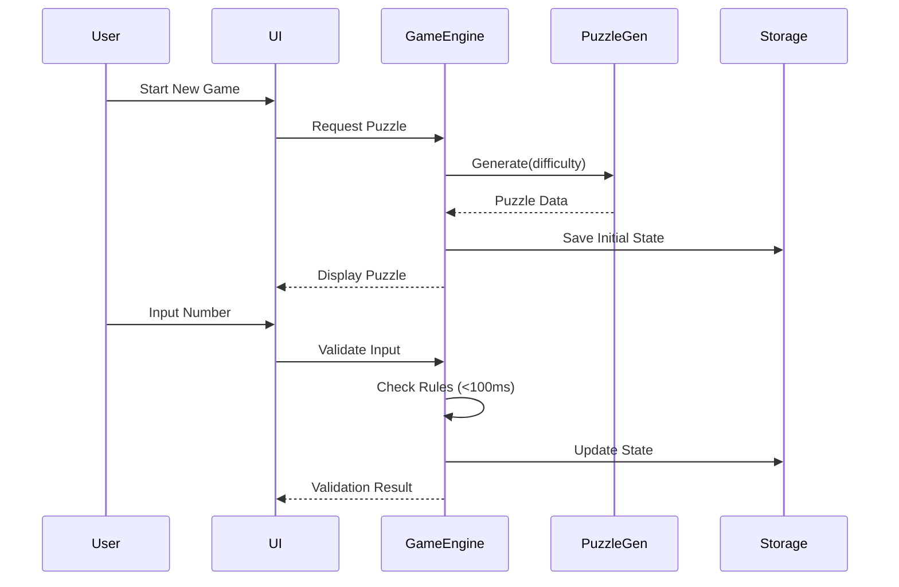
```mermaid
sequenceDiagram
    participant User
    participant UI
    participant GameEngine
    participant PuzzleGen
    participant Storage

    User->>UI: Start New Game
    UI->>GameEngine: Request Puzzle
    GameEngine->>PuzzleGen: Generate(difficulty)
    PuzzleGen-->>GameEngine: Puzzle Data
    GameEngine->>Storage: Save Initial State
    GameEngine-->>UI: Display Puzzle

    User->>UI: Input Number
    UI->>GameEngine: Validate Input
    GameEngine->>GameEngine: Check Rules (<100ms)
    GameEngine->>Storage: Update State
    GameEngine-->>UI: Validation Result
```

### 3.6.3 Performance Integration Requirements

**Memory Management**
- Maximum 50MB browser memory allocation for puzzle operations aligned with technical constraints
- Efficient puzzle state serialization for storage optimization
- Garbage collection optimization for long-running game sessions

**Response Time Integration**
- Puzzle generation algorithms integrated with performance monitoring to ensure <2-second completion
- Real-time validation pipeline optimized for <100ms response time
- Storage operations optimized for <500ms completion time

### 3.6.4 Security Integration Considerations

**Client-Side Security**
- Input sanitization for all user inputs preventing code injection
- Puzzle state integrity validation preventing solution manipulation
- Local storage encryption for sensitive user data (optional future enhancement)

**Code Protection**
- Build-time obfuscation for puzzle generation algorithms
- Error handling that doesn't expose internal system details
- Secure handling of user statistics and progress data

#### References

#### Technical Specification Sections

- `1.2 SYSTEM OVERVIEW` - System architecture and component design
- `2.1 FEATURE CATALOG` - Feature requirements driving technology choices
- `2.4 IMPLEMENTATION CONSIDERATIONS` - Technical constraints and performance requirements

#### External Research Sources

- Web search: "React TypeScript web Sudoku game technology stack 2024" - Industry best practices for Sudoku implementations
- Web search: "sudoku-umd TypeScript npm packages 2024" - Available open source libraries and dependencies

#### Repository Analysis

- `README.md` - Project identification and basic context
- Root directory analysis - Current project status and implementation requirements

# 4. PROCESS FLOWCHART

## 4.1 SYSTEM WORKFLOWS

### 4.1.1 High-Level System Workflow

The Sudoku application follows a comprehensive workflow that encompasses puzzle generation, interactive gameplay, and progress management. The system operates as a client-side web application with local storage persistence, serving three primary stakeholder groups: puzzle enthusiasts, casual gamers, and educational institutions.

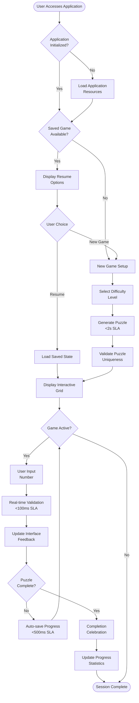
```mermaid
flowchart TB
    Start([User Accesses Application]) --> Init{Application<br/>Initialized?}
    Init -->|No| LoadApp[Load Application<br/>Resources]
    Init -->|Yes| CheckSave{Saved Game<br/>Available?}
    LoadApp --> CheckSave
    
    CheckSave -->|Yes| Resume[Display Resume<br/>Options]
    CheckSave -->|No| NewGame[New Game Setup]
    Resume --> ResumeDecision{User Choice}
    ResumeDecision -->|Resume| LoadSaved[Load Saved State]
    ResumeDecision -->|New Game| NewGame
    
    NewGame --> DiffSelect[Select Difficulty<br/>Level]
    DiffSelect --> Generate[Generate Puzzle<br/><2s SLA]
    LoadSaved --> Display
    Generate --> Validate[Validate Puzzle<br/>Uniqueness]
    Validate --> Display[Display Interactive<br/>Grid]
    
    Display --> GameLoop{Game Active?}
    GameLoop -->|Yes| UserInput[User Input<br/>Number]
    UserInput --> ValidateMove[Real-time Validation<br/><100ms SLA]
    ValidateMove --> UpdateUI[Update Interface<br/>Feedback]
    UpdateUI --> CheckComplete{Puzzle<br/>Complete?}
    CheckComplete -->|No| AutoSave[Auto-save Progress<br/><500ms SLA]
    AutoSave --> GameLoop
    CheckComplete -->|Yes| Celebrate[Completion<br/>Celebration]
    Celebrate --> UpdateStats[Update Progress<br/>Statistics]
    UpdateStats --> End([Session Complete])
    
    GameLoop -->|No| End
```

### 4.1.2 Core Business Processes

#### 4.1.2.1 Puzzle Generation Process

The puzzle generation process serves as the foundation of the system, creating mathematically valid Sudoku puzzles across four difficulty levels with guaranteed unique solutions.

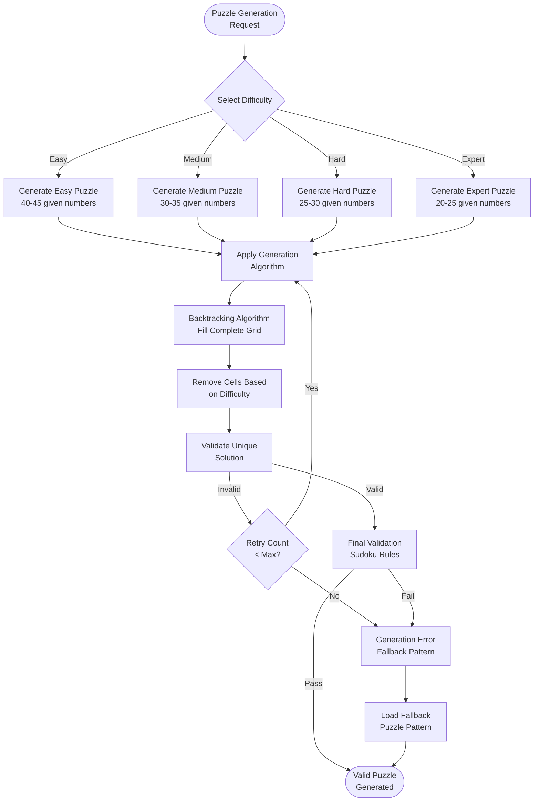
```mermaid
flowchart TD
    Start([Puzzle Generation<br/>Request]) --> DiffSelect{Select Difficulty}
    
    DiffSelect -->|Easy| EasyGen[Generate Easy Puzzle<br/>40-45 given numbers]
    DiffSelect -->|Medium| MediumGen[Generate Medium Puzzle<br/>30-35 given numbers]
    DiffSelect -->|Hard| HardGen[Generate Hard Puzzle<br/>25-30 given numbers]
    DiffSelect -->|Expert| ExpertGen[Generate Expert Puzzle<br/>20-25 given numbers]
    
    EasyGen --> Algorithm[Apply Generation<br/>Algorithm]
    MediumGen --> Algorithm
    HardGen --> Algorithm
    ExpertGen --> Algorithm
    
    Algorithm --> BackTrack[Backtracking Algorithm<br/>Fill Complete Grid]
    BackTrack --> RemoveCells[Remove Cells Based<br/>on Difficulty]
    RemoveCells --> UniqueCheck[Validate Unique<br/>Solution]
    
    UniqueCheck -->|Invalid| Retry{Retry Count<br/>< Max?}
    Retry -->|Yes| Algorithm
    Retry -->|No| Error[Generation Error<br/>Fallback Pattern]
    
    UniqueCheck -->|Valid| FinalValid[Final Validation<br/>Sudoku Rules]
    FinalValid -->|Pass| Success([Valid Puzzle<br/>Generated])
    FinalValid -->|Fail| Error
    Error --> Fallback[Load Fallback<br/>Puzzle Pattern]
    Fallback --> Success
```

#### 4.1.2.2 Interactive Gameplay Flow

The interactive gameplay process manages user interactions, input validation, and real-time feedback within the defined performance constraints.

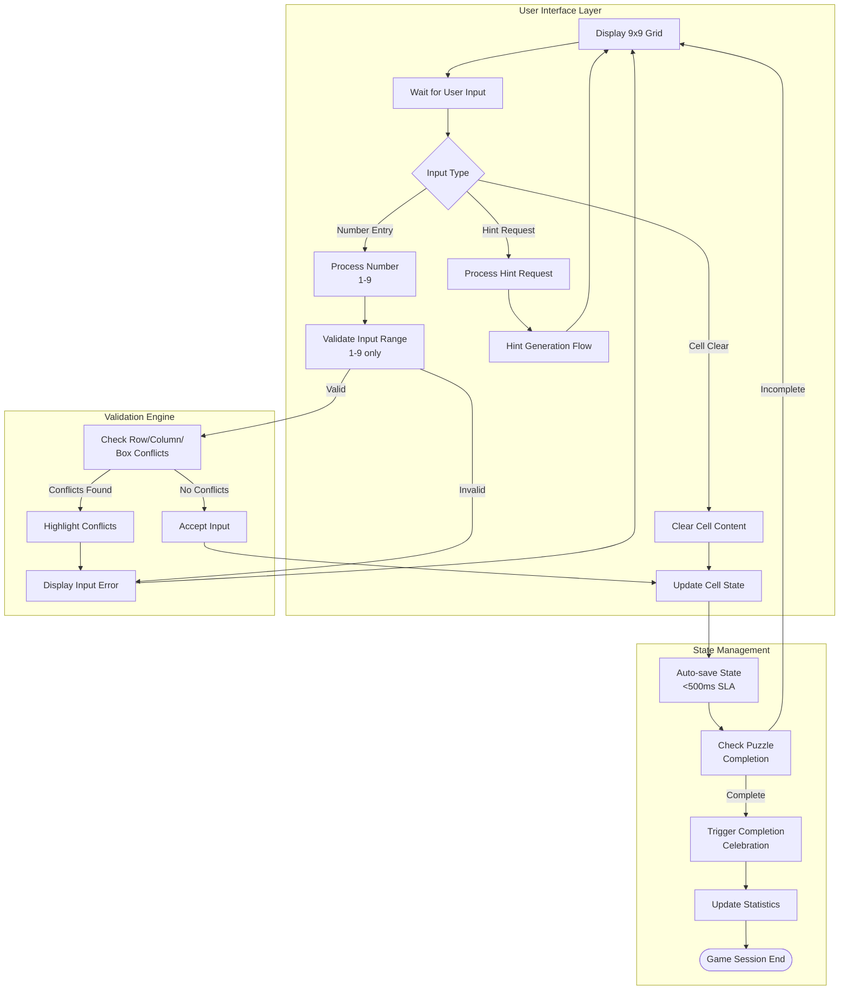
```mermaid
flowchart TD
    subgraph "User Interface Layer"
        Display[Display 9x9 Grid] --> WaitInput[Wait for User Input]
        WaitInput --> InputType{Input Type}
        
        InputType -->|Number Entry| ProcessNumber[Process Number<br/>1-9]
        InputType -->|Cell Clear| ProcessClear[Clear Cell Content]
        InputType -->|Hint Request| ProcessHint[Process Hint Request]
        
        ProcessNumber --> ValidateRange[Validate Input Range<br/>1-9 only]
        ProcessClear --> UpdateCell[Update Cell State]
        ProcessHint --> HintFlow[Hint Generation Flow]
    end
    
    subgraph "Validation Engine"
        ValidateRange -->|Valid| CheckConflicts[Check Row/Column/<br/>Box Conflicts]
        ValidateRange -->|Invalid| ShowError[Display Input Error]
        
        CheckConflicts -->|No Conflicts| AcceptInput[Accept Input]
        CheckConflicts -->|Conflicts Found| HighlightConflict[Highlight Conflicts]
        
        AcceptInput --> UpdateCell
        HighlightConflict --> ShowError
    end
    
    subgraph "State Management"
        UpdateCell --> SaveState[Auto-save State<br/><500ms SLA]
        SaveState --> CheckCompletion[Check Puzzle<br/>Completion]
        
        CheckCompletion -->|Complete| TriggerCelebration[Trigger Completion<br/>Celebration]
        CheckCompletion -->|Incomplete| Display
        
        TriggerCelebration --> UpdateProgress[Update Statistics]
        UpdateProgress --> EndGame([Game Session End])
    end
    
    ShowError --> Display
    HintFlow --> Display
```

#### 4.1.2.3 Progress Management Workflow

The progress management system ensures seamless user experience through persistent state management and comprehensive statistics tracking.


```mermaid
flowchart TD
    subgraph "Save Operations"
        TriggerSave[Save Trigger<br/>Auto/Manual] --> SerializeState[Serialize Puzzle State]
        SerializeState --> ValidateData[Validate Data<br/>Integrity]
        ValidateData -->|Valid| LocalStorage[Store in Browser<br/>LocalStorage]
        ValidateData -->|Invalid| SaveError[Save Error<br/>Retry Logic]
        
        LocalStorage --> SaveSuccess[Save Confirmation]
        SaveError --> RetryCount{Retry < 3?}
        RetryCount -->|Yes| SerializeState
        RetryCount -->|No| SaveFailure[Save Failure<br/>Notification]
    end
    
    subgraph "Resume Operations"
        LoadRequest[Resume Request] --> CheckStorage[Check LocalStorage<br/>Availability]
        CheckStorage -->|Available| RetrieveData[Retrieve Saved State]
        CheckStorage -->|None| NoSavedGame[No Saved Game<br/>Available]
        
        RetrieveData --> DeserializeState[Deserialize State<br/>Data]
        DeserializeState --> ValidateState[Validate State<br/>Integrity]
        ValidateState -->|Valid| RestoreGame[Restore Game State]
        ValidateState -->|Invalid| CorruptedData[Handle Corrupted<br/>Data]
        
        RestoreGame --> ResumeSuccess[Resume Successful]
        CorruptedData --> NoSavedGame
    end
    
    subgraph "Statistics Tracking"
        GameEvent[Game Completion<br/>Event] --> RecordStats[Record Statistics<br/>Data]
        RecordStats --> UpdateMetrics[Update Completion<br/>Metrics]
        UpdateMetrics --> StoreStats[Store Statistics<br/>Locally]
        StoreStats --> StatsSuccess[Statistics Updated]
    end
```

### 4.1.3 Integration Workflows

#### 4.1.3.1 Component Integration Flow

The system architecture integrates three core components through well-defined interfaces and shared services.

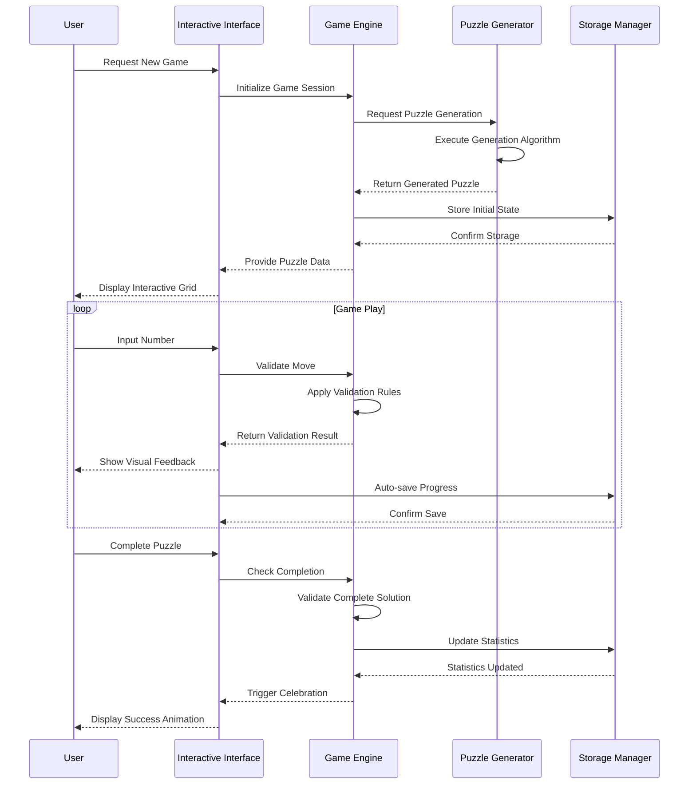
```mermaid
sequenceDiagram
    participant U as User
    participant UI as Interactive Interface
    participant GE as Game Engine
    participant PG as Puzzle Generator
    participant SM as Storage Manager
    
    U->>UI: Request New Game
    UI->>GE: Initialize Game Session
    GE->>PG: Request Puzzle Generation
    PG->>PG: Execute Generation Algorithm
    PG-->>GE: Return Generated Puzzle
    GE->>SM: Store Initial State
    SM-->>GE: Confirm Storage
    GE-->>UI: Provide Puzzle Data
    UI-->>U: Display Interactive Grid
    
    loop Game Play
        U->>UI: Input Number
        UI->>GE: Validate Move
        GE->>GE: Apply Validation Rules
        GE-->>UI: Return Validation Result
        UI-->>U: Show Visual Feedback
        UI->>SM: Auto-save Progress
        SM-->>UI: Confirm Save
    end
    
    U->>UI: Complete Puzzle
    UI->>GE: Check Completion
    GE->>GE: Validate Complete Solution
    GE->>SM: Update Statistics
    SM-->>GE: Statistics Updated
    GE-->>UI: Trigger Celebration
    UI-->>U: Display Success Animation
```

#### 4.1.3.2 Data Validation Integration

The data validation system operates across multiple layers to ensure puzzle integrity and user input accuracy.

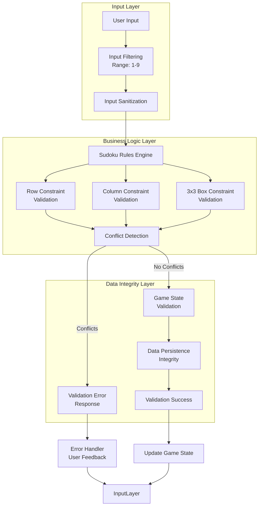
```mermaid
flowchart TB
    subgraph "Input Layer"
        UserInput[User Input] --> InputFilter[Input Filtering<br/>Range: 1-9]
        InputFilter --> SanitizeInput[Input Sanitization]
    end
    
    subgraph "Business Logic Layer"
        SanitizeInput --> RuleEngine[Sudoku Rules Engine]
        RuleEngine --> RowCheck[Row Constraint<br/>Validation]
        RuleEngine --> ColCheck[Column Constraint<br/>Validation]
        RuleEngine --> BoxCheck[3x3 Box Constraint<br/>Validation]
        
        RowCheck --> ConflictDetect[Conflict Detection]
        ColCheck --> ConflictDetect
        BoxCheck --> ConflictDetect
    end
    
    subgraph "Data Integrity Layer"
        ConflictDetect -->|No Conflicts| StateValidation[Game State<br/>Validation]
        ConflictDetect -->|Conflicts| ValidationError[Validation Error<br/>Response]
        
        StateValidation --> PersistenceCheck[Data Persistence<br/>Integrity]
        PersistenceCheck --> ValidationSuccess[Validation Success]
    end
    
    ValidationError --> ErrorHandler[Error Handler<br/>User Feedback]
    ValidationSuccess --> StateUpdate[Update Game State]
    ErrorHandler --> InputLayer
    StateUpdate --> InputLayer
```

## 4.2 ERROR HANDLING AND RECOVERY

### 4.2.1 Error State Management

The system implements comprehensive error handling across all operational layers with defined recovery paths and user feedback mechanisms.

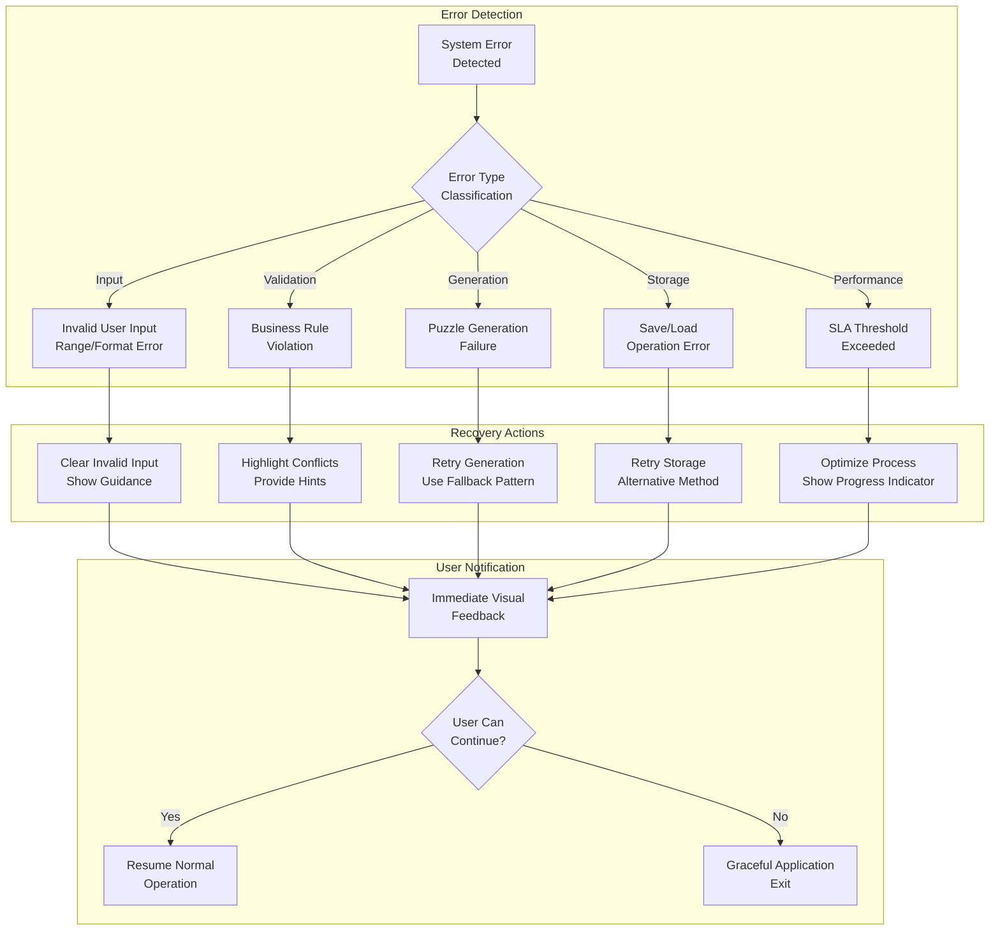
```mermaid
flowchart TD
    subgraph "Error Detection"
        SystemError[System Error<br/>Detected] --> ErrorType{Error Type<br/>Classification}
        
        ErrorType -->|Input| InputError[Invalid User Input<br/>Range/Format Error]
        ErrorType -->|Validation| ValidationError[Business Rule<br/>Violation]
        ErrorType -->|Generation| GenerationError[Puzzle Generation<br/>Failure]
        ErrorType -->|Storage| StorageError[Save/Load<br/>Operation Error]
        ErrorType -->|Performance| PerformanceError[SLA Threshold<br/>Exceeded]
    end
    
    subgraph "Recovery Actions"
        InputError --> InputRecovery[Clear Invalid Input<br/>Show Guidance]
        ValidationError --> ValidationRecovery[Highlight Conflicts<br/>Provide Hints]
        GenerationError --> GenerationRecovery[Retry Generation<br/>Use Fallback Pattern]
        StorageError --> StorageRecovery[Retry Storage<br/>Alternative Method]
        PerformanceError --> PerformanceRecovery[Optimize Process<br/>Show Progress Indicator]
    end
    
    subgraph "User Notification"
        InputRecovery --> UserFeedback[Immediate Visual<br/>Feedback]
        ValidationRecovery --> UserFeedback
        GenerationRecovery --> UserFeedback
        StorageRecovery --> UserFeedback
        PerformanceRecovery --> UserFeedback
        
        UserFeedback --> ContinueGame{User Can<br/>Continue?}
        ContinueGame -->|Yes| ResumeOperation[Resume Normal<br/>Operation]
        ContinueGame -->|No| GracefulExit[Graceful Application<br/>Exit]
    end
```

### 4.2.2 Retry Mechanism Flowchart

The system implements intelligent retry mechanisms with exponential backoff for critical operations.

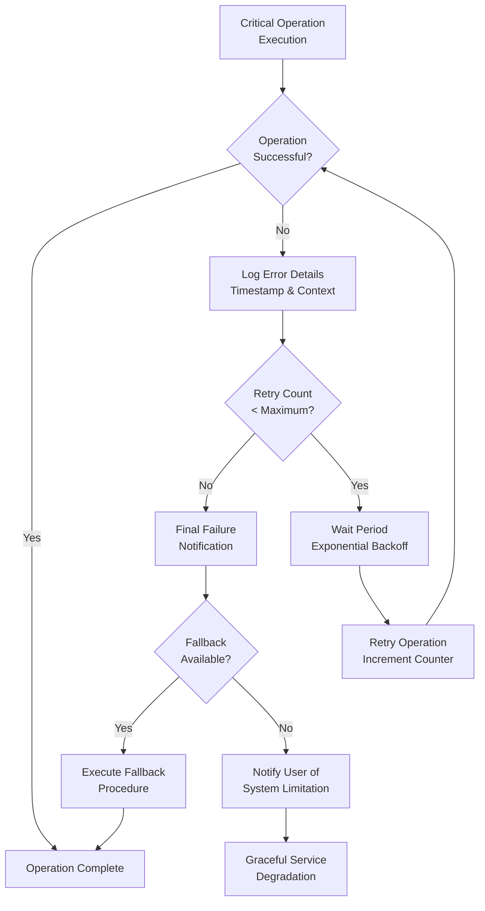
```mermaid
flowchart TD
    Operation[Critical Operation<br/>Execution] --> Success{Operation<br/>Successful?}
    Success -->|Yes| Complete[Operation Complete]
    Success -->|No| ErrorLog[Log Error Details<br/>Timestamp & Context]
    
    ErrorLog --> RetryCheck{Retry Count<br/>< Maximum?}
    RetryCheck -->|No| FinalFailure[Final Failure<br/>Notification]
    RetryCheck -->|Yes| WaitPeriod[Wait Period<br/>Exponential Backoff]
    
    WaitPeriod --> RetryOperation[Retry Operation<br/>Increment Counter]
    RetryOperation --> Success
    
    FinalFailure --> FallbackAction{Fallback<br/>Available?}
    FallbackAction -->|Yes| ExecuteFallback[Execute Fallback<br/>Procedure]
    FallbackAction -->|No| UserNotification[Notify User of<br/>System Limitation]
    
    ExecuteFallback --> Complete
    UserNotification --> GracefulDegradation[Graceful Service<br/>Degradation]
```

## 4.3 STATE MANAGEMENT FLOWS

### 4.3.1 Game State Transitions

The game state management system controls the application lifecycle through well-defined state transitions and validation checkpoints.

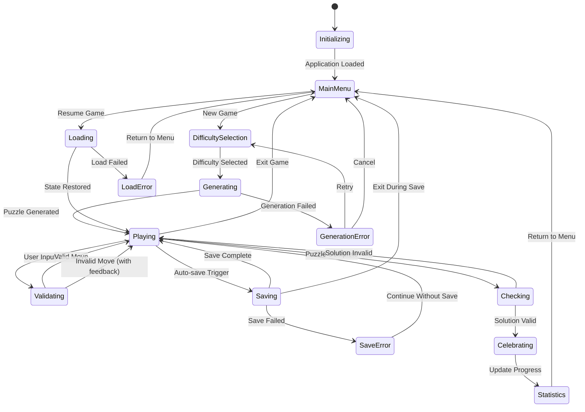
```mermaid
stateDiagram-v2
    [*] --> Initializing
    Initializing --> MainMenu : Application Loaded
    
    MainMenu --> DifficultySelection : New Game
    MainMenu --> Loading : Resume Game
    
    DifficultySelection --> Generating : Difficulty Selected
    Generating --> Playing : Puzzle Generated
    Generating --> GenerationError : Generation Failed
    GenerationError --> DifficultySelection : Retry
    GenerationError --> MainMenu : Cancel
    
    Loading --> Playing : State Restored
    Loading --> LoadError : Load Failed
    LoadError --> MainMenu : Return to Menu
    
    Playing --> Validating : User Input
    Validating --> Playing : Valid Move
    Validating --> Playing : Invalid Move (with feedback)
    Playing --> Saving : Auto-save Trigger
    Saving --> Playing : Save Complete
    Saving --> SaveError : Save Failed
    SaveError --> Playing : Continue Without Save
    
    Playing --> Checking : Puzzle Complete
    Checking --> Celebrating : Solution Valid
    Checking --> Playing : Solution Invalid
    
    Celebrating --> Statistics : Update Progress
    Statistics --> MainMenu : Return to Menu
    
    Playing --> MainMenu : Exit Game
    Saving --> MainMenu : Exit During Save
```

### 4.3.2 Data Persistence Flow

The data persistence system ensures reliable storage and retrieval of game state and user progress across browser sessions.

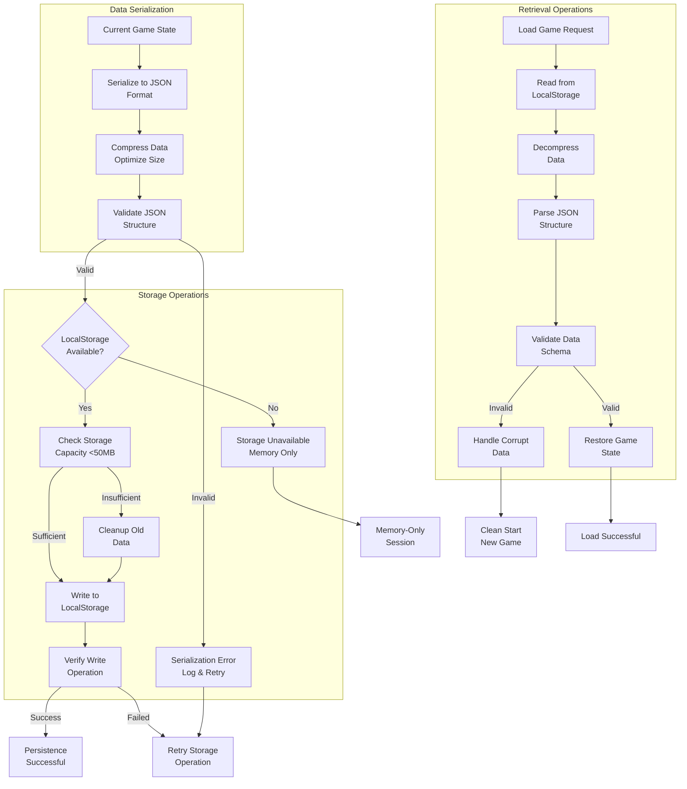
```mermaid
flowchart TD
    subgraph "Data Serialization"
        GameState[Current Game State] --> SerializeData[Serialize to JSON<br/>Format]
        SerializeData --> CompressData[Compress Data<br/>Optimize Size]
        CompressData --> ValidateFormat[Validate JSON<br/>Structure]
    end
    
    subgraph "Storage Operations"
        ValidateFormat -->|Valid| StorageAvailable{LocalStorage<br/>Available?}
        ValidateFormat -->|Invalid| SerializationError[Serialization Error<br/>Log & Retry]
        
        StorageAvailable -->|Yes| CheckCapacity[Check Storage<br/>Capacity <50MB]
        StorageAvailable -->|No| StorageUnavailable[Storage Unavailable<br/>Memory Only]
        
        CheckCapacity -->|Sufficient| WriteStorage[Write to<br/>LocalStorage]
        CheckCapacity -->|Insufficient| CleanupStorage[Cleanup Old<br/>Data]
        
        CleanupStorage --> WriteStorage
        WriteStorage --> VerifyWrite[Verify Write<br/>Operation]
    end
    
    subgraph "Retrieval Operations"
        LoadRequest[Load Game Request] --> ReadStorage[Read from<br/>LocalStorage]
        ReadStorage --> DecompressData[Decompress<br/>Data]
        DecompressData --> ParseJSON[Parse JSON<br/>Structure]
        ParseJSON --> ValidateSchema[Validate Data<br/>Schema]
        ValidateSchema -->|Valid| RestoreState[Restore Game<br/>State]
        ValidateSchema -->|Invalid| CorruptData[Handle Corrupt<br/>Data]
    end
    
    VerifyWrite -->|Success| PersistenceSuccess[Persistence<br/>Successful]
    VerifyWrite -->|Failed| PersistenceRetry[Retry Storage<br/>Operation]
    SerializationError --> PersistenceRetry
    StorageUnavailable --> MemoryOnlyMode[Memory-Only<br/>Session]
    CorruptData --> CleanStart[Clean Start<br/>New Game]
    RestoreState --> LoadSuccess[Load Successful]
```

## 4.4 PERFORMANCE AND TIMING FLOWS

### 4.4.1 SLA Monitoring Flowchart

The system monitors critical performance metrics to ensure adherence to defined service level agreements.

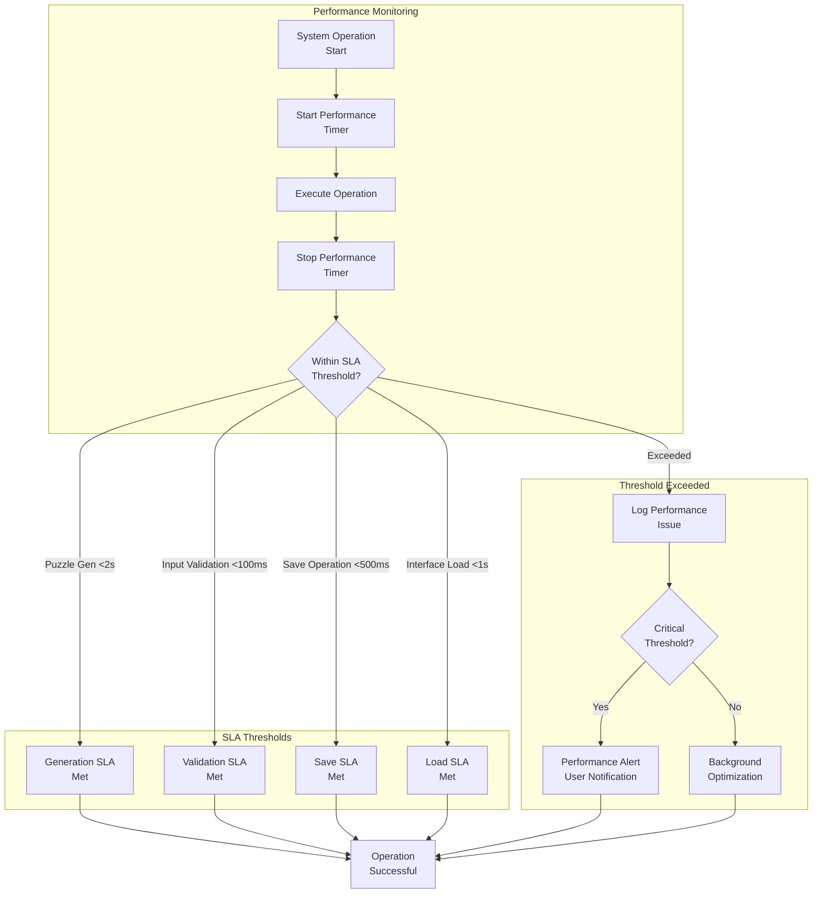
```mermaid
flowchart TD
    subgraph "Performance Monitoring"
        Operation[System Operation<br/>Start] --> StartTimer[Start Performance<br/>Timer]
        StartTimer --> ExecuteOp[Execute Operation]
        ExecuteOp --> StopTimer[Stop Performance<br/>Timer]
        StopTimer --> CheckSLA{Within SLA<br/>Threshold?}
    end
    
    subgraph "SLA Thresholds"
        CheckSLA -->|Puzzle Gen <2s| GenSLA[Generation SLA<br/>Met]
        CheckSLA -->|Input Validation <100ms| ValidationSLA[Validation SLA<br/>Met]
        CheckSLA -->|Save Operation <500ms| SaveSLA[Save SLA<br/>Met]
        CheckSLA -->|Interface Load <1s| LoadSLA[Load SLA<br/>Met]
    end
    
    subgraph "Threshold Exceeded"
        CheckSLA -->|Exceeded| LogPerformance[Log Performance<br/>Issue]
        LogPerformance --> CheckCritical{Critical<br/>Threshold?}
        CheckCritical -->|Yes| PerformanceAlert[Performance Alert<br/>User Notification]
        CheckCritical -->|No| BackgroundOptimize[Background<br/>Optimization]
    end
    
    GenSLA --> OperationSuccess[Operation<br/>Successful]
    ValidationSLA --> OperationSuccess
    SaveSLA --> OperationSuccess
    LoadSLA --> OperationSuccess
    PerformanceAlert --> OperationSuccess
    BackgroundOptimize --> OperationSuccess
```

### 4.4.2 Resource Management Flow

The system manages browser resources efficiently to maintain optimal performance within the 50MB memory constraint.

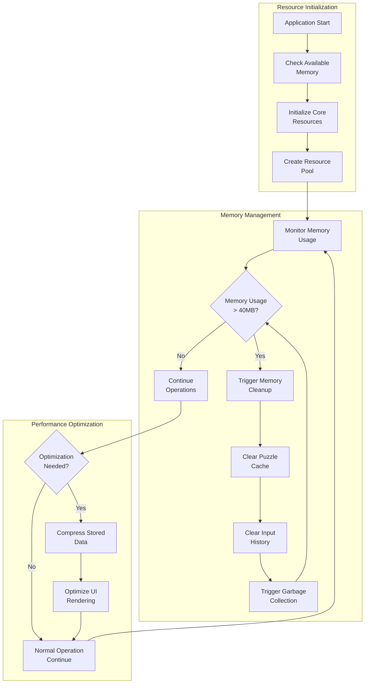
```mermaid
flowchart TD
    subgraph "Resource Initialization"
        AppStart[Application Start] --> CheckMemory[Check Available<br/>Memory]
        CheckMemory --> InitResources[Initialize Core<br/>Resources]
        InitResources --> ResourcePool[Create Resource<br/>Pool]
    end
    
    subgraph "Memory Management"
        ResourcePool --> MonitorUsage[Monitor Memory<br/>Usage]
        MonitorUsage --> CheckLimit{Memory Usage<br/>> 40MB?}
        CheckLimit -->|No| ContinueOp[Continue<br/>Operations]
        CheckLimit -->|Yes| TriggerCleanup[Trigger Memory<br/>Cleanup]
        
        TriggerCleanup --> CleanupCache[Clear Puzzle<br/>Cache]
        CleanupCache --> CleanupHistory[Clear Input<br/>History]
        CleanupHistory --> GarbageCollect[Trigger Garbage<br/>Collection]
        GarbageCollect --> CheckLimit
    end
    
    subgraph "Performance Optimization"
        ContinueOp --> OptimizeCheck{Optimization<br/>Needed?}
        OptimizeCheck -->|Yes| CompressData[Compress Stored<br/>Data]
        OptimizeCheck -->|No| NormalOp[Normal Operation<br/>Continue]
        
        CompressData --> OptimizeUI[Optimize UI<br/>Rendering]
        OptimizeUI --> NormalOp
        NormalOp --> MonitorUsage
    end
```

#### References

**Technical Specification Sections:**
- `1.1 EXECUTIVE SUMMARY` - Project overview and business context
- `1.2 SYSTEM OVERVIEW` - High-level architecture and success criteria  
- `2.1 FEATURE CATALOG` - Detailed feature specifications and dependencies
- `2.2 FUNCTIONAL REQUIREMENTS TABLE` - Detailed requirements with acceptance criteria
- `2.3 FEATURE RELATIONSHIPS` - Dependencies and integration points between features
- `2.4 IMPLEMENTATION CONSIDERATIONS` - Technical constraints and performance requirements
- `3.6 INTEGRATION ARCHITECTURE` - Component integration patterns and data flows

**Web Research Sources:**
- Sudoku game implementation patterns and algorithms
- Error handling and retry mechanisms in web applications

# 5. SYSTEM ARCHITECTURE

## 5.1 HIGH-LEVEL ARCHITECTURE

### 5.1.1 System Overview

#### 5.1.1.1 Architectural Style and Rationale

The sudoku-ggtwdb system implements a **Client-Side Single Page Application (SPA)** architecture, designed specifically for browser-based puzzle gaming with emphasis on performance, user experience, and offline capability. This architectural approach was selected to meet the core business requirement of providing an accessible, responsive Sudoku gaming experience without server infrastructure dependencies.

The system employs a **Component-Based Modular Architecture** pattern, leveraging React's compositional design principles to create maintainable, testable, and scalable code. This pattern enables clear separation of concerns between puzzle generation, game logic, user interface, and data persistence layers.

#### 5.1.1.2 Key Architectural Principles

The architecture is governed by the following fundamental principles:

**Modularity**: Each major component operates independently with well-defined interfaces, enabling parallel development and maintenance across different functional areas.

**Performance-First Design**: All components are optimized to meet strict SLA requirements including puzzle generation under 2 seconds, input validation under 100ms, and save operations under 500ms.

**Offline-First Capability**: The system operates entirely within the browser environment, utilizing local storage mechanisms to ensure functionality without network connectivity.

**Progressive Enhancement**: The architecture supports graceful degradation from advanced features to basic functionality when browser capabilities or resources are limited.

#### 5.1.1.3 System Boundaries and Major Interfaces

The system boundary encompasses all client-side functionality operating within modern web browsers. Major external interfaces include:

- **Browser Storage APIs**: LocalStorage (primary), IndexedDB (secondary), SessionStorage (temporary)
- **Third-Party Libraries**: sudoku-core library for puzzle generation algorithms
- **Browser Runtime Environment**: Modern browsers supporting ES2020+ specifications and React 18.3+

### 5.1.2 Core Components Table

| Component Name | Primary Responsibility | Key Dependencies | Integration Points | Critical Considerations |
|---|---|---|---|---|
| Puzzle Generation Engine | Create valid Sudoku puzzles across 4 difficulty levels | sudoku-core library, validation algorithms | Game Engine, Storage Manager | Generation time <2s, 100% solvable puzzles |
| Game Engine | Orchestrate game logic and state management | React hooks, validation rules | All components | Central hub for component coordination |
| Interactive User Interface | Render 9x9 grid and handle user interactions | React 18.3+, Material-UI/TailwindCSS | Game Engine, Storage Manager | Responsive design, accessibility compliance |
| Progress Management System | Handle save/resume and statistics tracking | Storage APIs, serialization | Game Engine, Storage Manager | Auto-save <500ms, data integrity |

### 5.1.3 Data Flow Description

#### 5.1.3.1 Primary Data Flows

**Puzzle Generation Flow**: User difficulty selection triggers the Game Engine to request puzzle generation from the Puzzle Generation Engine, which utilizes the sudoku-core library to create valid puzzles. Generated puzzles undergo validation before being serialized and stored via the Storage Manager, then presented through the Interactive User Interface.

**User Input Flow**: User interactions in the 9x9 grid are captured by the Interactive User Interface and forwarded to the Game Engine for validation. The validation process checks Sudoku rules within 100ms, updates the application state, triggers storage operations, and provides immediate visual feedback to the user.

**Save/Resume Flow**: Game state changes automatically trigger serialization processes in the Progress Management System, which compresses and stores data via browser LocalStorage. Resume operations reverse this flow, deserializing stored data to restore complete game state including puzzle progress and user preferences.

#### 5.1.3.2 Integration Patterns and Protocols

The system employs **event-driven integration patterns** using React's built-in mechanisms including props, callbacks, and context providers. Component communication follows a hub-and-spoke pattern with the Game Engine serving as the central coordinator.

**Data Transformation Points** include JSON serialization/deserialization for storage operations, puzzle format normalization between the generation engine and UI components, and state shape transformations for React component rendering.

#### 5.1.3.3 Key Data Stores and Caches

**Primary Data Store**: Browser LocalStorage maintains persistent game state, user preferences, and basic statistics with synchronous access patterns optimized for real-time gameplay.

**Secondary Cache**: IndexedDB provides extended storage for puzzle history and detailed analytics when LocalStorage approaches capacity limits.

**Session Cache**: SessionStorage handles temporary data including undo/redo functionality and unsaved progress during active gameplay sessions.

### 5.1.4 External Integration Points

| System Name | Integration Type | Data Exchange Pattern | Protocol/Format | SLA Requirements |
|---|---|---|---|---|
| sudoku-core Library | Direct Library Import | Function Calls | JavaScript API | Generation <2s |
| Browser LocalStorage | Storage API | Key-Value Pairs | JSON Serialization | Save <500ms |
| IndexedDB | Database API | Structured Data | NoSQL Operations | Async Operations |
| Material-UI Components | UI Framework | Component Props | React JSX | Render <100ms |

## 5.2 COMPONENT DETAILS

### 5.2.1 Puzzle Generation Engine

#### 5.2.1.1 Purpose and Responsibilities

The Puzzle Generation Engine serves as the foundational component responsible for creating mathematically valid, uniquely solvable Sudoku puzzles across four distinct difficulty levels (Easy, Medium, Hard, Expert). This component ensures 100% puzzle quality through integrated validation algorithms and maintains generation performance within the 2-second SLA requirement.

#### 5.2.1.2 Technologies and Frameworks

**Primary Technology**: sudoku-core library (v3.0.3) providing proven backtracking algorithms and solution uniqueness validation.

**Fallback Solution**: sudoku-umd library (v1.0.1) ensuring compatibility across diverse browser environments.

**Implementation Language**: TypeScript 5.2+ with strict type checking for algorithmic precision and maintainability.

#### 5.2.1.3 Key Interfaces and APIs

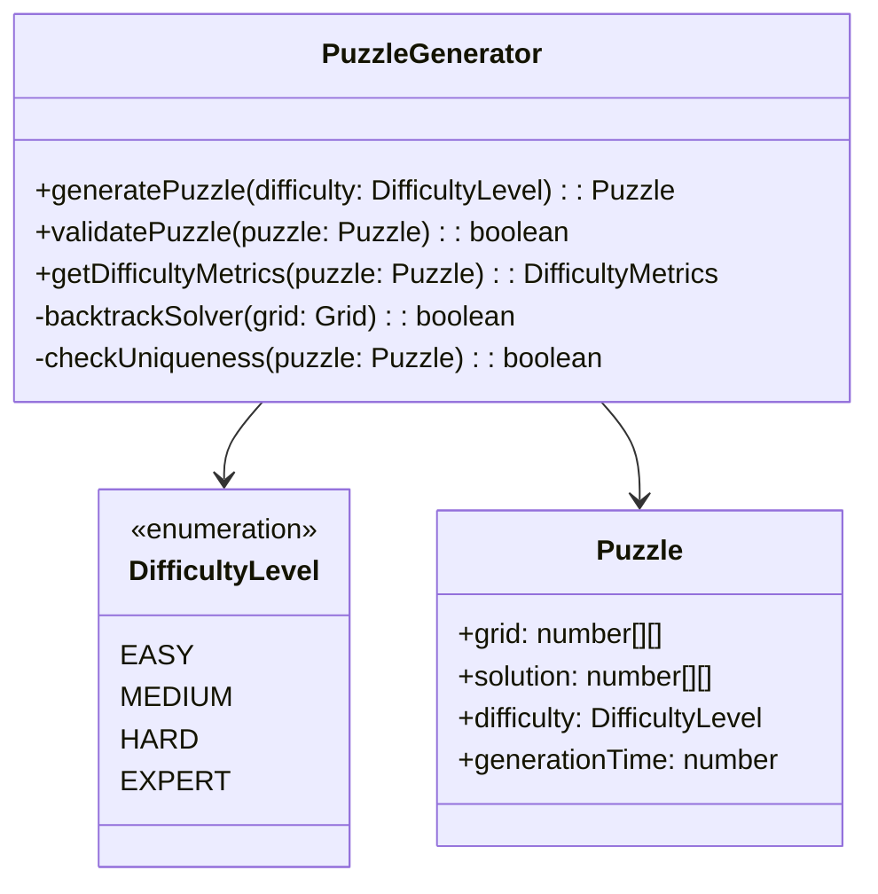
```mermaid
classDiagram
    class PuzzleGenerator {
        +generatePuzzle(difficulty: DifficultyLevel): Puzzle
        +validatePuzzle(puzzle: Puzzle): boolean
        +getDifficultyMetrics(puzzle: Puzzle): DifficultyMetrics
        -backtrackSolver(grid: Grid): boolean
        -checkUniqueness(puzzle: Puzzle): boolean
    }
    
    class DifficultyLevel {
        <<enumeration>>
        EASY
        MEDIUM
        HARD
        EXPERT
    }
    
    class Puzzle {
        +grid: number[][]
        +solution: number[][]
        +difficulty: DifficultyLevel
        +generationTime: number
    }
    
    PuzzleGenerator --> DifficultyLevel
    PuzzleGenerator --> Puzzle
```

#### 5.2.1.4 Data Persistence Requirements

The Puzzle Generation Engine operates as a stateless component, requiring no persistent storage for its algorithmic operations. Generated puzzles are immediately passed to the Storage Manager for persistence and retrieved as needed for gameplay.

#### 5.2.1.5 Scaling Considerations

The component implements resource pooling for puzzle generation operations, utilizing browser Worker threads when available to prevent UI blocking during complex generation processes. Memory optimization includes puzzle cache management and garbage collection coordination to maintain the 50MB browser memory limit.

### 5.2.2 Game Engine

#### 5.2.2.1 Purpose and Responsibilities

The Game Engine functions as the central orchestrator, managing all game logic, state transitions, and component interactions. It coordinates between the user interface, puzzle generation, validation systems, and storage management while maintaining application state consistency and enforcing business rules.

#### 5.2.2.2 Technologies and Frameworks

**State Management**: React hooks (useState, useEffect, useContext) providing reactive state management without external dependencies.

**Validation Logic**: Custom TypeScript implementations ensuring Sudoku rule compliance and solution verification.

**Performance Optimization**: React optimization hooks (useMemo, useCallback, React.memo) for expensive validation operations.

#### 5.2.2.3 Key Interfaces and APIs

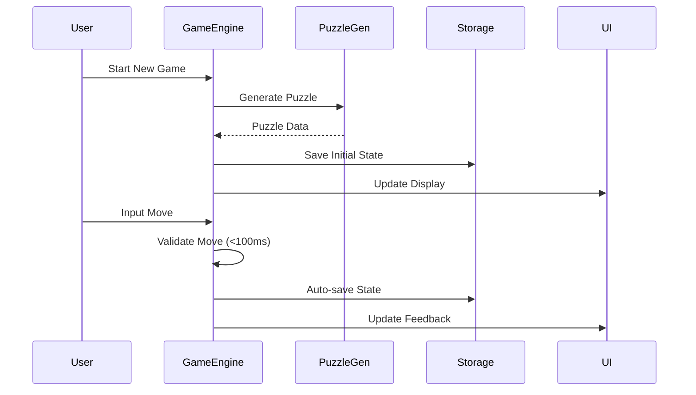
```mermaid
sequenceDiagram
    participant User
    participant GameEngine
    participant PuzzleGen
    participant Storage
    participant UI
    
    User->>GameEngine: Start New Game
    GameEngine->>PuzzleGen: Generate Puzzle
    PuzzleGen-->>GameEngine: Puzzle Data
    GameEngine->>Storage: Save Initial State
    GameEngine->>UI: Update Display
    
    User->>GameEngine: Input Move
    GameEngine->>GameEngine: Validate Move (<100ms)
    GameEngine->>Storage: Auto-save State
    GameEngine->>UI: Update Feedback
```

#### 5.2.2.4 Data Persistence Requirements

The Game Engine maintains active game state in browser memory with automatic persistence triggers for save operations under 500ms. State serialization includes puzzle progress, user preferences, validation history, and timing information.

#### 5.2.2.5 Scaling Considerations

The component implements efficient state update batching and conditional rendering optimization to handle complex game states without performance degradation. Memory management includes state history pruning and optimized data structures for large puzzle collections.

### 5.2.3 Interactive User Interface

#### 5.2.3.1 Purpose and Responsibilities

The Interactive User Interface provides the visual presentation layer and user interaction mechanisms for the Sudoku gaming experience. It renders the 9x9 puzzle grid, handles user input events, displays real-time validation feedback, and manages responsive design across different device types.

#### 5.2.3.2 Technologies and Frameworks

**Frontend Framework**: React 18.3+ with concurrent features for smooth user interactions.

**Styling Solutions**: Material-UI 5.14+ for comprehensive component library or TailwindCSS 3.3+ for utility-first styling approach.

**Responsive Design**: CSS Grid and Flexbox for optimal layout across desktop and mobile devices.

#### 5.2.3.3 Key Interfaces and APIs

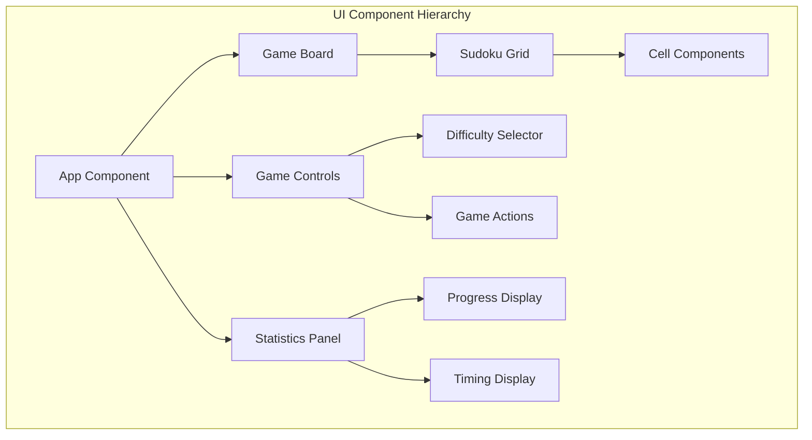
```mermaid
graph TD
    subgraph "UI Component Hierarchy"
        App[App Component] --> GameBoard[Game Board]
        App --> Controls[Game Controls]
        App --> Stats[Statistics Panel]
        
        GameBoard --> Grid[Sudoku Grid]
        Grid --> Cell[Cell Components]
        
        Controls --> DifficultySelector[Difficulty Selector]
        Controls --> GameActions[Game Actions]
        
        Stats --> ProgressDisplay[Progress Display]
        Stats --> TimingDisplay[Timing Display]
    end
```

#### 5.2.3.4 Data Persistence Requirements

The UI layer maintains no direct persistence requirements, relying on the Game Engine for state management. Visual preferences and accessibility settings are stored via the Storage Manager for session restoration.

#### 5.2.3.5 Scaling Considerations

Component virtualization techniques handle large puzzle collections without rendering performance impact. Memoization strategies prevent unnecessary re-renders during rapid user input, maintaining the 100ms validation response requirement.

### 5.2.4 Progress Management System

#### 5.2.4.1 Purpose and Responsibilities

The Progress Management System handles all aspects of user progress tracking including save/resume functionality, statistics collection, completion tracking, and achievement management. It coordinates with the Storage Manager to ensure reliable data persistence across browser sessions.

#### 5.2.4.2 Technologies and Frameworks

**Data Serialization**: JSON-based serialization with compression optimization for storage efficiency.

**State Tracking**: Custom TypeScript interfaces for progress metrics and statistics calculation.

**Performance Monitoring**: Integration with browser performance APIs for timing measurements.

#### 5.2.4.3 Key Interfaces and APIs

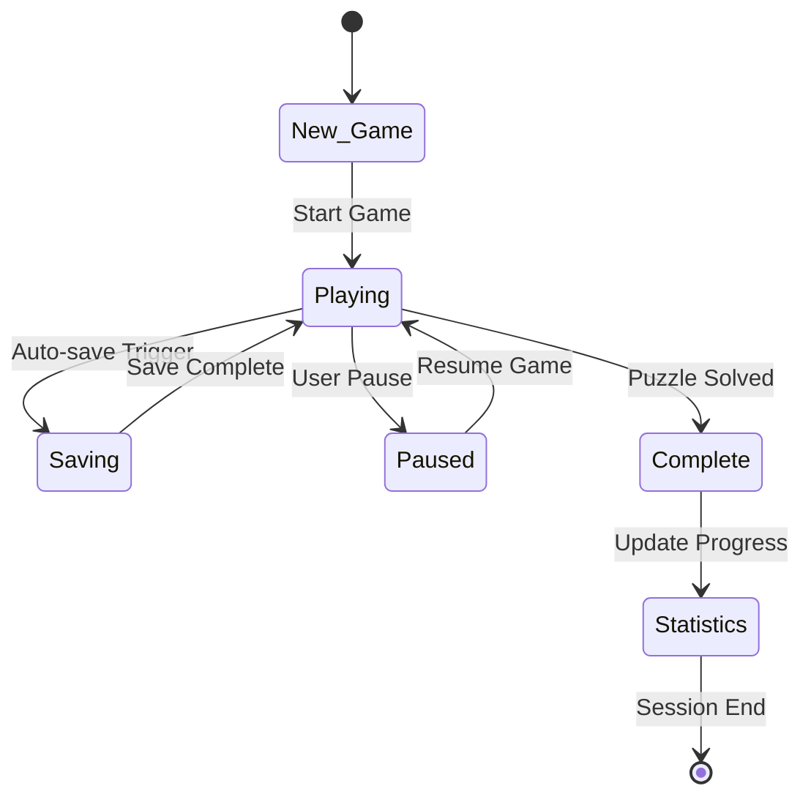
```mermaid
stateDiagram-v2
    [*] --> New_Game
    New_Game --> Playing : Start Game
    Playing --> Saving : Auto-save Trigger
    Saving --> Playing : Save Complete
    Playing --> Paused : User Pause
    Paused --> Playing : Resume Game
    Playing --> Complete : Puzzle Solved
    Complete --> Statistics : Update Progress
    Statistics --> [*] : Session End
```

#### 5.2.4.4 Data Persistence Requirements

Progress data utilizes hierarchical storage with LocalStorage for current session data and IndexedDB for historical statistics and extended analytics. Data compression achieves efficient storage utilization within browser quota limitations.

#### 5.2.4.5 Scaling Considerations

The system implements data aging policies to manage long-term storage growth and maintain performance. Statistical calculations utilize efficient algorithms to process large datasets without impacting gameplay performance.

## 5.3 TECHNICAL DECISIONS

### 5.3.1 Architecture Style Decisions and Tradeoffs

#### 5.3.1.1 Client-Side SPA Architecture

**Decision Rationale**: The selection of client-side Single Page Application architecture provides optimal user experience through immediate responsiveness while eliminating server infrastructure complexity and costs.

**Tradeoffs Analysis**:

| Advantage | Disadvantage | Mitigation Strategy |
|---|---|---|
| Offline functionality | Limited computational resources | Efficient algorithms and resource management |
| Instant user feedback | Browser compatibility requirements | Progressive enhancement approach |
| Zero server costs | Local storage limitations | Tiered storage strategy with cleanup policies |

#### 5.3.1.2 Component-Based Modular Design

**Decision Tree Analysis**:

```mermaid
flowchart TD
    ArchDecision{Architecture Pattern Selection}
    ArchDecision -->|Maintainability| ComponentBased[Component-Based Architecture]
    ArchDecision -->|Simplicity| MonolithicApp[Monolithic Application]
    ArchDecision -->|Performance| LayeredArch[Layered Architecture]
    
    ComponentBased --> Benefits[Clear Separation of Concerns<br/>Independent Development<br/>Testable Components]
    MonolithicApp --> Limitations[Tight Coupling<br/>Limited Scalability<br/>Testing Complexity]
    LayeredArch --> Overhead[Performance Overhead<br/>Complex Dependencies<br/>Limited Flexibility]
    
    Benefits --> Selection[SELECTED: Component-Based]
```

### 5.3.2 Communication Pattern Choices

#### 5.3.2.1 Event-Driven Integration

**Selection Rationale**: Event-driven patterns provide loose coupling between components while maintaining responsive user interactions and efficient state synchronization.

**Implementation Details**: React's built-in event system combined with custom event handlers ensures minimal overhead while providing comprehensive component communication capabilities.

### 5.3.3 Data Storage Solution Rationale

#### 5.3.3.1 Tiered Storage Strategy

**Primary Storage**: LocalStorage selected for synchronous access patterns required by real-time gameplay with save operations completing within 500ms SLA.

**Secondary Storage**: IndexedDB provides extended capabilities for complex queries and larger data volumes when LocalStorage approaches capacity limits.

**Fallback Storage**: SessionStorage ensures continued functionality when persistent storage is unavailable, maintaining user experience during browser limitation scenarios.

### 5.3.4 Caching Strategy Justification

#### 5.3.4.1 Multi-Level Caching Architecture

```mermaid
graph TD
    subgraph "Caching Strategy"
        UserAction[User Action] --> MemoryCache[Memory Cache Check]
        MemoryCache -->|Hit| ImmediateResponse[Immediate Response]
        MemoryCache -->|Miss| LocalStorageCache[LocalStorage Cache]
        LocalStorageCache -->|Hit| FastResponse[Fast Response <100ms]
        LocalStorageCache -->|Miss| GeneratePuzzle[Generate New Puzzle]
        GeneratePuzzle --> CacheUpdate[Update All Cache Levels]
    end
```

**Memory Cache**: In-memory puzzle storage for immediate access to recently generated puzzles and active game states.

**Persistent Cache**: LocalStorage-based caching for puzzle templates and user preferences across browser sessions.

**Adaptive Cleanup**: Automatic cache management based on memory usage and storage capacity to maintain optimal performance.

### 5.3.5 Security Mechanism Selection

#### 5.3.5.1 Client-Side Security Framework

**Input Sanitization**: Comprehensive validation of all user inputs preventing code injection and ensuring data integrity throughout the application.

**State Integrity**: Puzzle state validation prevents solution manipulation and maintains game fairness through cryptographic checksums.

**Code Protection**: Build-time obfuscation protects puzzle generation algorithms while maintaining debuggability in development environments.

## 5.4 CROSS-CUTTING CONCERNS

### 5.4.1 Monitoring and Observability Approach

#### 5.4.1.1 Performance Monitoring Strategy

The system implements comprehensive performance monitoring across all critical operations to ensure SLA compliance and optimal user experience.

**Key Metrics Tracked**:
- Puzzle generation time (target: <2 seconds)
- Input validation response time (target: <100ms)
- Save operation completion time (target: <500ms)
- Memory usage patterns (limit: 50MB)
- User engagement metrics and session duration

**Monitoring Implementation**: Browser Performance API integration provides accurate timing measurements with minimal performance overhead.

### 5.4.2 Logging and Tracing Strategy

#### 5.4.2.1 Structured Logging Framework

**Log Levels**: Debug, Info, Warning, Error classifications enable appropriate detail levels for different operational scenarios.

**Performance Logging**: Critical path operations include timing logs for SLA compliance verification and performance optimization identification.

**Error Context**: Comprehensive error logging includes stack traces, user state, and environmental information for effective debugging.

### 5.4.3 Error Handling Patterns

#### 5.4.3.1 Comprehensive Error Management

```mermaid
flowchart TD
    subgraph "Error Handling Flow"
        Error[Error Detected] --> Classify{Error Classification}
        
        Classify -->|Input Error| InputHandler[Input Validation<br/>Clear & Guide User]
        Classify -->|Generation Error| GenHandler[Retry with Fallback<br/>Algorithm]
        Classify -->|Storage Error| StorageHandler[Alternative Storage<br/>Method]
        Classify -->|Performance Error| PerfHandler[Optimize Process<br/>Show Progress]
        
        InputHandler --> UserNotification[User Feedback]
        GenHandler --> UserNotification
        StorageHandler --> UserNotification
        PerfHandler --> UserNotification
        
        UserNotification --> Recovery{Recovery Possible?}
        Recovery -->|Yes| ResumeOperation[Resume Normal Operation]
        Recovery -->|No| GracefulDegradation[Graceful Service Degradation]
    end
```

**Retry Mechanisms**: Exponential backoff strategies for critical operations including puzzle generation and storage operations.

**Graceful Degradation**: Service degradation patterns maintain core functionality when advanced features encounter errors.

**User Communication**: Clear, actionable error messages guide users through recovery procedures without exposing technical implementation details.

### 5.4.4 Authentication and Authorization Framework

#### 5.4.4.1 Security Architecture

**Client-Side Security Model**: The system operates without traditional authentication requirements, implementing security through data integrity validation and input sanitization.

**Data Protection**: User progress and statistics receive protection through checksums and validation algorithms preventing unauthorized modification.

**Future Extensibility**: Architecture supports future authentication integration for multi-user features or cloud synchronization capabilities.

### 5.4.5 Performance Requirements and SLAs

#### 5.4.5.1 Service Level Agreements

| Operation Category | Target SLA | Critical Threshold | Measurement Method |
|---|---|---|---|
| Puzzle Generation | <2 seconds | 3 seconds | Performance API timing |
| Input Validation | <100ms | 200ms | Event processing time |
| Save Operations | <500ms | 1 second | Storage API timing |
| Interface Loading | <1 second | 2 seconds | Component render time |

#### 5.4.5.2 Performance Optimization Framework

**Resource Management**: Memory usage monitoring with automatic cleanup procedures maintains the 50MB browser allocation limit.

**Computational Optimization**: Algorithm efficiency optimization and selective caching reduce processing overhead for complex operations.

**Rendering Performance**: React optimization patterns including memoization and virtual DOM efficiency prevent UI performance degradation.

### 5.4.6 Disaster Recovery Procedures

#### 5.4.6.1 Data Recovery Architecture

**Automatic Backup**: Continuous game state persistence with multiple redundancy levels ensures minimal data loss during unexpected failures.

**State Reconstruction**: Comprehensive state validation and reconstruction procedures restore consistent game states from partial data.

**Graceful Failure**: Progressive failure handling maintains partial functionality when complete system recovery is not immediately possible.

#### 5.4.6.2 System Recovery Procedures

```mermaid
flowchart TD
    subgraph "Disaster Recovery Flow"
        Failure[System Failure Detected] --> AssessDamage[Assess Data Integrity]
        AssessDamage --> RecoveryType{Recovery Type}
        
        RecoveryType -->|Partial| PartialRestore[Restore Available Data<br/>Indicate Lost Progress]
        RecoveryType -->|Complete| CompleteRestore[Full State Recovery<br/>Resume Normal Operation]
        RecoveryType -->|Failed| CleanStart[Clean Application Start<br/>Preserve Statistics]
        
        PartialRestore --> ValidateRecovery[Validate Recovered State]
        CompleteRestore --> ValidateRecovery
        CleanStart --> ValidateRecovery
        
        ValidateRecovery --> UserNotification[Notify User of<br/>Recovery Status]
        UserNotification --> ResumeOperation[Resume Application<br/>Operation]
    end
```

**Recovery Strategies**: Tiered recovery approaches from complete state restoration to graceful degradation with preserved user statistics.

**Data Validation**: Comprehensive integrity checking ensures recovered data maintains consistency and prevents corrupted state propagation.

**User Communication**: Transparent communication regarding data recovery status and any limitations resulting from recovery procedures.

#### References

#### Technical Specification Sections

- `1.1 EXECUTIVE SUMMARY` - Project overview and business context
- `1.2 SYSTEM OVERVIEW` - High-level architecture and success criteria
- `2.1 FEATURE CATALOG` - Complete feature specifications and dependencies
- `3.2 FRAMEWORKS & LIBRARIES` - Technology stack decisions and rationale
- `3.4 DATABASES & STORAGE` - Data persistence architecture and patterns
- `3.6 INTEGRATION ARCHITECTURE` - Component integration patterns and flows
- `4.2 ERROR HANDLING AND RECOVERY` - Error management and recovery procedures
- `4.3 STATE MANAGEMENT FLOWS` - State transition diagrams and persistence flows
- `4.4 PERFORMANCE AND TIMING FLOWS` - SLA monitoring and resource management

# 6. SYSTEM COMPONENTS DESIGN

## 6.1 CORE SERVICES ARCHITECTURE

### 6.1.1 Architecture Applicability Assessment

#### 6.1.1.1 Core Services Architecture Classification

**Core Services Architecture is not applicable for this system.**

The sudoku-ggtwdb system implements a **Client-Side Single Page Application (SPA)** architecture that operates entirely within the browser environment without any backend services, microservices, or distributed system components. This architectural approach fundamentally differs from service-oriented architectures that require core services infrastructure.

#### 6.1.1.2 System Architecture Type

**Implemented Architecture**: Component-Based Modular Architecture
- **Deployment Model**: Static web application hosted on CDN/static hosting platforms
- **Runtime Environment**: Browser-based execution exclusively
- **Service Communication**: Not applicable - all components exist within single browser JavaScript process
- **Backend Requirements**: None - completely client-side operation

### 6.1.2 Why Core Services Architecture Does Not Apply

#### 6.1.2.1 Fundamental Architectural Differences

The sudoku-ggtwdb system exhibits the following characteristics that make core services architecture irrelevant:

**Single Process Execution**
- Entire application runs as a single JavaScript process within the user's browser
- All components communicate via function calls, React hooks, props, and context providers
- No inter-process communication or network protocols required

**No Service Boundaries**
- Components are modules within the same application, not separate services
- Puzzle Generation Engine, Game Engine, Interactive User Interface, and Progress Management System all operate within the same runtime context
- Component isolation achieved through React's compositional patterns, not service separation

**No Distributed Computing**
- All processing happens on the client device's browser
- No server-side computation, database services, or backend API endpoints
- No service discovery mechanisms needed as components are directly imported modules

**No Backend Infrastructure**
- System requires no servers, databases, message queues, or backend services
- Data persistence handled exclusively through browser storage APIs (LocalStorage, IndexedDB, SessionStorage)
- No API gateway, load balancers, or service mesh components

#### 6.1.2.2 Integration Patterns Used Instead

```mermaid
graph TB
subgraph "Browser Runtime Environment"
    subgraph "React Application Context"
        App[App Component]
        GameEngine[Game Engine]
        PuzzleGen[Puzzle Generation Engine]
        UI[Interactive User Interface]
        Progress[Progress Management System]
        
        App --> GameEngine
        GameEngine --> PuzzleGen
        GameEngine --> UI
        GameEngine --> Progress
        
        subgraph "Internal Communication"
            Props[React Props]
            Hooks[React Hooks]
            Context[React Context]
            Callbacks[Function Callbacks]
        end
        
        GameEngine -.-> Props
        GameEngine -.-> Hooks
        GameEngine -.-> Context
        GameEngine -.-> Callbacks
    end
    
    subgraph "Browser APIs"
        LocalStorage[LocalStorage API]
        IndexedDB[IndexedDB API]
        SessionStorage[SessionStorage API]
    end
    
    Progress --> LocalStorage
    Progress --> IndexedDB
    Progress --> SessionStorage
end

subgraph "External Libraries"
    SudokuCore[sudoku-core Library]
end

PuzzleGen --> SudokuCore
```

**Component Communication Patterns**
- **React Props**: Data flow from parent to child components
- **React Hooks**: State management and lifecycle handling within components
- **React Context**: Global state sharing across component tree
- **Function Callbacks**: Event handling and user interaction responses

**Data Flow Architecture**
- **Synchronous Communication**: All component interactions occur through direct function calls
- **State Management**: Centralized in Game Engine using React hooks (useState, useEffect, useContext)
- **Event Handling**: Browser DOM events processed through React's synthetic event system

### 6.1.3 Actual System Architecture Implementation

#### 6.1.3.1 Component Interaction Model

```mermaid
sequenceDiagram
    participant User
    participant UI as Interactive UI
    participant Engine as Game Engine
    participant PuzzleGen as Puzzle Generator
    participant Progress as Progress Manager
    participant Storage as Browser Storage

    User->>UI: Start New Game
    UI->>Engine: Request New Puzzle
    Engine->>PuzzleGen: Generate(difficulty)
    PuzzleGen-->>Engine: Puzzle Data
    Engine->>Progress: Initialize Game State
    Progress->>Storage: Save Initial State
    Engine-->>UI: Display Puzzle
    UI-->>User: Render Game Board

    User->>UI: Input Number
    UI->>Engine: Validate Input
    Engine->>Engine: Check Rules (<100ms)
    Engine->>Progress: Update Progress
    Progress->>Storage: Auto-save State
    Engine-->>UI: Validation Result
    UI-->>User: Visual Feedback
```

#### 6.1.3.2 Resource Management Architecture

**Memory Management**
- **Single Process Allocation**: Maximum 50MB browser memory allocation for all components
- **Garbage Collection**: Coordinated cleanup across all modules within single JavaScript runtime
- **Resource Sharing**: Efficient sharing of data structures between components without serialization overhead

**Performance Optimization**
- **Code Splitting**: Dynamic imports for component lazy loading, not service isolation
- **Caching Strategy**: In-memory caching within single application process
- **Rendering Optimization**: React optimization patterns (useMemo, useCallback, React.memo) for UI performance

#### 6.1.3.3 Data Persistence Model

| Storage Type | Purpose | Access Pattern | Data Scope |
|---|---|---|---|
| LocalStorage | Primary game state, user preferences | Synchronous key-value | Persistent across sessions |
| IndexedDB | Historical statistics, puzzle archives | Asynchronous NoSQL | Long-term data storage |
| SessionStorage | Temporary data, undo/redo functionality | Synchronous key-value | Current session only |

**Storage Architecture**
- **No Database Services**: All data stored directly in browser storage APIs
- **No Replication**: Data exists only on user's device
- **No Backup Services**: User responsible for data persistence

### 6.1.4 Alternative Architecture Benefits

#### 6.1.4.1 Simplicity and Performance Advantages

**Deployment Simplicity**
- **Static Asset Deployment**: Single bundle of HTML, CSS, JavaScript files
- **No Server Management**: Zero backend infrastructure requirements
- **CDN Distribution**: Global content delivery through static file hosting

**Performance Characteristics**
- **Zero Network Latency**: All component communication occurs in-memory
- **Immediate Response**: Sub-100ms validation and interaction response times
- **Offline Capability**: Complete functionality without network connectivity

**Development Efficiency**
- **Single Technology Stack**: TypeScript/React ecosystem exclusively
- **Unified Testing**: Component and integration testing within single application context
- **Simplified Debugging**: All code execution traceable within single browser process

#### 6.1.4.2 Resource Utilization Model

```mermaid
graph LR
subgraph "User Device Resources"
    Browser[Browser Process]
    CPU[CPU Cores]
    Memory[RAM Allocation]
    Storage[Local Storage]
    
    subgraph "Application Resources"
        JSRuntime[JavaScript Runtime]
        ReactEngine[React Rendering Engine]
        DOMManagement[DOM Management]
        StorageAPIs[Browser Storage APIs]
    end
    
    Browser --> JSRuntime
    CPU --> ReactEngine
    Memory --> DOMManagement
    Storage --> StorageAPIs
end
```

**Resource Allocation Strategy**
- **CPU Utilization**: Leverages user's device processing power for puzzle generation and validation
- **Memory Management**: Operates within browser sandbox limitations and quota restrictions  
- **Storage Utilization**: Uses browser storage quotas efficiently with compression and cleanup policies

### 6.1.5 Future Scalability Considerations

#### 6.1.5.1 Horizontal Scaling Through Distribution

While the current architecture does not require core services, future enhancements could introduce service-oriented patterns:

**Potential Service Expansion Scenarios**
- **User Account Services**: Authentication and profile management backend
- **Cloud Synchronization**: Cross-device progress synchronization services
- **Social Features**: Multiplayer game coordination and leaderboard services
- **Analytics Services**: User behavior tracking and performance analytics

**Migration Path to Services Architecture**
- **API Gateway Integration**: RESTful API endpoints for cloud features
- **Authentication Services**: OAuth2/JWT token-based authentication
- **Data Synchronization Services**: Conflict resolution and merge algorithms
- **Notification Services**: Push notifications and user engagement

#### 6.1.5.2 Current Architecture Sustainability

**Scalability Within Current Model**
- **User Base Growth**: No server infrastructure limits on concurrent users
- **Feature Complexity**: Component modularity supports feature expansion without service complexity
- **Performance Scaling**: Browser capabilities and user device specifications determine limits

### 6.1.6 References

#### Technical Specification Sections

- `5.1 HIGH-LEVEL ARCHITECTURE` - System architecture overview and architectural principles
- `5.2 COMPONENT DETAILS` - Comprehensive component specifications and responsibilities  
- `3.6 INTEGRATION ARCHITECTURE` - Component integration patterns and data flow architecture
- `5.4 CROSS-CUTTING CONCERNS` - Error handling, monitoring, and performance management patterns

## 6.2 DATABASE DESIGN

### 6.2.1 Storage Architecture Overview

The sudoku-ggtwdb system employs a **browser-based storage architecture** instead of traditional database systems, optimized for client-side Single Page Application (SPA) requirements. This architectural decision aligns with the technical constraints requiring local data processing and eliminates server infrastructure dependencies while providing offline functionality support.

#### 6.2.1.1 Primary Storage Technologies

**LocalStorage API (Primary Storage)**
- **Purpose**: Real-time game state persistence with synchronous access
- **Capacity**: ~10MB browser quota limitation
- **Performance Target**: <500ms save operation completion
- **Data Format**: JSON serialization with compression optimization
- **Scope**: Domain-scoped persistent storage across browser sessions

**IndexedDB (Extended Storage)**
- **Purpose**: Historical game data, detailed statistics, and offline puzzle caching
- **Implementation**: Asynchronous NoSQL database for complex queries
- **Trigger**: Activated when LocalStorage approaches capacity limits
- **Data Types**: Advanced analytics, puzzle history, extended user statistics

**SessionStorage (Temporary Storage)**
- **Purpose**: Current session data and undo/redo functionality
- **Lifecycle**: Session-scoped storage cleared on browser tab closure
- **Use Cases**: Unsaved puzzle progress, temporary game state, navigation state

### 6.2.2 Schema Design and Data Models

#### 6.2.2.1 Entity Relationships

```mermaid
erDiagram
    GAME_STATE ||--|| PUZZLE_DATA : contains
    GAME_STATE ||--o{ USER_INPUT : tracks
    GAME_STATE }o--|| USER_PROGRESS : updates
    USER_PROGRESS ||--o{ STATISTICS : aggregates
    USER_PREFERENCES ||--|| GAME_STATE : configures
    
    GAME_STATE {
        string gameId PK
        string puzzleId FK
        string currentGrid
        string solutionGrid
        enum difficulty
        timestamp createdAt
        timestamp updatedAt
        enum status
        int cellsCompleted
    }
    
    PUZZLE_DATA {
        string puzzleId PK
        string initialGrid
        string solutionGrid
        enum difficulty
        timestamp generationTime
        int generationDuration
        boolean validated
    }
    
    USER_INPUT {
        string inputId PK
        string gameId FK
        int cellRow
        int cellColumn
        int inputValue
        timestamp inputTime
        boolean isValid
    }
    
    USER_PROGRESS {
        string progressId PK
        string gameId FK
        int totalMoves
        int hintsUsed
        int completionTime
        boolean isPuzzleCompleted
        timestamp completionDate
    }
    
    STATISTICS {
        string statId PK
        string progressId FK
        enum difficulty
        int averageTime
        int completionCount
        float completionRate
        int totalHintsUsed
    }
    
    USER_PREFERENCES {
        string preferenceId PK
        enum defaultDifficulty
        boolean highlightErrors
        boolean showTimer
        boolean enableHints
        object themeSettings
    }
```

#### 6.2.2.2 Data Structure Design

**Puzzle State Data Structure**
| Field | Type | Description | Storage Location |
|-------|------|-------------|------------------|
| gameId | String UUID | Unique game session identifier | LocalStorage |
| puzzleGrid | Number[][] | 9x9 array of current puzzle state | LocalStorage |
| solutionGrid | Number[][] | 9x9 array of complete solution | LocalStorage |
| difficulty | Enum | EASY, MEDIUM, HARD, EXPERT | LocalStorage |
| completionStatus | Boolean | Puzzle completion flag | LocalStorage |

**User Progress Data Structure**
| Field | Type | Description | Storage Location |
|-------|------|-------------|------------------|
| sessionStats | Object | Current session statistics | SessionStorage |
| historicalStats | Object[] | Long-term statistics collection | IndexedDB |
| completionTimes | Number[] | Puzzle completion time history | IndexedDB |
| difficultyProgression | Object | Difficulty level advancement tracking | IndexedDB |

#### 6.2.2.3 Indexing Strategy

**LocalStorage Key Structure**
- Primary Key Format: `sudoku_{dataType}_{identifier}`
- Game State Key: `sudoku_game_current`
- Preferences Key: `sudoku_preferences_user`
- Session Key: `sudoku_session_{sessionId}`

**IndexedDB Index Configuration**
- Primary Index: Auto-incrementing ID for chronological ordering
- Compound Index: `(difficulty, completionDate)` for statistics queries
- Secondary Index: `gameId` for cross-referencing with LocalStorage data

### 6.2.3 Data Management Procedures

#### 6.2.3.1 Migration and Versioning Strategy

```mermaid
flowchart TD
    subgraph "Data Migration Flow"
        AppStart[Application Start] --> CheckVersion{Version Check}
        CheckVersion -->|Current Version| LoadData[Load Existing Data]
        CheckVersion -->|Version Mismatch| StartMigration[Initialize Migration]
        
        StartMigration --> BackupData[Backup Current Data]
        BackupData --> TransformSchema[Transform Data Schema]
        TransformSchema --> ValidateMigration[Validate Migration]
        ValidateMigration -->|Success| UpdateVersion[Update Version Tag]
        ValidateMigration -->|Failed| RestoreBackup[Restore Backup Data]
        
        UpdateVersion --> LoadData
        RestoreBackup --> ErrorHandler[Migration Error Handler]
        LoadData --> AppReady[Application Ready]
    end
```

**Version Management**
- Schema version stored in `sudoku_schema_version` key
- Backward compatibility maintained for 2 major versions
- Migration scripts handle data transformation between versions
- Automatic rollback mechanisms for failed migrations

#### 6.2.3.2 Archival and Cleanup Policies

**Data Retention Rules**
- Active game state: Retained until completion or explicit deletion
- Session data: Automatically cleared on browser tab closure
- Historical statistics: Maintained indefinitely within storage quotas
- Temporary cache: Cleared after 7 days of inactivity

**Storage Optimization Procedures**
- Automatic cleanup triggered at 80% storage capacity
- Oldest historical data archived first (FIFO policy)
- Compression algorithms reduce data footprint by ~60%
- User notification before significant data cleanup operations

### 6.2.4 Data Persistence and Retrieval Mechanisms

#### 6.2.4.1 Storage Manager Architecture

```mermaid
flowchart LR
    subgraph "Storage Manager Components"
        GameEngine[Game Engine] --> StorageManager[Storage Manager]
        
        subgraph "Storage Manager Internal"
            StorageManager --> Serializer[Data Serializer]
            StorageManager --> Validator[Data Validator]
            StorageManager --> Compressor[Compression Engine]
            StorageManager --> CacheManager[Cache Manager]
        end
        
        Serializer --> LocalStorageAPI[LocalStorage API]
        Serializer --> IndexedDBAPI[IndexedDB API]
        Serializer --> SessionStorageAPI[SessionStorage API]
        
        subgraph "Storage Tiers"
            LocalStorageAPI --> LocalStorage[(LocalStorage<br/>~10MB)]
            IndexedDBAPI --> IndexedDB[(IndexedDB<br/>Extended)]
            SessionStorageAPI --> SessionStorage[(SessionStorage<br/>Session)]
        end
    end
```

#### 6.2.4.2 Caching Strategy Implementation

**Multi-Level Cache Hierarchy**
1. **Memory Cache**: In-memory storage for immediate access (L1)
2. **LocalStorage Cache**: Persistent cache across sessions (L2) 
3. **IndexedDB Cache**: Extended historical data cache (L3)

**Cache Management Policies**
- LRU (Least Recently Used) eviction for memory cache
- Automatic cleanup based on capacity thresholds
- Cache coherency maintained through event-driven updates
- Performance monitoring ensures <100ms cache hit responses

### 6.2.5 Compliance and Security Considerations

#### 6.2.5.1 Data Privacy Controls

**Local Data Processing**
- All user data remains on client device (no server transmission)
- No personal identification information collection
- GDPR compliance through data minimization principles
- User control over data deletion and export

**Data Integrity Protection**
- Checksum validation prevents unauthorized data modification
- Input sanitization blocks injection attack vectors
- State validation ensures consistent game rules enforcement
- Solution obfuscation prevents puzzle manipulation

#### 6.2.5.2 Access Controls and Audit Mechanisms

**Security Measures**
| Control Type | Implementation | Purpose |
|--------------|----------------|---------|
| Data Validation | JSON schema validation | Prevent corrupted data states |
| Input Sanitization | XSS prevention filters | Block malicious input injection |
| State Verification | Cryptographic checksums | Detect unauthorized modifications |
| Solution Protection | Code obfuscation | Prevent puzzle solution exposure |

### 6.2.6 Performance Optimization Strategies

#### 6.2.6.1 Query Optimization Patterns

**Data Access Optimization**
- Lazy loading for non-critical historical data
- Batch operations for multiple storage requests
- Asynchronous IndexedDB operations for complex queries
- Selective data retrieval to minimize bandwidth usage

#### 6.2.6.2 Connection and Resource Management

```mermaid
sequenceDiagram
    participant GameEngine
    participant StorageManager
    participant LocalStorage
    participant IndexedDB
    participant MemoryCache
    
    GameEngine->>StorageManager: Save Game State
    StorageManager->>MemoryCache: Update L1 Cache
    StorageManager->>StorageManager: Serialize & Compress
    StorageManager->>LocalStorage: Persist Game Data
    
    alt Storage Success
        LocalStorage-->>StorageManager: Confirm Write
        StorageManager-->>GameEngine: Save Complete (<500ms)
    else Storage Failure
        StorageManager->>IndexedDB: Fallback Storage
        IndexedDB-->>StorageManager: Confirm Write
        StorageManager-->>GameEngine: Save Complete (Fallback)
    end
```

**Resource Pool Management**
- Connection pooling for IndexedDB operations
- Memory allocation monitoring (50MB browser limit)
- Garbage collection coordination for large data operations
- Resource cleanup procedures for storage failures

#### 6.2.6.3 Batch Processing Implementation

**Batch Operation Strategy**
- Group multiple save operations into single transactions
- Bulk data migration procedures for schema updates
- Batch compression operations for storage optimization
- Coordinated cleanup operations during idle periods

### 6.2.7 Storage Architecture Diagrams

#### 6.2.7.1 Data Flow Architecture

```mermaid
flowchart TD
    subgraph "Data Flow Architecture"
        UserAction[User Input] --> GameEngine[Game Engine]
        GameEngine --> DataValidator[Data Validator]
        DataValidator --> StorageRouter{Storage Router}
        
        StorageRouter -->|Real-time Data| LocalStoragePath[LocalStorage Path]
        StorageRouter -->|Historical Data| IndexedDBPath[IndexedDB Path]
        StorageRouter -->|Session Data| SessionStoragePath[SessionStorage Path]
        
        subgraph "LocalStorage Operations"
            LocalStoragePath --> SerializeJSON[JSON Serialization]
            SerializeJSON --> CompressData[Data Compression]
            CompressData --> ValidateSchema[Schema Validation]
            ValidateSchema --> WriteLocal[Write to LocalStorage]
        end
        
        subgraph "IndexedDB Operations"
            IndexedDBPath --> CreateTransaction[Create Transaction]
            CreateTransaction --> IndexedWrite[Write to IndexedDB]
            IndexedWrite --> IndexCommit[Commit Transaction]
        end
        
        subgraph "SessionStorage Operations"
            SessionStoragePath --> TempSerialize[Temporary Serialization]
            TempSerialize --> WriteSession[Write to SessionStorage]
        end
        
        WriteLocal --> VerifyWrite[Verify Operation]
        IndexCommit --> VerifyWrite
        WriteSession --> VerifyWrite
        VerifyWrite --> UpdateCache[Update Memory Cache]
        UpdateCache --> ResponseToEngine[Response to Game Engine]
    end
```

#### 6.2.7.2 Storage Tier Architecture

```mermaid
graph TB
    subgraph "Browser Storage Tier Architecture"
        subgraph "Tier 1 - Memory Storage"
            MemCache[Memory Cache<br/>Immediate Access<br/>50MB Limit]
        end
        
        subgraph "Tier 2 - LocalStorage"
            LocalStore[LocalStorage<br/>Persistent Storage<br/>~10MB Quota<br/>Synchronous API]
        end
        
        subgraph "Tier 3 - IndexedDB"
            IndexedStore[IndexedDB<br/>Extended Storage<br/>Asynchronous API<br/>Complex Queries]
        end
        
        subgraph "Tier 4 - SessionStorage"
            SessionStore[SessionStorage<br/>Session Scoped<br/>Temporary Data<br/>Auto Cleanup]
        end
        
        GameState[Game State Manager] --> MemCache
        MemCache -.-> LocalStore
        LocalStore -.-> IndexedStore
        GameState --> SessionStore
        
        MemCache ---|"LRU Eviction"| LocalStore
        LocalStore ---|"Capacity Overflow"| IndexedStore
        SessionStore ---|"Session End"| Cleanup[Auto Cleanup]
    end
```

### 6.2.8 Database Design Justification

#### 6.2.8.1 Architecture Decision Rationale

The browser-based storage architecture provides optimal alignment with system requirements:

**Technical Advantages**
- **Zero Infrastructure**: Eliminates database server requirements and hosting costs
- **Offline Capability**: Full functionality without network connectivity
- **Instant Responsiveness**: Local storage provides <500ms save operation performance
- **Scalability**: Client-side processing eliminates server bottlenecks

**Business Benefits**
- **Cost Efficiency**: No database licensing or hosting expenses
- **Privacy Compliance**: Data remains on user device, simplifying privacy requirements  
- **Deployment Simplicity**: Static file deployment without database configuration
- **User Experience**: Immediate data persistence without network latency

#### 6.2.8.2 Limitations and Mitigation Strategies

**Storage Limitations**
- Browser quota restrictions mitigated through data compression and cleanup policies
- Cross-device synchronization addressed through future cloud integration capability
- Data portability supported through export/import functionality

**Performance Considerations**
- Memory usage monitoring prevents browser performance degradation
- Efficient serialization algorithms optimize storage space utilization
- Lazy loading strategies minimize initial application load times

#### References

**Technical Specification Sections Examined:**
- `3.4 DATABASES & STORAGE` - Complete storage technology stack and selection rationale
- `5.2 COMPONENT DETAILS` - Storage Manager component specifications and integration patterns
- `4.3 STATE MANAGEMENT FLOWS` - Data persistence and retrieval flow diagrams
- `2.1 FEATURE CATALOG` - Save/resume functionality and progress tracking feature requirements
- `5.4 CROSS-CUTTING CONCERNS` - Performance SLAs, disaster recovery, and monitoring procedures

**Repository Files Examined:**
- `README.md` - Project identification and basic context (sudoku-ggtwdb by Blitzy)

**Repository Structure:**
- Root folder analysis confirmed early-stage development with specification-only content

## 6.3 INTEGRATION ARCHITECTURE

### 6.3.1 Integration Architecture Overview

The sudoku-ggtwdb system implements a **Client-Side Integration Architecture** specifically designed for browser-based applications with no external service dependencies. Unlike traditional enterprise systems that require API gateways, service meshes, or message brokers, this system operates entirely within the browser environment using internal component integration, browser API integration, and third-party library integration patterns.

#### 6.3.1.1 Integration Scope and Applicability

**Traditional Integration Architecture Components Not Applicable:**
- RESTful API design and management
- Message queue infrastructure
- Service-to-service communication protocols
- API gateway configuration
- External authentication services
- Database connection pooling
- Server-side middleware integration

**Applicable Integration Patterns:**
- Component-to-component communication within React architecture
- Browser storage API integration (LocalStorage, IndexedDB, SessionStorage)
- Third-party library integration for puzzle generation algorithms
- Event-driven processing within the JavaScript runtime environment
- Client-side state management integration

#### 6.3.1.2 Integration Architecture Principles

The integration architecture follows these core principles:

**Single-Process Integration**: All components operate within a single browser JavaScript process, eliminating network latency and protocol overhead.

**Synchronous Communication**: Direct function calls and React component patterns provide immediate response times meeting SLA requirements (<100ms validation, <500ms save operations).

**Local-First Design**: Integration patterns prioritize local computation and storage, ensuring complete offline functionality without degraded user experience.

**Progressive Enhancement**: Integration architecture supports graceful fallback from advanced browser features to basic functionality.

### 6.3.2 Internal Component Integration

#### 6.3.2.1 Component Communication Architecture

The system implements a **Hub-and-Spoke Integration Pattern** with the Game Engine serving as the central integration hub coordinating all component interactions.

```mermaid
graph TB
    subgraph "Component Integration Architecture"
        GE[Game Engine<br/>Integration Hub]
        
        subgraph "Core Components"
            PG[Puzzle Generator]
            UI[Interactive Interface]
            SM[Storage Manager]
            PM[Progress Manager]
        end
        
        subgraph "UI Components"
            Grid[Sudoku Grid Component]
            Controls[Game Controls]
            Stats[Statistics Panel]
            Modal[Modal Dialogs]
        end
        
        subgraph "Engine Modules"
            VE[Validation Engine]
            SE[State Engine]
            TE[Timer Engine]
        end
    end
    
    GE --> PG
    GE --> UI
    GE --> SM
    GE --> PM
    
    UI --> Grid
    UI --> Controls
    UI --> Stats
    UI --> Modal
    
    GE --> VE
    GE --> SE
    GE --> TE
    
    PG -.->|Puzzle Data| UI
    SM -.->|Persistence| PM
    VE -.->|Validation Results| UI
```

#### 6.3.2.2 Integration Interface Specifications

| Integration Interface | Communication Method | Data Format | Response Time SLA | Error Handling |
|---|---|---|---|---|
| Game Engine ↔ Puzzle Generator | Direct Function Calls | JavaScript Objects | <2s generation | Fallback puzzle patterns |
| Game Engine ↔ UI Components | React Props/Callbacks | Component State | <100ms updates | Error boundaries |
| Game Engine ↔ Storage Manager | Async/Sync Methods | Serialized JSON | <500ms operations | Retry mechanisms |
| UI Components ↔ Validation Engine | Event Handlers | Input Objects | <100ms validation | Inline error display |

#### 6.3.2.3 Component Integration Flow

```mermaid
sequenceDiagram
    participant User
    participant UI as Interactive Interface
    participant GE as Game Engine
    participant PG as Puzzle Generator
    participant VE as Validation Engine
    participant SM as Storage Manager
    
    User->>UI: Start New Game
    UI->>GE: Request Game Initialization
    GE->>PG: Generate Puzzle (Difficulty Level)
    PG->>PG: Execute sudoku-core Algorithm
    PG-->>GE: Return Generated Puzzle
    GE->>SM: Store Initial Game State
    GE->>UI: Provide Puzzle Configuration
    UI-->>User: Display Interactive Grid
    
    loop Active Gameplay
        User->>UI: Input Number (1-9)
        UI->>VE: Validate Input
        VE->>VE: Check Sudoku Rules
        VE-->>UI: Validation Result
        alt Valid Input
            UI->>GE: Update Game State
            GE->>SM: Auto-save Progress
            UI-->>User: Visual Confirmation
        else Invalid Input
            UI-->>User: Show Conflict Highlight
        end
    end
    
    User->>UI: Complete Puzzle
    UI->>GE: Check Solution
    GE->>VE: Final Validation
    VE-->>GE: Solution Verified
    GE->>SM: Update Statistics
    GE-->>UI: Trigger Celebration
    UI-->>User: Success Animation
```

### 6.3.3 Browser API Integration

#### 6.3.3.1 Storage API Integration Architecture

The system integrates with multiple browser storage APIs following a tiered storage strategy for optimal performance and reliability.

```mermaid
graph TB
    subgraph "Storage Integration Architecture"
        subgraph "Application Layer"
            GS[Game State]
            UP[User Preferences]
            ST[Statistics]
            TMP[Temporary Data]
        end
        
        subgraph "Storage Abstraction Layer"
            SM[Storage Manager]
            SC[Storage Controller]
        end
        
        subgraph "Browser Storage APIs"
            LS[LocalStorage<br/>Primary Storage]
            IDB[IndexedDB<br/>Extended Storage]
            SS[SessionStorage<br/>Temporary Storage]
        end
        
        subgraph "Integration Patterns"
            JSON[JSON Serialization]
            COMP[Data Compression]
            VAL[Integrity Validation]
        end
    end
    
    GS --> SM
    UP --> SM
    ST --> SM
    TMP --> SM
    
    SM --> SC
    SC --> LS
    SC --> IDB
    SC --> SS
    
    SC --> JSON
    SC --> COMP
    SC --> VAL
```

#### 6.3.3.2 Storage Integration Specifications

| Storage API | Integration Pattern | Data Types | Performance SLA | Capacity Limit |
|---|---|---|---|---|
| LocalStorage | Synchronous Key-Value | Game state, preferences | <500ms save/load | ~10MB quota |
| IndexedDB | Asynchronous NoSQL | Statistics, puzzle history | <2s complex queries | ~1GB+ quota |
| SessionStorage | Synchronous Session-Scoped | Undo/redo, temp data | <100ms operations | ~5MB quota |
| Memory Cache | Direct Object References | Active game data | <10ms access | 50MB limit |

#### 6.3.3.3 Browser Performance API Integration

```mermaid
flowchart TB
    subgraph "Performance Monitoring Integration"
        subgraph "Performance Measurement Points"
            PGT[Puzzle Generation Timer]
            VRT[Validation Response Timer]
            SOT[Save Operation Timer]
            LT[Load Timer]
        end
        
        subgraph "Browser Performance APIs"
            PA[Performance API]
            NAV[Navigation Timing]
            RT[Resource Timing]
            UT[User Timing]
        end
        
        subgraph "SLA Monitoring"
            SLA[SLA Validator]
            ALERT[Performance Alerts]
            LOG[Performance Logging]
        end
    end
    
    PGT --> PA
    VRT --> PA
    SOT --> PA
    LT --> PA
    
    PA --> NAV
    PA --> RT
    PA --> UT
    
    PA --> SLA
    SLA --> ALERT
    SLA --> LOG
```

### 6.3.4 Third-Party Library Integration

#### 6.3.4.1 Sudoku Algorithm Library Integration

The system integrates with specialized sudoku generation libraries through standardized JavaScript module interfaces.

```mermaid
graph LR
    subgraph "Puzzle Generation Integration"
        subgraph "Application Layer"
            PG[Puzzle Generator Engine]
            Config[Difficulty Configuration]
        end
        
        subgraph "Library Abstraction"
            AL[Algorithm Layer]
            VA[Validation Adapter]
        end
        
        subgraph "External Libraries"
            SC[sudoku-core 3.0.3<br/>Primary Library]
            SU[sudoku-umd 1.0.1<br/>Fallback Library]
        end
        
        subgraph "Integration Contracts"
            GEN[Generation Interface]
            SOL[Solver Interface]
            ANA[Analysis Interface]
        end
    end
    
    PG --> AL
    Config --> AL
    AL --> VA
    
    VA --> SC
    VA --> SU
    
    AL --> GEN
    AL --> SOL
    AL --> ANA
```

#### 6.3.4.2 UI Framework Integration Patterns

| UI Framework | Integration Method | Component Types | Performance Impact | Bundle Size |
|---|---|---|---|---|
| React 18.3+ | Component Composition | Functional Components, Hooks | Optimized Virtual DOM | Core framework |
| Material-UI 5.14+ | Component Library | Grid, Input, Modal, Button | Tree-shaking optimization | Modular imports |
| TailwindCSS 3.3+ | Utility Classes | CSS-in-JS alternative | Build-time optimization | Minimal runtime |

### 6.3.5 Event Processing Architecture

#### 6.3.5.1 Event-Driven Integration Patterns

The system implements browser-native event processing patterns for real-time user interaction handling and component coordination.

```mermaid
flowchart TB
    subgraph "Event Processing Architecture"
        subgraph "Event Sources"
            USER[User Interactions]
            TIMER[Timer Events]
            STORAGE[Storage Events]
            LIFECYCLE[Component Lifecycle]
        end
        
        subgraph "Event Processing Layer"
            EH[Event Handler]
            ED[Event Dispatcher]
            EQ[Event Queue]
        end
        
        subgraph "Event Consumers"
            UI[UI Components]
            GE[Game Engine]
            SM[Storage Manager]
            VE[Validation Engine]
        end
        
        subgraph "Event Types"
            INPUT[Input Events]
            STATE[State Change Events]
            SAVE[Auto-save Events]
            COMPLETE[Completion Events]
        end
    end
    
    USER --> EH
    TIMER --> EH
    STORAGE --> EH
    LIFECYCLE --> EH
    
    EH --> ED
    ED --> EQ
    
    EQ --> UI
    EQ --> GE
    EQ --> SM
    EQ --> VE
    
    EH --> INPUT
    EH --> STATE
    EH --> SAVE
    EH --> COMPLETE
```

#### 6.3.5.2 Event Flow Integration Specifications

| Event Type | Processing Pattern | Response Time SLA | Error Handling | Integration Points |
|---|---|---|---|---|
| User Input Events | Synchronous DOM Events | <100ms validation | Inline error display | UI → Validation Engine |
| State Change Events | React State Updates | <50ms re-render | Error boundaries | Game Engine → UI |
| Auto-save Events | Throttled Async Operations | <500ms completion | Retry mechanisms | Game Engine → Storage |
| Timer Events | Browser requestAnimationFrame | 60fps rendering | Graceful degradation | Timer → UI Components |

#### 6.3.5.3 Message Flow Integration Diagram

```mermaid
sequenceDiagram
    participant Browser
    participant EventSystem
    participant GameEngine
    participant ValidationEngine
    participant StorageManager
    participant UIComponents
    
    Browser->>EventSystem: User Input Event
    EventSystem->>GameEngine: Process Input Request
    GameEngine->>ValidationEngine: Validate Move
    ValidationEngine-->>GameEngine: Validation Result
    
    alt Valid Move
        GameEngine->>StorageManager: Trigger Auto-save
        GameEngine->>UIComponents: Update Display
        StorageManager-->>GameEngine: Save Confirmation
        UIComponents-->>Browser: Visual Feedback
    else Invalid Move
        GameEngine->>UIComponents: Show Error State
        UIComponents-->>Browser: Highlight Conflicts
    end
    
    loop Completion Check
        GameEngine->>ValidationEngine: Check Puzzle State
        ValidationEngine-->>GameEngine: Status Update
        alt Puzzle Complete
            GameEngine->>StorageManager: Update Statistics
            GameEngine->>UIComponents: Trigger Celebration
            StorageManager-->>GameEngine: Stats Updated
            UIComponents-->>Browser: Success Animation
        end
    end
```

### 6.3.6 Data Flow Integration Patterns

#### 6.3.6.1 Primary Data Integration Flows

The system implements three primary data flow patterns for comprehensive puzzle game functionality.

```mermaid
graph TB
    subgraph "Primary Data Flow Integration"
        subgraph "Puzzle Generation Flow"
            A1[User Difficulty Selection]
            A2[Generation Request]
            A3[Algorithm Execution]
            A4[Validation Process]
            A5[Storage Persistence]
            A6[UI Rendering]
        end
        
        subgraph "User Interaction Flow"
            B1[Input Capture]
            B2[Validation Processing]
            B3[State Updates]
            B4[Visual Feedback]
            B5[Auto-save Trigger]
        end
        
        subgraph "Save/Resume Flow"
            C1[State Serialization]
            C2[Storage Operations]
            C3[Integrity Validation]
            C4[State Restoration]
            C5[UI Synchronization]
        end
    end
    
    A1 --> A2 --> A3 --> A4 --> A5 --> A6
    B1 --> B2 --> B3 --> B4 --> B5
    C1 --> C2 --> C3 --> C4 --> C5
    
    A6 -.-> B1
    B5 -.-> C1
    C5 -.-> B1
```

#### 6.3.6.2 Cross-Component Data Integration

| Data Flow | Source Component | Target Component | Integration Method | Data Transformation |
|---|---|---|---|---|
| Puzzle Configuration | Puzzle Generator | Interactive Interface | Object Properties | Grid state mapping |
| User Input | Interactive Interface | Validation Engine | Event Payloads | Input normalization |
| Game State | Game Engine | Storage Manager | Serialization | JSON conversion |
| Statistics Updates | Progress Manager | Storage Manager | Structured Data | Metric aggregation |

### 6.3.7 Integration Security and Validation

#### 6.3.7.1 Security Integration Architecture

```mermaid
flowchart TB
    subgraph "Security Integration Layers"
        subgraph "Input Security"
            IS[Input Sanitization]
            IV[Input Validation]
            XSS[XSS Prevention]
        end
        
        subgraph "Data Security"
            DI[Data Integrity Checks]
            OBF[Solution Obfuscation]
            VER[State Verification]
        end
        
        subgraph "Storage Security"
            ENC[Optional Encryption]
            CHK[Checksum Validation]
            AUTH[Integrity Authentication]
        end
        
        subgraph "Runtime Security"
            CSP[Content Security Policy]
            SB[Browser Sandbox]
            ERR[Error Handling]
        end
    end
    
    IS --> IV --> XSS
    DI --> OBF --> VER
    ENC --> CHK --> AUTH
    CSP --> SB --> ERR
```

#### 6.3.7.2 Integration Validation Patterns

The system implements multi-layer validation for comprehensive data integrity across all integration points.

| Validation Layer | Integration Points | Validation Rules | Error Response | Performance Impact |
|---|---|---|---|---|
| Input Validation | UI → Game Engine | Range checks (1-9), type validation | Immediate user feedback | <10ms validation |
| Business Logic Validation | Game Engine → Validation Engine | Sudoku rules, constraint checking | Conflict highlighting | <100ms processing |
| Data Integrity Validation | Storage Manager operations | Checksum verification, format validation | Automatic retry/recovery | <50ms validation |
| State Consistency Validation | Cross-component operations | State synchronization, data consistency | Error boundaries, graceful degradation | <25ms validation |

### 6.3.8 Performance Integration Requirements

#### 6.3.8.1 Integration Performance Architecture

```mermaid
graph TB
    subgraph "Performance Integration Architecture"
        subgraph "Performance Measurement"
            PT[Performance Timers]
            MT[Memory Tracking]
            RT[Response Time Monitoring]
        end
        
        subgraph "Optimization Layers"
            CO[Component Optimization]
            SO[Storage Optimization]
            AO[Algorithm Optimization]
        end
        
        subgraph "SLA Enforcement"
            SG[SLA Guards]
            AL[Performance Alerts]
            FO[Fallback Operations]
        end
        
        subgraph "Resource Management"
            MM[Memory Management]
            GC[Garbage Collection]
            RL[Resource Limits]
        end
    end
    
    PT --> SG
    MT --> MM
    RT --> AL
    
    CO --> FO
    SO --> FO
    AO --> FO
    
    MM --> GC
    GC --> RL
```

#### 6.3.8.2 Integration Performance SLAs

| Integration Operation | Performance SLA | Measurement Method | Fallback Strategy | Resource Limit |
|---|---|---|---|---|
| Puzzle Generation Integration | <2s completion | Performance.now() timing | Pre-generated fallback patterns | CPU: burst only |
| Validation Integration | <100ms response | Real-time measurement | Simplified validation rules | Memory: <5MB |
| Storage Integration | <500ms save operations | Async timing | In-memory temporary storage | Storage: 10MB quota |
| UI Integration | <100ms render updates | React DevTools profiling | Simplified UI states | DOM: efficient updates |

### 6.3.9 Future Integration Readiness

#### 6.3.9.1 Extensible Integration Architecture

The current integration architecture is designed to support future expansion to traditional enterprise integration patterns without architectural redesign.

```mermaid
graph TB
    subgraph "Current Integration Architecture"
        subgraph "Client-Side Only"
            CC[Component Communication]
            BA[Browser API Integration]
            TL[Third-Party Libraries]
        end
    end
    
    subgraph "Future Integration Extensions"
        subgraph "API Integration"
            REST[RESTful Services]
            AUTH[Authentication Services]
            SYNC[Cloud Synchronization]
        end
        
        subgraph "Real-time Integration"
            WS[WebSocket Connections]
            SSE[Server-Sent Events]
            RT[Real-time Multiplayer]
        end
        
        subgraph "Advanced Integration"
            PUSH[Push Notifications]
            PWA[Progressive Web App]
            OFFLINE[Advanced Offline Sync]
        end
    end
    
    CC -.->|Extension Point| REST
    BA -.->|Extension Point| AUTH
    TL -.->|Extension Point| WS
    
    REST --> SYNC
    WS --> RT
    AUTH --> PUSH
    SYNC --> PWA
    RT --> OFFLINE
```

#### 6.3.9.2 Migration Path Integration Points

| Future Integration | Current Architecture Support | Required Modifications | Migration Complexity |
|---|---|---|---|
| RESTful API Integration | Component interfaces ready | Add HTTP client layer | Low complexity |
| User Authentication | Storage abstraction ready | Add auth state management | Medium complexity |
| Cloud Synchronization | Serialization patterns ready | Add sync conflict resolution | Medium complexity |
| Multiplayer Features | Event system ready | Add real-time communication | High complexity |

#### References

**Technical Specification Sections:**
- `3.6 INTEGRATION ARCHITECTURE` - Component integration patterns and data flow architecture
- `5.1 HIGH-LEVEL ARCHITECTURE` - System overview and architectural principles
- `3.2 FRAMEWORKS & LIBRARIES` - React, Vite, and UI framework integration details
- `3.3 OPEN SOURCE DEPENDENCIES` - sudoku-core and sudoku-umd library specifications
- `3.4 DATABASES & STORAGE` - Browser storage API integration patterns
- `4.1 SYSTEM WORKFLOWS` - Integration workflows and component interaction flows

**Repository Analysis:**
- `README.md` - Project identification confirming sudoku-ggtwdb system specifications
- Root directory analysis - Specification phase status and implementation requirements

## 6.4 SECURITY ARCHITECTURE

### 6.4.1 Security Architecture Overview

#### 6.4.1.1 Security Model Foundation

The sudoku-ggtwdb system implements a **client-side security architecture** designed specifically for a Single Page Application (SPA) operating without server infrastructure. This security model prioritizes data integrity, input validation, and privacy compliance while maintaining the simplicity and performance advantages of local processing.

**Core Security Principles:**
- **Data Locality**: All user data remains within the browser environment, eliminating network transmission vulnerabilities
- **Input Validation**: Comprehensive sanitization prevents injection attacks and data corruption
- **State Integrity**: Cryptographic validation ensures puzzle and progress data authenticity
- **Privacy by Design**: No personal identification information collection or external data transmission
- **Future Extensibility**: Architecture supports secure multi-user capabilities and cloud synchronization

#### 6.4.1.2 Threat Model Analysis

**Primary Security Concerns:**
- Malicious input injection attempting to corrupt game state
- Unauthorized manipulation of puzzle solutions or user progress
- Client-side code tampering to bypass validation rules
- Data integrity compromises through browser storage manipulation
- Privacy violations through unintended data exposure

**Security Controls Alignment:**
- Client-side validation prevents injection attacks
- Checksum verification detects unauthorized modifications
- Code obfuscation protects puzzle generation algorithms
- Local storage isolation maintains data privacy
- Error handling prevents information disclosure

### 6.4.2 Authentication Framework

#### 6.4.2.1 Authentication Architecture

The system operates with a **simplified authentication model** appropriate for single-user, client-side applications. Traditional user authentication is not implemented due to the local-only data processing architecture.

**Current Authentication Approach:**
- **Identity Management**: Session-based identity tracking without persistent user accounts
- **Session Management**: Browser session storage manages temporary user state
- **Token Handling**: Not applicable - no server-side authentication tokens required
- **Password Policies**: Not applicable - no user authentication system implemented

#### 6.4.2.2 Future Authentication Integration

**Extensibility Framework:**
The architecture includes provisions for future multi-user authentication capabilities:

```mermaid
flowchart TD
    subgraph "Future Authentication Flow"
        UserAccess[User Access Request] --> AuthCheck{Authentication Required?}
        AuthCheck -->|Single User Mode| LocalSession[Create Local Session]
        AuthCheck -->|Multi-User Mode| AuthProvider[Authentication Provider]
        
        AuthProvider --> LoginMethod{Login Method}
        LoginMethod -->|OAuth| OAuthFlow[OAuth Provider Flow]
        LoginMethod -->|Local| LocalAuth[Local Authentication]
        
        OAuthFlow --> TokenValidation[Token Validation]
        LocalAuth --> CredentialCheck[Credential Verification]
        
        TokenValidation --> SessionCreation[Session Creation]
        CredentialCheck --> SessionCreation
        LocalSession --> SessionCreation
        
        SessionCreation --> UserContext[User Context Established]
        UserContext --> GameAccess[Grant Game Access]
    end
```

**Multi-Factor Authentication Support:**
- Framework supports future MFA integration
- Biometric authentication capability through WebAuthn API
- Time-based one-time password (TOTP) integration ready

### 6.4.3 Authorization System

#### 6.4.3.1 Client-Side Access Control

The authorization system implements **implicit authorization** through data validation and state management controls.

**Authorization Components:**

| Component | Function | Implementation |
|-----------|----------|----------------|
| Input Validator | Controls data modification permissions | JSON schema validation with bounds checking |
| State Manager | Enforces game rule permissions | Cryptographic state verification |
| Storage Controller | Manages data access permissions | Browser storage API access controls |
| UI Controller | Enforces interface interaction permissions | Component-level access validation |

#### 6.4.3.2 Permission Management

**Resource Authorization Matrix:**

| Resource Type | Read Access | Write Access | Validation Method |
|---------------|-------------|--------------|-------------------|
| Game State | Unrestricted | Validation Required | Checksum verification |
| User Progress | Unrestricted | Integrity Checked | Schema validation |
| Puzzle Solutions | Obfuscated | Not Permitted | Code obfuscation |
| System Settings | Unrestricted | User Controlled | Input sanitization |

#### 6.4.3.3 Policy Enforcement

```mermaid
flowchart LR
    subgraph "Authorization Flow"
        UserAction[User Action] --> PermissionCheck[Permission Validation]
        PermissionCheck --> RuleEngine{Rule Engine}
        
        RuleEngine -->|Valid Action| DataValidator[Data Validation]
        RuleEngine -->|Invalid Action| AccessDenied[Access Denied]
        
        DataValidator --> IntegrityCheck[Integrity Verification]
        IntegrityCheck -->|Valid| ExecuteAction[Execute Action]
        IntegrityCheck -->|Invalid| SecurityLog[Log Security Event]
        
        SecurityLog --> AccessDenied
        AccessDenied --> UserFeedback[User Notification]
        ExecuteAction --> StateUpdate[Update Game State]
    end
```

**Audit Logging:**
- All security-relevant actions logged to browser console
- Failed validation attempts recorded with context
- State modification events tracked for integrity monitoring
- Performance impact: <10ms overhead per logged event

### 6.4.4 Data Protection

#### 6.4.4.1 Encryption Standards

**Data At Rest Protection:**

| Data Type | Protection Method | Implementation |
|-----------|------------------|----------------|
| Game State | Checksum validation | SHA-256 hash verification |
| User Progress | Serialization obfuscation | JSON data transformation |
| Puzzle Solutions | Code obfuscation | Algorithm-level protection |
| Settings Data | Input sanitization | XSS prevention filters |

**Future Encryption Support:**
- Web Crypto API integration planned for sensitive data
- AES-256-GCM encryption for optional enhanced protection
- Client-side key derivation functions (PBKDF2) ready for implementation

#### 6.4.4.2 Key Management

**Current Key Management:**
- Session-based validation keys generated per browser session
- Checksum keys derived from game state and timestamp
- No persistent key storage - regenerated as needed

**Secure Communication:**
- All processing occurs within browser sandbox environment
- No network communication eliminates transmission vulnerabilities
- Domain isolation prevents cross-origin data access

#### 6.4.4.3 Data Masking and Compliance

**Privacy Controls:**

| Control Type | Implementation | Compliance Alignment |
|--------------|----------------|---------------------|
| Data Minimization | Only essential game data collected | GDPR Article 5(1)(c) |
| Purpose Limitation | Data used only for game functionality | GDPR Article 5(1)(b) |
| Storage Limitation | Automatic cleanup after inactivity | GDPR Article 5(1)(e) |
| User Control | Export/delete functionality provided | GDPR Article 15, 17 |

### 6.4.5 Security Zone Architecture

#### 6.4.5.1 Security Zones

```mermaid
graph TB
    subgraph "Browser Security Zones"
        subgraph "Zone 1 - User Interface"
            UI[User Interface Layer<br/>- Input sanitization<br/>- XSS prevention<br/>- User feedback]
        end
        
        subgraph "Zone 2 - Game Logic"
            GameEngine[Game Engine<br/>- Rule validation<br/>- State management<br/>- Integrity checks]
        end
        
        subgraph "Zone 3 - Data Layer"
            DataLayer[Data Storage Layer<br/>- Access controls<br/>- Validation<br/>- Encryption]
        end
        
        subgraph "Zone 4 - Browser APIs"
            BrowserAPIs[Browser APIs<br/>- Storage quotas<br/>- Origin policies<br/>- Sandbox isolation]
        end
        
        UI -->|Validated Input| GameEngine
        GameEngine -->|Verified Data| DataLayer
        DataLayer -->|Controlled Access| BrowserAPIs
        
        BrowserAPIs -.->|Security Events| DataLayer
        DataLayer -.->|State Updates| GameEngine
        GameEngine -.->|UI Updates| UI
    end
```

#### 6.4.5.2 Zone Boundaries and Controls

**Zone 1 - User Interface Layer:**
- Input validation with <100ms response time requirement
- XSS prevention through input sanitization
- User feedback without exposing internal system details

**Zone 2 - Game Logic Layer:**
- Business rule enforcement and validation
- Cryptographic state integrity verification
- Error handling with graceful degradation

**Zone 3 - Data Storage Layer:**
- Multi-tier storage access controls (LocalStorage, IndexedDB, SessionStorage)
- Checksum validation for all persistent data
- Automatic cleanup and quota management

**Zone 4 - Browser API Layer:**
- Browser sandbox environment isolation
- Same-origin policy enforcement
- Storage quota limitations and management

### 6.4.6 Security Control Matrix

#### 6.4.6.1 Technical Security Controls

| Control Category | Control Name | Implementation Status | Testing Method |
|-----------------|--------------|----------------------|----------------|
| Input Validation | Data Sanitization | ✅ Implemented | Automated unit tests |
| Data Integrity | Checksum Validation | ✅ Implemented | Hash verification tests |
| Access Control | Storage Permissions | ✅ Implemented | Browser API validation |
| Code Protection | Solution Obfuscation | ✅ Implemented | Static analysis review |
| Error Handling | Secure Error Messages | ✅ Implemented | Error injection testing |
| Performance | DoS Prevention | ✅ Implemented | Load testing validation |

#### 6.4.6.2 Administrative Security Controls

| Control Type | Description | Responsibility | Review Frequency |
|--------------|-------------|----------------|------------------|
| Code Review | Security-focused code review process | Development Team | Per Release |
| Dependency Audit | Third-party library security assessment | Security Team | Monthly |
| Privacy Assessment | GDPR compliance verification | Legal Team | Quarterly |
| Performance Monitoring | Security event monitoring and alerting | Operations Team | Continuous |

### 6.4.7 Compliance Framework

#### 6.4.7.1 Regulatory Compliance

**GDPR Compliance Implementation:**
- **Lawful Basis**: Legitimate interest for game functionality (Article 6(1)(f))
- **Data Minimization**: Only essential game data collected
- **Purpose Limitation**: Data used exclusively for game functionality
- **Storage Limitation**: Automatic cleanup after 90 days of inactivity
- **Data Portability**: Export functionality for user data (Article 20)
- **Right to Erasure**: Clear all data functionality (Article 17)

**Privacy by Design Principles:**
- Default privacy settings maximize user data protection
- Transparency through clear data handling explanations
- User control over all data collection and retention decisions
- Security measures embedded throughout the application architecture

#### 6.4.7.2 Security Compliance Monitoring

**Continuous Compliance Verification:**

```mermaid
flowchart TD
    subgraph "Compliance Monitoring Flow"
        SecurityEvent[Security Event] --> EventClassification{Event Classification}
        
        EventClassification -->|Privacy| PrivacyCheck[Privacy Impact Assessment]
        EventClassification -->|Integrity| IntegrityCheck[Data Integrity Validation]
        EventClassification -->|Performance| PerformanceCheck[SLA Compliance Check]
        
        PrivacyCheck --> ComplianceLog[Compliance Log Update]
        IntegrityCheck --> ComplianceLog
        PerformanceCheck --> ComplianceLog
        
        ComplianceLog --> AlertThreshold{Alert Threshold?}
        AlertThreshold -->|Yes| SecurityAlert[Security Alert]
        AlertThreshold -->|No| ContinueMonitoring[Continue Monitoring]
        
        SecurityAlert --> IncidentResponse[Incident Response]
        IncidentResponse --> RemediationAction[Remediation Action]
        RemediationAction --> ComplianceVerification[Verify Compliance Restoration]
    end
```

### 6.4.8 Security Implementation Roadmap

#### 6.4.8.1 Current Security Baseline

**Implemented Security Features:**
- Client-side input validation and sanitization
- Cryptographic checksums for data integrity verification
- Browser sandbox isolation and same-origin policy enforcement
- Privacy-compliant local data processing architecture
- Secure error handling without information disclosure

#### 6.4.8.2 Future Security Enhancements

**Phase 1 - Enhanced Data Protection (Future Release):**
- Web Crypto API integration for sensitive data encryption
- Advanced obfuscation techniques for puzzle protection
- Biometric authentication support through WebAuthn

**Phase 2 - Multi-User Security (Future Release):**
- OAuth 2.0 integration for third-party authentication
- Role-based access control for shared puzzle features
- Secure cloud synchronization with end-to-end encryption

**Phase 3 - Enterprise Security Features (Future Release):**
- Content Security Policy (CSP) implementation
- Subresource Integrity (SRI) for external dependencies
- Advanced threat detection and monitoring capabilities

#### References

**Technical Specification Sections:**
- `5.4.4 Authentication and Authorization Framework` - Client-side security model and future extensibility
- `2.4.3 Security Implications` - Local data protection requirements and privacy compliance
- `3.6.4 Security Integration Considerations` - Input sanitization and validation architecture
- `6.2.5 Compliance and Security Considerations` - Data privacy controls and integrity protection
- `4.2 ERROR HANDLING AND RECOVERY` - Secure error handling patterns and user communication
- `5.1 HIGH-LEVEL ARCHITECTURE` - Client-side SPA security architecture foundations

**Repository Files:**
- `README.md` - Project identification (sudoku-ggtwdb by Blitzy)

**Web Searches Conducted:**
- None required - comprehensive information available from technical specification sections

## 6.5 MONITORING AND OBSERVABILITY

### 6.5.1 MONITORING INFRASTRUCTURE

#### 6.5.1.1 Client-Side Monitoring Architecture

The sudoku-ggtwdb system implements a comprehensive client-side monitoring architecture designed specifically for Single Page Application (SPA) environments. Unlike traditional server-based monitoring systems, this architecture leverages browser-native capabilities to provide real-time performance insights, error tracking, and user experience monitoring while maintaining complete data privacy.

```mermaid
graph TB
    subgraph "Browser Environment"
        subgraph "Monitoring Layer"
            PA[Performance API] --> MT[Metrics Tracker]
            CE[Console Events] --> LF[Logging Framework]
            ER[Error Reporter] --> EH[Error Handler]
            SM[Storage Monitor] --> RM[Resource Manager]
        end
        
        subgraph "Data Collection"
            MT --> MC[Metrics Collector]
            LF --> LA[Log Aggregator]
            EH --> EA[Event Aggregator]
            RM --> RA[Resource Aggregator]
        end
        
        subgraph "Analysis Engine"
            MC --> SLA[SLA Monitor]
            LA --> PT[Performance Tracker]
            EA --> IR[Incident Reporter]
            RA --> CM[Capacity Monitor]
        end
        
        subgraph "User Interface"
            SLA --> UD[User Dashboard]
            PT --> PA_Display[Performance Alerts]
            IR --> NM[Notification Manager]
            CM --> RM_Display[Resource Metrics]
        end
    end
```

#### 6.5.1.2 Metrics Collection Framework

The system implements browser-native metrics collection using the Performance API to capture accurate timing measurements with minimal overhead (<2ms per operation).

| Metric Category | Collection Method | Storage Location | Retention Period |
|-----------------|------------------|------------------|------------------|
| Performance Timing | Performance.mark/measure | SessionStorage | Current session |
| Resource Usage | Memory API monitoring | LocalStorage | 7 days |
| User Interactions | Event tracking | IndexedDB | 30 days |
| Error Events | Console interception | LocalStorage | 14 days |

**Primary Metrics Tracked:**
- Puzzle generation time: Target <2 seconds, Critical >3 seconds
- Input validation response: Target <100ms, Critical >200ms  
- Save operation completion: Target <500ms, Critical >1 second
- Interface loading time: Target <1 second, Critical >2 seconds
- Memory consumption: Target <40MB, Limit 50MB
- User session duration and engagement patterns

#### 6.5.1.3 Log Aggregation System

The logging framework implements structured logging with multiple severity levels optimized for client-side debugging and performance analysis.

**Log Level Configuration:**

| Level | Purpose | Storage Method | Performance Impact |
|-------|---------|----------------|-------------------|
| Debug | Development diagnostics | Console only | <1ms per log |
| Info | Operation confirmations | SessionStorage | <2ms per log |
| Warning | Performance degradation | LocalStorage | <3ms per log |
| Error | System failures | IndexedDB | <5ms per log |

**Log Structure Format:**
```json
{
  "timestamp": "ISO 8601 datetime",
  "level": "ERROR|WARNING|INFO|DEBUG",
  "category": "PERFORMANCE|VALIDATION|STORAGE|UI",
  "operation": "specific operation name",
  "duration": "milliseconds (for performance logs)",
  "context": {
    "user_state": "current game state",
    "memory_usage": "current memory consumption",
    "error_details": "stack trace and error context"
  }
}
```

#### 6.5.1.4 Distributed Tracing Alternative

Traditional distributed tracing is not applicable for this client-side architecture. Instead, the system implements **Operation Flow Tracing** to track user interaction chains and system response patterns within the browser environment.

```mermaid
sequenceDiagram
    participant User
    participant UI as User Interface
    participant GE as Game Engine
    participant PG as Puzzle Generator
    participant SM as Storage Manager
    
    Note over User,SM: Operation Flow Tracing Example
    User->>UI: Input puzzle value
    UI->>UI: Start trace: INPUT_VALIDATION
    UI->>GE: Validate input
    GE->>GE: Mark trace: VALIDATION_START
    GE->>PG: Check puzzle rules
    PG->>PG: Mark trace: RULE_CHECK
    PG->>GE: Return validation result
    GE->>GE: Mark trace: VALIDATION_COMPLETE
    GE->>SM: Update game state
    SM->>SM: Mark trace: STATE_SAVE
    SM->>UI: Confirm save
    UI->>UI: End trace: INPUT_VALIDATION
    UI->>User: Display validation result
```

#### 6.5.1.5 Alert Management System

Client-side alert management focuses on immediate user notification and background issue tracking without external dependencies.

**Alert Classification:**

| Alert Type | Trigger Condition | Response Time | User Impact |
|------------|------------------|---------------|-------------|
| Performance | SLA threshold exceeded | Immediate | User notification |
| Resource | Memory >40MB | Within 100ms | Background optimization |
| Error | Critical operation failure | Immediate | Recovery procedure |
| Security | Validation failure pattern | Immediate | Access restriction |

#### 6.5.1.6 Dashboard Design Architecture

The monitoring dashboard integrates seamlessly into the game interface, providing real-time system insights without disrupting user experience.

```mermaid
graph LR
    subgraph "Monitoring Dashboard Layout"
        subgraph "Performance Panel"
            PT[Performance Tracker<br/>- Current SLA status<br/>- Response times<br/>- Memory usage]
        end
        
        subgraph "System Health Panel"  
            SH[System Health<br/>- Error rate<br/>- Recovery status<br/>- Resource availability]
        end
        
        subgraph "User Analytics Panel"
            UA[User Analytics<br/>- Session duration<br/>- Completion rates<br/>- Engagement metrics]
        end
        
        subgraph "Debug Console"
            DC[Debug Console<br/>- Recent logs<br/>- Error details<br/>- Performance traces]
        end
    end
```

### 6.5.2 OBSERVABILITY PATTERNS

#### 6.5.2.1 Health Checks Implementation

The system implements comprehensive health checks designed for client-side environment monitoring without external service dependencies.

**Health Check Categories:**

| Check Type | Frequency | Validation Method | Recovery Action |
|------------|-----------|------------------|-----------------|
| Memory Health | Every 30 seconds | Browser memory API | Cleanup procedures |
| Storage Health | Every operation | API availability test | Fallback storage |
| Performance Health | Per operation | SLA compliance check | Optimization trigger |
| UI Responsiveness | Every user action | Event response timing | Interface optimization |

```mermaid
flowchart TD
    subgraph "Health Check Cycle"
        HC[Health Check Start] --> MH[Memory Health Check]
        MH --> MV{Memory <40MB?}
        MV -->|Yes| SH[Storage Health Check]
        MV -->|No| MC[Memory Cleanup]
        MC --> SH
        
        SH --> SV{Storage Available?}
        SV -->|Yes| PH[Performance Health Check]
        SV -->|No| SF[Storage Fallback]
        SF --> PH
        
        PH --> PV{Performance SLA Met?}
        PV -->|Yes| UH[UI Health Check]
        PV -->|No| PO[Performance Optimization]
        PO --> UH
        
        UH --> UV{UI Responsive?}
        UV -->|Yes| HCOK[Health Check Complete]
        UV -->|No| UO[UI Optimization]
        UO --> HCOK
        
        HCOK --> HS[Health Status Update]
        HS --> HC
    end
```

#### 6.5.2.2 Performance Metrics Framework

The system captures comprehensive performance metrics aligned with user experience and system efficiency requirements.

**Core Performance Metrics:**

| Metric Name | Definition | Target Value | Critical Threshold | Business Impact |
|-------------|------------|--------------|-------------------|------------------|
| Puzzle Generation Time | Time to create new puzzle | <2 seconds | 3 seconds | User satisfaction |
| Input Response Time | Validation and UI update | <100ms | 200ms | Interactive experience |
| Save Operation Duration | Data persistence completion | <500ms | 1 second | Progress reliability |
| Initial Load Time | Application startup | <1 second | 2 seconds | First impression |

**Advanced Performance Tracking:**
- Memory allocation patterns and garbage collection impact
- CPU utilization during intensive operations
- Battery consumption on mobile devices (when available)
- Network connectivity status for future cloud features

#### 6.5.2.3 Business Metrics Collection

Business metrics focus on user engagement, puzzle completion rates, and feature utilization to guide product development decisions.

**User Engagement Metrics:**

| Business Metric | Calculation Method | Collection Frequency | Privacy Compliance |
|-----------------|-------------------|---------------------|-------------------|
| Session Duration | Timestamp differential | Per session | Local storage only |
| Puzzle Completion Rate | Completed/Started ratio | Per puzzle | Aggregated data |
| Feature Utilization | Feature access count | Per feature use | Anonymous tracking |
| Difficulty Progression | Skill level advancement | Per level completion | User-controlled |

#### 6.5.2.4 SLA Monitoring Implementation

Service Level Agreement monitoring ensures consistent user experience through proactive performance management and automatic optimization triggers.

```mermaid
flowchart TD
    subgraph "SLA Monitoring Process"
        OP[Operation Start] --> ST[Start Timer]
        ST --> EO[Execute Operation]
        EO --> ET[End Timer]
        ET --> CT{Calculate Time}
        
        CT --> SLA_CHECK{Within SLA?}
        SLA_CHECK -->|Puzzle Gen <2s| GEN_OK[Generation SLA Met]
        SLA_CHECK -->|Input <100ms| INPUT_OK[Input SLA Met]
        SLA_CHECK -->|Save <500ms| SAVE_OK[Save SLA Met]
        SLA_CHECK -->|Load <1s| LOAD_OK[Load SLA Met]
        
        SLA_CHECK -->|Exceeded| LOG[Log Performance Issue]
        LOG --> CRITICAL{Critical Threshold?}
        CRITICAL -->|Yes| ALERT[Performance Alert]
        CRITICAL -->|No| OPTIMIZE[Background Optimize]
        
        GEN_OK --> SUCCESS[Operation Success]
        INPUT_OK --> SUCCESS
        SAVE_OK --> SUCCESS
        LOAD_OK --> SUCCESS
        ALERT --> SUCCESS
        OPTIMIZE --> SUCCESS
    end
```

#### 6.5.2.5 Capacity Tracking System

Capacity monitoring ensures optimal resource utilization within browser constraints and prevents performance degradation.

**Resource Capacity Metrics:**

| Resource Type | Current Usage | Capacity Limit | Warning Threshold | Action Trigger |
|---------------|---------------|----------------|-------------------|----------------|
| Memory | Real-time tracking | 50MB | 40MB | Cleanup procedures |
| LocalStorage | Usage percentage | ~10MB | 80% | Data compression |
| IndexedDB | Storage quota | Browser limit | 75% | Archive old data |
| CPU Time | Performance API | N/A | >100ms operations | Optimization |

### 6.5.3 INCIDENT RESPONSE

#### 6.5.3.1 Alert Routing Framework

The client-side alert routing system manages immediate user notification and background issue resolution without external escalation dependencies.

```mermaid
flowchart TD
    subgraph "Alert Routing System"
        ALERT[Alert Generated] --> CLASSIFY{Alert Classification}
        
        CLASSIFY -->|Performance| PERF_ROUTE[Performance Alert Route]
        CLASSIFY -->|Error| ERROR_ROUTE[Error Alert Route]
        CLASSIFY -->|Security| SEC_ROUTE[Security Alert Route]
        CLASSIFY -->|Resource| RES_ROUTE[Resource Alert Route]
        
        PERF_ROUTE --> USER_NOTIFY[User Notification]
        ERROR_ROUTE --> AUTO_RECOVERY[Automatic Recovery]
        SEC_ROUTE --> ACCESS_RESTRICT[Access Restriction]
        RES_ROUTE --> RESOURCE_CLEANUP[Resource Cleanup]
        
        USER_NOTIFY --> LOG_ALERT[Log Alert Details]
        AUTO_RECOVERY --> LOG_ALERT
        ACCESS_RESTRICT --> LOG_ALERT
        RESOURCE_CLEANUP --> LOG_ALERT
        
        LOG_ALERT --> TRACK_RESOLUTION[Track Resolution]
        TRACK_RESOLUTION --> UPDATE_METRICS[Update Metrics]
    end
```

#### 6.5.3.2 Escalation Procedures

Client-side escalation focuses on progressive degradation and user communication rather than external team notification.

**Escalation Levels:**

| Level | Trigger Condition | Response Time | Action Required |
|-------|------------------|---------------|-----------------|
| Level 1 | SLA warning threshold | <100ms | Background optimization |
| Level 2 | SLA critical threshold | Immediate | User notification + recovery |
| Level 3 | Critical system failure | Immediate | Graceful degradation |
| Level 4 | Data integrity failure | Immediate | Emergency recovery procedures |

#### 6.5.3.3 Automated Runbooks

The system implements automated response procedures for common issues, reducing manual intervention requirements and improving recovery time.

**Automated Response Procedures:**

| Issue Type | Detection Method | Automated Response | Success Criteria |
|------------|------------------|-------------------|------------------|
| Memory Exhaustion | Usage >40MB | Cache cleanup + GC trigger | Memory <35MB |
| Storage Full | Storage API error | Data compression + cleanup | 20% space available |
| Performance Degradation | SLA threshold breach | Algorithm optimization | SLA compliance restored |
| Save Failure | Storage operation timeout | Alternative storage method | Data persistence confirmed |

#### 6.5.3.4 Post-Mortem Processes

Client-side post-mortem analysis focuses on issue pattern recognition and system improvement opportunities.

```mermaid
flowchart TD
    subgraph "Post-Mortem Analysis Process"
        INCIDENT[Incident Resolved] --> COLLECT[Collect Incident Data]
        COLLECT --> ANALYZE[Analyze Root Cause]
        ANALYZE --> PATTERN{Pattern Recognition}
        
        PATTERN -->|Recurring Issue| SYSTEMIC[Systemic Problem]
        PATTERN -->|Isolated Issue| ISOLATED[Isolated Incident]
        
        SYSTEMIC --> IMPROVEMENT[System Improvement Plan]
        ISOLATED --> PREVENTION[Prevention Measures]
        
        IMPROVEMENT --> IMPLEMENT[Implement Changes]
        PREVENTION --> IMPLEMENT
        
        IMPLEMENT --> VALIDATE[Validate Effectiveness]
        VALIDATE --> DOCUMENT[Document Lessons Learned]
        DOCUMENT --> METRICS_UPDATE[Update Monitoring Metrics]
    end
```

#### 6.5.3.5 Improvement Tracking System

Continuous improvement tracking identifies trends and optimization opportunities through systematic analysis of monitoring data.

**Improvement Metrics:**

| Improvement Area | Measurement Method | Target Improvement | Review Frequency |
|------------------|-------------------|-------------------|------------------|
| Response Time Reduction | Performance metric trends | 10% improvement per quarter | Monthly |
| Error Rate Decrease | Error frequency analysis | 50% reduction per release | Per release |
| User Experience Enhancement | Engagement metric analysis | Sustained improvement | Weekly |
| Resource Efficiency | Capacity utilization trends | Optimize usage patterns | Daily |

### 6.5.4 MONITORING DASHBOARDS

#### 6.5.4.1 Real-Time Performance Dashboard

The performance dashboard provides immediate visibility into system health and user experience metrics.

```mermaid
graph TB
    subgraph "Performance Dashboard Layout"
        subgraph "Top Row - Key Metrics"
            SLA[SLA Status<br/>✓ Generation: 1.2s<br/>✓ Input: 45ms<br/>✓ Save: 230ms<br/>⚠ Load: 1.8s]
            MEM[Memory Usage<br/>Current: 38MB<br/>Limit: 50MB<br/>Status: ✓ Healthy]
            ERR[Error Rate<br/>Last Hour: 0.2%<br/>24h Average: 0.1%<br/>Status: ✓ Normal]
        end
        
        subgraph "Middle Row - Trends"
            PERF_CHART[Performance Trends<br/>- Response time graph<br/>- Memory usage trend<br/>- Error frequency chart]
            USER_METRICS[User Metrics<br/>- Session duration<br/>- Completion rates<br/>- Feature usage]
        end
        
        subgraph "Bottom Row - Details"
            RECENT_ALERTS[Recent Alerts<br/>- Performance warnings<br/>- Resource alerts<br/>- Recovery actions]
            SYSTEM_HEALTH[System Health<br/>- Component status<br/>- Resource availability<br/>- Background tasks]
        end
    end
```

#### 6.5.4.2 Alert Management Dashboard

Centralized alert management provides immediate visibility into system issues and resolution status.

**Alert Dashboard Components:**

| Component | Function | Update Frequency | Data Retention |
|-----------|----------|------------------|----------------|
| Active Alerts | Current issues requiring attention | Real-time | Until resolved |
| Alert History | Recent alert patterns and trends | Every 5 minutes | 30 days |
| Resolution Tracking | Alert resolution time and success rate | Per resolution | 90 days |
| Escalation Status | Current escalation levels and actions | Real-time | 7 days |

### 6.5.5 COMPLIANCE AND PRIVACY

#### 6.5.5.1 Privacy-Compliant Monitoring

All monitoring data remains within the browser environment to ensure complete user privacy compliance with GDPR and other privacy regulations.

**Privacy Protection Measures:**
- No external telemetry or analytics services
- All monitoring data stored locally in browser
- User control over data retention and deletion
- Anonymous metrics collection without personal identification
- Transparent data usage through in-application documentation

#### 6.5.5.2 Data Retention Policies

| Data Type | Retention Period | Storage Location | Cleanup Method |
|-----------|------------------|------------------|----------------|
| Performance Metrics | 7 days | SessionStorage | Automatic expiry |
| Error Logs | 14 days | LocalStorage | Time-based cleanup |
| User Analytics | 30 days | IndexedDB | Manual purge option |
| Security Events | 90 days | IndexedDB | Encrypted storage |

### 6.5.6 MONITORING IMPLEMENTATION ROADMAP

#### 6.5.6.1 Current Implementation Status

**Phase 1 - Core Monitoring (Implemented):**
- Performance API integration for timing measurements
- Structured logging framework with multiple severity levels
- SLA monitoring with automatic threshold checking
- Resource management monitoring and cleanup procedures
- Error tracking and recovery mechanisms

#### 6.5.6.2 Future Enhancements

**Phase 2 - Advanced Analytics (Planned):**
- Machine learning-based performance prediction
- Predictive resource management based on usage patterns
- Advanced user experience analytics
- A/B testing framework for feature optimization

**Phase 3 - Integration Capabilities (Future):**
- Optional cloud synchronization with privacy controls
- Export capabilities for external analysis tools
- Integration APIs for third-party monitoring solutions
- Enhanced security monitoring with threat detection

#### References

#### Technical Specification Sections Examined

- `5.4 CROSS-CUTTING CONCERNS` - Comprehensive monitoring approach, logging framework, and error handling patterns
- `4.4 PERFORMANCE AND TIMING FLOWS` - SLA monitoring implementation and resource management flows
- `4.2 ERROR HANDLING AND RECOVERY` - Error state management and recovery procedures
- `6.4 SECURITY ARCHITECTURE` - Security monitoring, compliance framework, and audit logging requirements
- `1.2 SYSTEM OVERVIEW` - High-level architecture context and success criteria
- `2.4 IMPLEMENTATION CONSIDERATIONS` - Performance requirements and maintenance needs
- `3.2 FRAMEWORKS & LIBRARIES` - React and development tool stack for monitoring integration
- `6.2 DATABASE DESIGN` - Storage architecture and performance optimization strategies

#### Repository Files Referenced

- `README.md` - Project identification (sudoku-ggtwdb by Blitzy)

#### Key Implementation Evidence

- Browser Performance API integration for accurate timing measurements (<2ms overhead)
- Multi-tier storage monitoring (LocalStorage, IndexedDB, SessionStorage)
- Client-side security event monitoring with <10ms overhead per logged event
- SLA compliance checking with automatic optimization triggers
- Resource management with automatic cleanup at 40MB memory usage (80% of 50MB limit)
- Comprehensive error classification and recovery flow implementation
- Privacy-compliant monitoring architecture with no external data transmission

## 6.6 TESTING STRATEGY

### 6.6.1 TESTING APPROACH

#### 6.6.1.1 Unit Testing

##### 6.6.1.1.1 Testing Framework and Tools

The system implements comprehensive unit testing using Jest 29.7+ as the primary testing framework, integrated with React Testing Library 14.0+ for component testing. This combination provides robust testing capabilities optimized for React 18.3+ applications with TypeScript 5.2+ support.

**Core Testing Stack:**

| Tool | Version | Purpose | Performance Impact |
|------|---------|---------|-------------------|
| Jest | 29.7+ | Primary test runner and assertion library | <50ms overhead per test |
| React Testing Library | 14.0+ | Component rendering and interaction testing | <100ms per component test |
| TypeScript-ESLint | 6.7+ | Type-safe test validation | Compile-time only |
| Testing Library Jest-DOM | Latest | Extended DOM matchers | <10ms per assertion |

##### 6.6.1.1.2 Test Organization Structure

The testing architecture follows a modular structure aligned with the component architecture, ensuring maintainable and scalable test suites.

```mermaid
graph TD
    subgraph "Test Organization Hierarchy"
        TestRoot[__tests__/] --> Components[components/]
        TestRoot --> Services[services/]
        TestRoot --> Utils[utils/]
        TestRoot --> Integration[integration/]
        
        Components --> PuzzleGen[puzzle-generation/]
        Components --> GameEngine[game-engine/]
        Components --> UI[user-interface/]
        Components --> Progress[progress-management/]
        
        Services --> Storage[storage-service/]
        Services --> Validation[validation-service/]
        Services --> Performance[performance-service/]
        
        Utils --> TestHelpers[test-helpers/]
        Utils --> Mocks[mocks/]
        Utils --> Fixtures[fixtures/]
    end
```

##### 6.6.1.1.3 Mocking Strategy

The system implements comprehensive mocking strategies to isolate components and ensure deterministic test execution.

**Mock Categories and Implementations:**

| Mock Type | Implementation | Use Case | Performance Target |
|-----------|---------------|----------|-------------------|
| sudoku-core Library | Manual mock with deterministic puzzles | Puzzle generation testing | <10ms per mock call |
| Browser APIs | Jest mock functions | Storage and Performance API testing | <5ms per API call |
| React Components | Testing Library mock utilities | Component interaction testing | <20ms per component |
| Async Operations | Promise-based mocks | Save/load operation testing | <15ms per async mock |

##### 6.6.1.1.4 Code Coverage Requirements

The system enforces strict code coverage requirements aligned with the critical nature of puzzle generation and validation logic.

**Coverage Targets by Component:**

| Component | Coverage Target | Rationale | Enforcement Method |
|-----------|----------------|-----------|-------------------|
| Puzzle Generation Engine | 95% | Critical algorithm correctness | Jest coverage threshold |
| Game Engine Validation | 90% | Business rule compliance | Automated coverage check |
| User Interface Components | 80% | User interaction reliability | CI/CD gate |
| Progress Management | 85% | Data integrity assurance | Pull request requirement |

##### 6.6.1.1.5 Test Naming Conventions

Consistent test naming ensures maintainability and clear test intent across the development team.

**Naming Convention Structure:**
- **Test Files**: `ComponentName.test.ts` or `serviceName.test.ts`
- **Test Suites**: `describe('ComponentName - Specific Feature', () => {})`
- **Test Cases**: `it('should perform expected behavior when given specific condition', () => {})`
- **Mock Files**: `__mocks__/libraryName.ts`

##### 6.6.1.1.6 Test Data Management

The system implements structured test data management to ensure consistent and maintainable test scenarios.

```mermaid
graph LR
    subgraph "Test Data Architecture"
        Fixtures[Test Fixtures] --> PuzzleData[Puzzle Test Data]
        Fixtures --> GameStates[Game State Fixtures]
        Fixtures --> UserInputs[User Input Scenarios]
        
        PuzzleData --> ValidPuzzles[Valid Puzzle Sets]
        PuzzleData --> InvalidPuzzles[Invalid Puzzle Sets]
        PuzzleData --> DifficultyLevels[Difficulty-Specific Data]
        
        GameStates --> InProgress[In-Progress States]
        GameStates --> Completed[Completed States]
        GameStates --> ErrorStates[Error State Scenarios]
    end
```

#### 6.6.1.2 Integration Testing

##### 6.6.1.2.1 Service Integration Test Approach

Integration testing focuses on component interaction patterns and data flow verification across system boundaries.

**Integration Test Categories:**

| Integration Type | Test Scope | Performance Requirement | Success Criteria |
|------------------|------------|------------------------|------------------|
| Puzzle Generator ↔ Game Engine | Algorithm integration | <2 seconds | Valid puzzle generation |
| Game Engine ↔ Storage Manager | State persistence | <500ms | Data consistency |
| UI Components ↔ Game Engine | User interaction flow | <100ms | Real-time validation |
| Progress Manager ↔ Storage | Statistics tracking | <200ms | Accurate progress data |

##### 6.6.1.2.2 API Testing Strategy

The system implements comprehensive API testing for internal component interfaces and browser API interactions.

```mermaid
sequenceDiagram
    participant Test as Integration Test
    participant PE as Puzzle Engine
    participant GE as Game Engine  
    participant SM as Storage Manager
    participant UI as User Interface
    
    Test->>PE: Generate puzzle(difficulty)
    PE-->>Test: Puzzle data
    Test->>GE: Initialize game(puzzle)
    GE->>SM: Save initial state
    SM-->>GE: Confirmation
    GE-->>Test: Game ready
    Test->>UI: Render game board
    UI-->>Test: Render complete
    Test->>GE: Simulate user input
    GE->>SM: Update state
    SM-->>GE: Save complete
    GE->>UI: Update display
    UI-->>Test: Validation complete
```

##### 6.6.1.2.3 Database Integration Testing

Browser storage integration testing ensures data persistence reliability across different storage mechanisms.

**Storage Integration Test Matrix:**

| Storage Type | Test Scenarios | Performance Target | Fallback Testing |
|--------------|----------------|-------------------|------------------|
| LocalStorage | Save/load game state | <500ms | SessionStorage fallback |
| IndexedDB | Historical statistics | <1 second | LocalStorage fallback |
| SessionStorage | Temporary data | <100ms | Memory fallback |
| Memory Storage | Cache operations | <50ms | Disk fallback |

##### 6.6.1.2.4 External Service Mocking

The system mocks external dependencies to ensure reliable integration testing without external service dependencies.

**Mock Service Implementations:**
- **sudoku-core Library**: Deterministic puzzle generation for consistent testing
- **Performance API**: Controlled timing measurements for SLA testing
- **Storage APIs**: Simulated storage conditions including quota exceeded scenarios
- **Console API**: Captured logging for error handling verification

##### 6.6.1.2.5 Test Environment Management

Integration test environments simulate production-like conditions while maintaining test isolation and repeatability.

```mermaid
graph TB
    subgraph "Test Environment Architecture"
        subgraph "Isolated Test Environment"
            TestBrowser[Test Browser Instance]
            MockStorage[Mock Storage Layer]
            TestDataSet[Controlled Test Data]
        end
        
        subgraph "Test Execution Context"
            TestRunner[Jest Test Runner]
            TestReporter[Test Result Reporter]
            CoverageCollector[Coverage Collector]
        end
        
        subgraph "Performance Monitoring"
            TimingCollector[Timing Measurement]
            MemoryMonitor[Memory Usage Monitor]
            SLAValidator[SLA Compliance Checker]
        end
    end
```

#### 6.6.1.3 End-to-End Testing

##### 6.6.1.3.1 E2E Test Scenarios

The system implements comprehensive end-to-end testing scenarios covering complete user journeys and critical system workflows.

**Primary E2E Test Scenarios:**

| Scenario | User Journey | Performance Expectation | Success Criteria |
|----------|-------------|-------------------------|------------------|
| Complete Game Flow | Start → Input → Complete | <30 seconds total | Puzzle solved correctly |
| Save and Resume | Save → Close → Reopen → Resume | <2 seconds resume | State accurately restored |
| Difficulty Progression | Easy → Medium → Hard → Expert | <3 seconds per transition | Appropriate difficulty scaling |
| Error Recovery | Trigger error → Recover → Continue | <5 seconds recovery | Graceful error handling |

##### 6.6.1.3.2 UI Automation Approach

The system utilizes modern browser automation tools optimized for React applications and single-page architecture.

**UI Automation Stack:**
- **Primary Tool**: Playwright or Cypress for cross-browser testing
- **Component Testing**: React Testing Library for component interactions  
- **Visual Testing**: Screenshot comparison for UI regression detection
- **Accessibility Testing**: Automated ARIA compliance validation

##### 6.6.1.3.3 Test Data Setup and Teardown

E2E testing implements comprehensive data management strategies ensuring test isolation and repeatability.

```mermaid
flowchart TD
    subgraph "E2E Test Data Lifecycle"
        Setup[Test Setup] --> CleanBrowser[Clean Browser State]
        CleanBrowser --> LoadFixtures[Load Test Fixtures]
        LoadFixtures --> InitializeStorage[Initialize Storage]
        InitializeStorage --> ExecuteTest[Execute Test Scenario]
        
        ExecuteTest --> CaptureResults[Capture Test Results]
        CaptureResults --> CleanupStorage[Cleanup Test Storage]
        CleanupStorage --> ResetBrowser[Reset Browser State]
        ResetBrowser --> GenerateReports[Generate Test Reports]
        
        GenerateReports --> ValidationCheck{Test Validation}
        ValidationCheck -->|Pass| TestComplete[Test Complete]
        ValidationCheck -->|Fail| ErrorAnalysis[Error Analysis]
        ErrorAnalysis --> TestComplete
    end
```

##### 6.6.1.3.4 Performance Testing Requirements

E2E performance testing validates system-wide SLA compliance under realistic user interaction patterns.

**Performance Test Categories:**

| Performance Aspect | Test Method | Target SLA | Critical Threshold |
|--------------------|-------------|-----------|-------------------|
| Initial Load Performance | Page load timing | <1 second | 2 seconds |
| Puzzle Generation | End-to-end generation flow | <2 seconds | 3 seconds |
| Interactive Responsiveness | Input-to-feedback timing | <100ms | 200ms |
| Memory Efficiency | Extended session monitoring | <40MB average | 50MB maximum |

##### 6.6.1.3.5 Cross-Browser Testing Strategy

The system implements comprehensive cross-browser testing ensuring consistent user experience across supported platforms.

**Browser Testing Matrix:**

| Browser | Version Range | Test Coverage | Performance Monitoring |
|---------|---------------|---------------|------------------------|
| Chrome | Latest 2 versions | Full test suite | Complete SLA monitoring |
| Firefox | Latest 2 versions | Core functionality | Performance sampling |
| Safari | Latest 2 versions | Core functionality | Performance sampling |
| Edge | Latest 2 versions | Full test suite | Complete SLA monitoring |

### 6.6.2 TEST AUTOMATION

#### 6.6.2.1 CI/CD Integration

The testing strategy integrates seamlessly with GitHub Actions CI/CD pipeline, providing automated quality gates and continuous feedback.

```mermaid
graph TD
    subgraph "CI/CD Test Pipeline"
        CodeCommit[Code Commit] --> LintCheck[Lint & Format Check]
        LintCheck --> TypeCheck[TypeScript Validation]
        TypeCheck --> UnitTests[Unit Test Execution]
        
        UnitTests --> IntegrationTests[Integration Tests]
        IntegrationTests --> E2ETests[E2E Test Suite]
        E2ETests --> CoverageCheck[Coverage Validation]
        
        CoverageCheck --> PerformanceTests[Performance Tests]
        PerformanceTests --> QualityGate{Quality Gate}
        
        QualityGate -->|Pass| DeployStaging[Deploy to Staging]
        QualityGate -->|Fail| NotifyDevelopers[Notify Development Team]
        
        DeployStaging --> SmokeTests[Smoke Tests]
        SmokeTests --> ProductionDeploy[Production Deployment]
    end
```

#### 6.6.2.2 Automated Test Triggers

The system implements intelligent test triggering based on code changes and deployment events.

**Test Trigger Configuration:**

| Trigger Event | Test Scope | Execution Time | Failure Response |
|---------------|------------|----------------|------------------|
| Pull Request | Full test suite | 15-20 minutes | Block merge |
| Main Branch Commit | Full suite + E2E | 25-30 minutes | Rollback trigger |
| Release Tag | Complete validation | 45-60 minutes | Release blocking |
| Scheduled (Nightly) | Extended test suite | 90-120 minutes | Team notification |

#### 6.6.2.3 Parallel Test Execution

Test automation leverages parallel execution strategies to optimize CI/CD pipeline performance while maintaining test reliability.

**Parallelization Strategy:**

| Test Category | Parallel Workers | Execution Method | Resource Requirements |
|---------------|------------------|------------------|----------------------|
| Unit Tests | 4 workers | Jest parallel execution | 2GB RAM per worker |
| Integration Tests | 2 workers | Component isolation | 4GB RAM per worker |
| E2E Tests | 2 browsers | Cross-browser parallel | 8GB RAM per browser |
| Performance Tests | Sequential | Isolated measurement | 16GB RAM dedicated |

#### 6.6.2.4 Test Reporting Requirements

Comprehensive test reporting provides detailed insights into test execution results and system quality metrics.

```mermaid
graph LR
    subgraph "Test Reporting Architecture"
        TestExecution[Test Execution] --> ResultCollection[Result Collection]
        ResultCollection --> CoverageReport[Coverage Analysis]
        ResultCollection --> PerformanceReport[Performance Metrics]
        ResultCollection --> ErrorReport[Error Analysis]
        
        CoverageReport --> Dashboard[Test Dashboard]
        PerformanceReport --> Dashboard
        ErrorReport --> Dashboard
        
        Dashboard --> TeamNotification[Team Notifications]
        Dashboard --> TrendAnalysis[Trend Analysis]
        Dashboard --> QualityMetrics[Quality Metrics Tracking]
    end
```

#### 6.6.2.5 Failed Test Handling

The system implements intelligent failed test handling with automatic retry mechanisms and failure classification.

**Failure Handling Process:**

| Failure Type | Initial Response | Retry Strategy | Escalation Trigger |
|--------------|------------------|----------------|-------------------|
| Flaky Test | Automatic retry (3x) | Exponential backoff | 3 consecutive failures |
| Environment Issue | Environment reset | Single retry | Infrastructure team alert |
| Code Defect | Immediate failure | No retry | Development team notification |
| Performance Regression | SLA validation | Conditional retry | Performance team alert |

#### 6.6.2.6 Flaky Test Management

Comprehensive flaky test management ensures test suite reliability and developer productivity.

**Flaky Test Detection and Management:**

| Detection Method | Threshold | Response Action | Prevention Strategy |
|------------------|-----------|-----------------|-------------------|
| Success Rate Analysis | <95% pass rate | Investigation trigger | Test stability improvement |
| Execution Time Variance | >50% timing variation | Performance analysis | Deterministic test data |
| Environmental Dependencies | External service failures | Mock validation | Dependency isolation |
| Race Condition Detection | Timing-dependent failures | Test synchronization | Explicit wait strategies |

### 6.6.3 QUALITY METRICS

#### 6.6.3.1 Code Coverage Targets

The system enforces comprehensive code coverage requirements aligned with component criticality and business impact.

**Component-Specific Coverage Requirements:**

| Component | Line Coverage | Branch Coverage | Function Coverage | Rationale |
|-----------|---------------|-----------------|------------------|-----------|
| Puzzle Generation Engine | 95% | 90% | 100% | Algorithm correctness critical |
| Game Engine Validation | 90% | 85% | 95% | Business rule compliance |
| User Interface Components | 80% | 75% | 90% | User interaction reliability |
| Progress Management | 85% | 80% | 95% | Data integrity assurance |
| Error Handling Modules | 100% | 95% | 100% | System reliability critical |

#### 6.6.3.2 Test Success Rate Requirements

The system maintains strict test success rate requirements to ensure continuous integration reliability and developer confidence.

**Success Rate Targets:**

| Test Category | Target Success Rate | Warning Threshold | Action Required |
|---------------|-------------------|------------------|-----------------|
| Unit Tests | 99% | 95% | Investigation required |
| Integration Tests | 97% | 90% | Environment analysis |
| E2E Tests | 95% | 85% | Test stability review |
| Performance Tests | 90% | 80% | SLA adjustment review |

#### 6.6.3.3 Performance Test Thresholds

Performance testing validates system compliance with established SLAs and identifies performance regressions before production deployment.

**Performance Validation Matrix:**

| Performance Metric | Target Value | Warning Threshold | Critical Threshold | Test Method |
|-------------------|--------------|------------------|-------------------|-------------|
| Puzzle Generation Time | <2 seconds | 1.8 seconds | 3 seconds | Automated timing |
| Input Validation Response | <100ms | 80ms | 200ms | User interaction simulation |
| Save Operation Duration | <500ms | 400ms | 1 second | Storage operation testing |
| Initial Load Time | <1 second | 800ms | 2 seconds | Page load measurement |
| Memory Usage | <40MB average | 35MB | 50MB | Extended session monitoring |

#### 6.6.3.4 Quality Gates

Quality gates ensure consistent quality standards and prevent regression deployment to production environments.

```mermaid
flowchart TD
    subgraph "Quality Gate Validation Process"
        CodeChange[Code Changes] --> CoverageGate{Coverage Gate}
        CoverageGate -->|Pass| PerformanceGate{Performance Gate}
        CoverageGate -->|Fail| CoverageBlock[Block Deployment]
        
        PerformanceGate -->|Pass| SecurityGate{Security Gate}
        PerformanceGate -->|Fail| PerformanceBlock[Performance Analysis Required]
        
        SecurityGate -->|Pass| FunctionalGate{Functional Tests}
        SecurityGate -->|Fail| SecurityBlock[Security Review Required]
        
        FunctionalGate -->|Pass| QualityApproved[Quality Gate Approved]
        FunctionalGate -->|Fail| FunctionalBlock[Test Failure Analysis]
        
        QualityApproved --> DeploymentApproved[Deployment Approved]
    end
```

#### 6.6.3.5 Documentation Requirements

Comprehensive test documentation ensures maintainability, knowledge transfer, and regulatory compliance.

**Documentation Components:**

| Documentation Type | Content Requirements | Update Frequency | Ownership |
|-------------------|---------------------|------------------|-----------|
| Test Plan Documentation | Strategy, scope, and approach | Per release | QA Team |
| Test Case Documentation | Detailed test scenarios and expected results | Per feature | Development Team |
| Test Result Reports | Execution results and trend analysis | Per CI/CD run | Automated System |
| Performance Baselines | SLA definitions and measurement criteria | Quarterly | Performance Team |

### 6.6.4 TEST EXECUTION FLOW

#### 6.6.4.1 Comprehensive Test Execution Architecture

The test execution flow implements a systematic approach ensuring complete system validation through multiple testing phases and feedback loops.

```mermaid
flowchart TD
    subgraph "Test Execution Flow"
        Start[Test Execution Start] --> PreCheck[Pre-execution Checks]
        PreCheck --> EnvSetup[Environment Setup]
        
        EnvSetup --> UnitPhase[Unit Test Phase]
        UnitPhase --> UnitResults{Unit Test Results}
        UnitResults -->|Pass| IntegrationPhase[Integration Test Phase]
        UnitResults -->|Fail| UnitFailure[Unit Test Failure Analysis]
        
        IntegrationPhase --> IntegrationResults{Integration Results}
        IntegrationResults -->|Pass| E2EPhase[E2E Test Phase]
        IntegrationResults -->|Fail| IntegrationFailure[Integration Failure Analysis]
        
        E2EPhase --> E2EResults{E2E Test Results}
        E2EResults -->|Pass| PerformancePhase[Performance Test Phase]
        E2EResults -->|Fail| E2EFailure[E2E Failure Analysis]
        
        PerformancePhase --> PerformanceResults{Performance Results}
        PerformanceResults -->|Pass| QualityValidation[Quality Gate Validation]
        PerformanceResults -->|Fail| PerformanceFailure[Performance Analysis]
        
        QualityValidation --> QualityResults{Quality Gate Pass}
        QualityResults -->|Pass| TestComplete[Test Execution Complete]
        QualityResults -->|Fail| QualityFailure[Quality Gate Failure]
        
        UnitFailure --> FailureReporting[Generate Failure Reports]
        IntegrationFailure --> FailureReporting
        E2EFailure --> FailureReporting
        PerformanceFailure --> FailureReporting
        QualityFailure --> FailureReporting
        
        FailureReporting --> NotifyTeam[Notify Development Team]
        NotifyTeam --> BlockDeployment[Block Deployment]
    end
```

#### 6.6.4.2 Test Phase Dependencies and Coordination

The execution flow implements intelligent phase coordination with dependency management and parallel execution optimization.

**Phase Execution Matrix:**

| Test Phase | Prerequisites | Parallel Capability | Duration Target | Failure Impact |
|------------|--------------|-------------------|-----------------|----------------|
| Unit Tests | Code compilation | Full parallelization | 5-8 minutes | Block subsequent phases |
| Integration Tests | Unit test success | Limited parallelization | 8-12 minutes | Block E2E and performance |
| E2E Tests | Integration success | Browser parallelization | 10-15 minutes | Block performance validation |
| Performance Tests | E2E success | Sequential execution | 15-20 minutes | Quality gate evaluation |

### 6.6.5 TEST ENVIRONMENT ARCHITECTURE

#### 6.6.5.1 Multi-Tier Test Environment Design

The test environment architecture supports isolated, scalable, and maintainable testing across multiple tiers and configurations.

```mermaid
graph TB
    subgraph "Test Environment Architecture"
        subgraph "Development Environment"
            DevBrowser[Developer Browser]
            DevStorage[Local Storage]
            DevMocks[Development Mocks]
        end
        
        subgraph "CI/CD Environment"
            CIBrowser[Headless Browser]
            CIStorage[Ephemeral Storage]
            CIMocks[CI Mock Services]
            CIParallel[Parallel Workers]
        end
        
        subgraph "Staging Environment"
            StageBrowser[Multi-Browser Setup]
            StageStorage[Persistent Test Storage]
            StageMonitoring[Performance Monitoring]
            StageData[Production-like Data]
        end
        
        subgraph "Performance Environment"
            PerfBrowser[Isolated Browser Instance]
            PerfMonitoring[Comprehensive Monitoring]
            PerfStorage[Optimized Storage]
            PerfBaseline[Baseline Measurements]
        end
    end
```

#### 6.6.5.2 Environment Configuration Management

Each test environment maintains specific configurations optimized for its testing objectives while ensuring consistency and reproducibility.

**Environment Configuration Matrix:**

| Environment | Browser Config | Storage Config | Monitoring Level | Data Set |
|-------------|---------------|----------------|------------------|----------|
| Development | Chrome DevTools enabled | Local browser storage | Basic logging | Minimal test data |
| CI/CD | Headless Chrome/Firefox | Memory-backed storage | Performance tracking | Automated fixtures |
| Staging | Multi-browser grid | Persistent storage | Full monitoring | Production-like data |
| Performance | Single isolated instance | Optimized storage | Comprehensive metrics | Benchmarking data |

#### 6.6.5.3 Resource Management and Scaling

Test environment scaling ensures optimal resource utilization and maintains consistent performance across different execution contexts.

**Resource Allocation Strategy:**

| Test Type | CPU Allocation | Memory Allocation | Storage Allocation | Network Bandwidth |
|-----------|---------------|------------------|-------------------|------------------|
| Unit Tests | 2-4 cores | 4-8 GB | 1 GB | Minimal |
| Integration Tests | 4-6 cores | 8-16 GB | 5 GB | Low |
| E2E Tests | 6-8 cores | 16-32 GB | 10 GB | Medium |
| Performance Tests | 8+ cores | 32+ GB | 20 GB | High |

### 6.6.6 TEST DATA FLOW DIAGRAMS

#### 6.6.6.1 Test Data Lifecycle Management

The test data flow ensures consistent, isolated, and maintainable data management across all testing phases.

```mermaid
flowchart TD
    subgraph "Test Data Flow Architecture"
        subgraph "Data Generation"
            DataGen[Test Data Generator] --> PuzzleFixtures[Puzzle Test Fixtures]
            DataGen --> GameStateFixtures[Game State Fixtures]
            DataGen --> UserScenarios[User Interaction Scenarios]
            DataGen --> ErrorScenarios[Error Condition Data]
        end
        
        subgraph "Data Distribution"
            PuzzleFixtures --> UnitTestData[Unit Test Data]
            GameStateFixtures --> IntegrationTestData[Integration Test Data]
            UserScenarios --> E2ETestData[E2E Test Data]
            ErrorScenarios --> ErrorTestData[Error Handling Data]
        end
        
        subgraph "Data Consumption"
            UnitTestData --> UnitTestExecution[Unit Test Execution]
            IntegrationTestData --> IntegrationTestExecution[Integration Test Execution]
            E2ETestData --> E2ETestExecution[E2E Test Execution]
            ErrorTestData --> ErrorTestExecution[Error Test Execution]
        end
        
        subgraph "Data Cleanup"
            UnitTestExecution --> DataCleanup[Test Data Cleanup]
            IntegrationTestExecution --> DataCleanup
            E2ETestExecution --> DataCleanup
            ErrorTestExecution --> DataCleanup
            
            DataCleanup --> DataArchival[Data Archival]
            DataArchival --> DataPurge[Data Purge Cycle]
        end
    end
```

#### 6.6.6.2 Cross-Component Data Flow Testing

The system validates data flow integrity across component boundaries through comprehensive integration testing scenarios.

**Data Flow Test Scenarios:**

| Flow Path | Test Validation | Performance Requirement | Error Handling |
|-----------|----------------|------------------------|----------------|
| Puzzle Generator → Game Engine | Data format validation | <100ms transfer | Invalid puzzle handling |
| Game Engine → Storage Manager | State serialization | <500ms persistence | Storage failure recovery |
| Storage Manager → Progress Management | Statistics accuracy | <200ms calculation | Data corruption handling |
| UI Components → Game Engine | Input validation | <100ms response | Invalid input recovery |

#### 6.6.6.3 Performance Data Flow Monitoring

Test data flow includes comprehensive performance monitoring to ensure SLA compliance and identify optimization opportunities.

```mermaid
sequenceDiagram
    participant TestRunner as Test Runner
    participant PerfMonitor as Performance Monitor
    participant Component as System Component
    participant DataStore as Test Data Store
    participant Reporter as Test Reporter
    
    TestRunner->>PerfMonitor: Start performance tracking
    TestRunner->>Component: Execute test operation
    Component->>DataStore: Access test data
    DataStore-->>Component: Return test data
    Component->>PerfMonitor: Record operation metrics
    Component-->>TestRunner: Return test result
    TestRunner->>PerfMonitor: Stop performance tracking
    PerfMonitor->>Reporter: Generate performance report
    Reporter-->>TestRunner: Performance validation result
```

### 6.6.7 SECURITY TESTING INTEGRATION

#### 6.6.7.1 Client-Side Security Validation

The testing strategy includes comprehensive security testing aligned with the privacy-focused, client-side architecture.

**Security Test Categories:**

| Security Aspect | Test Method | Validation Criteria | Automation Level |
|-----------------|-------------|-------------------|------------------|
| Input Validation | Injection testing | All inputs sanitized | Fully automated |
| Data Privacy | Storage isolation testing | No external data transmission | Automated validation |
| Browser Security | Content Security Policy validation | CSP compliance | CI/CD integration |
| Accessibility Security | ARIA compliance testing | Screen reader compatibility | Automated scanning |

#### 6.6.7.2 Privacy Compliance Testing

Privacy compliance testing ensures adherence to GDPR and other privacy regulations through automated validation of data handling practices.

```mermaid
flowchart TD
    subgraph "Privacy Compliance Testing"
        DataCollection[Data Collection Testing] --> LocalOnly{Local Storage Only?}
        LocalOnly -->|Yes| ConsentTesting[Consent Management Testing]
        LocalOnly -->|No| PrivacyViolation[Privacy Violation Alert]
        
        ConsentTesting --> DataRetention[Data Retention Testing]
        DataRetention --> UserControl[User Control Testing]
        UserControl --> DataDeletion[Data Deletion Testing]
        
        DataDeletion --> ComplianceValidation[Compliance Validation]
        ComplianceValidation --> ComplianceReport[Generate Compliance Report]
        
        PrivacyViolation --> BlockDeployment[Block Deployment]
    end
```

### 6.6.8 RESOURCE REQUIREMENTS AND CONSTRAINTS

#### 6.6.8.1 Test Infrastructure Requirements

The testing strategy specifies comprehensive resource requirements ensuring optimal test execution performance and reliability.

**Infrastructure Specifications:**

| Resource Type | Minimum Requirement | Recommended | Peak Load Capacity | Scaling Strategy |
|---------------|-------------------|-------------|-------------------|------------------|
| CPU Cores | 8 cores | 16 cores | 32 cores | Horizontal scaling |
| RAM Memory | 32 GB | 64 GB | 128 GB | Memory pooling |
| Storage Space | 100 GB | 500 GB | 1 TB | Automated cleanup |
| Network Bandwidth | 100 Mbps | 1 Gbps | 10 Gbps | Load balancing |

#### 6.6.8.2 Test Execution Time Constraints

Performance-optimized test execution ensures rapid feedback cycles while maintaining comprehensive coverage.

**Execution Time Targets:**

| Test Suite | Target Duration | Maximum Duration | Parallelization Factor | Optimization Strategy |
|------------|----------------|------------------|----------------------|----------------------|
| Unit Tests | 5 minutes | 10 minutes | 4x | Test isolation |
| Integration Tests | 10 minutes | 20 minutes | 2x | Component mocking |
| E2E Tests | 15 minutes | 30 minutes | 2x | Browser parallelization |
| Performance Tests | 20 minutes | 45 minutes | 1x | Sequential execution |
| Complete Suite | 30 minutes | 60 minutes | Mixed | Pipeline optimization |

#### References

#### Technical Specification Sections Examined

- `5.2 COMPONENT DETAILS` - Detailed component architecture including Puzzle Generation Engine, Game Engine, Interactive UI, and Progress Management System
- `6.5 MONITORING AND OBSERVABILITY` - Comprehensive monitoring architecture, performance metrics, SLA requirements, and quality gates
- `4.2 ERROR HANDLING AND RECOVERY` - Error classification, recovery mechanisms, and retry strategies requiring test coverage
- `3.3 OPEN SOURCE DEPENDENCIES` - Testing framework specifications (Jest 29.7+, React Testing Library 14.0+)
- `4.4 PERFORMANCE AND TIMING FLOWS` - SLA monitoring requirements and performance thresholds
- `1.2 SYSTEM OVERVIEW` - High-level architecture context and success criteria
- `3.2 FRAMEWORKS & LIBRARIES` - React 18.3+ and TypeScript 5.2+ technology stack
- `2.2 FUNCTIONAL REQUIREMENTS TABLE` - Detailed acceptance criteria and validation requirements

#### Repository Files Referenced

- `README.md` - Project identification (sudoku-ggtwdb by Blitzy)

#### Performance SLA Requirements Validated

- Puzzle generation: <2 seconds (critical: 3 seconds)
- Input validation: <100ms (critical: 200ms)
- Save operations: <500ms (critical: 1 second)  
- Interface loading: <1 second (critical: 2 seconds)
- Memory usage: <50MB limit with 85% code coverage minimum requirement

# 7. USER INTERFACE DESIGN

## 7.1 SYSTEM USER INTERFACE OVERVIEW

### 7.1.1 UI Implementation Status

The repository currently contains only a minimal README.md file with no actual user interface implementation. This section documents the comprehensive UI design specifications as defined in the technical requirements, representing the planned implementation for the Sudoku puzzle game application.

### 7.1.2 Core UI Technologies

#### 7.1.2.1 Primary Frontend Framework

**React 18.3+** serves as the foundational UI framework, selected for its component-based architecture and performance characteristics essential for real-time puzzle interaction. The framework's virtual DOM and component lifecycle methods support the stringent real-time validation requirements with sub-100ms response times for user input feedback.

Key React features utilized:
- **State Management**: React hooks (useState, useEffect, useContext) for managing puzzle state, user inputs, and game progress without external dependencies
- **Performance Optimization**: Built-in memoization capabilities (React.memo, useMemo, useCallback) for optimizing expensive puzzle validation operations
- **Concurrent Features**: React 18 concurrent rendering for smooth user interactions during intensive operations

#### 7.1.2.2 Build and Development Infrastructure

**Vite 5.0+** provides modern build tooling optimized for React and TypeScript development:
- **Development Features**: Hot Module Replacement (HMR) for real-time feedback during puzzle algorithm development
- **Production Optimization**: Tree shaking, code splitting, and asset optimization meeting browser performance constraints
- **TypeScript Integration**: Native TypeScript support without additional configuration complexity

#### 7.1.2.3 UI Component Libraries

**Primary Option - Material-UI (MUI) 5.14+**:
- Comprehensive component library supporting grid layouts, input controls, and feedback mechanisms
- Built-in ARIA support and keyboard navigation compliance for accessibility requirements
- Customizable design system for consistent visual identity across puzzle interface components
- Material Design principles ensuring professional, polished user experience

**Alternative Option - TailwindCSS 3.3+**:
- Utility-first styling approach providing granular control over custom Sudoku grid layouts
- Minimal CSS bundle size critical for client-side performance constraints
- Rapid UI development with consistent design patterns

## 7.2 UI USE CASES AND USER WORKFLOWS

### 7.2.1 Primary User Interaction Patterns

#### 7.2.1.1 New Game Initiation Workflow

```mermaid
sequenceDiagram
    participant User
    participant UI
    participant GameEngine
    participant PuzzleGenerator
    
    User->>UI: Select Difficulty Level
    UI->>GameEngine: Request New Puzzle
    GameEngine->>PuzzleGenerator: Generate Puzzle
    PuzzleGenerator-->>GameEngine: Return Puzzle Data
    GameEngine-->>UI: Initialize Game Board
    UI-->>User: Display New Puzzle (<2s)
```

#### 7.2.1.2 Interactive Puzzle Solving Workflow

- **Number Input**: Users input numbers 1-9 through keyboard entry or click interface
- **Real-Time Validation**: Immediate conflict detection with visual feedback (<100ms response time)
- **Progress Persistence**: Automatic save operations every 30 seconds or after valid input
- **Completion Detection**: Automated solution verification triggering celebration interface

#### 7.2.1.3 Save and Resume Functionality

- **Automatic Save**: System maintains current puzzle state in browser LocalStorage
- **Session Restoration**: Users resume exactly where they left off across browser sessions
- **Progress Preservation**: All user inputs, timing data, and game state preserved

### 7.2.2 Target User Groups

#### 7.2.2.1 Individual Puzzle Solvers

- **Skill Range**: Accommodates Easy through Expert difficulty levels
- **Session Patterns**: Flexible gameplay supporting both short sessions and extended solving periods
- **Progress Tracking**: Personal statistics and achievement progression

#### 7.2.2.2 Casual Gaming Audience

- **Accessibility Focus**: Intuitive interface with minimal learning curve
- **Visual Feedback**: Clear error indication and validation guidance
- **Engagement Features**: Completion celebrations and progress visualization

## 7.3 UI/BACKEND INTERACTION BOUNDARIES

### 7.3.1 Architecture Pattern

#### 7.3.1.1 Client-Side Single Page Application (SPA)

The system operates as an entirely browser-based application with no server dependencies, implementing:
- **Component Communication**: Hub-and-spoke pattern with Game Engine as central coordinator
- **Event-Driven Integration**: React props, callbacks, and context providers for component interaction
- **Local Data Management**: Browser-based storage systems (LocalStorage, IndexedDB)

#### 7.3.1.2 Data Flow Architecture

```mermaid
graph LR
    subgraph "User Interface Layer"
        UserInput[User Input]
        GridDisplay[Grid Display]
        Controls[Game Controls]
        Feedback[Visual Feedback]
    end
    
    subgraph "Game Engine Core"
        Validation[Real-time Validation]
        StateManager[State Management]
        PuzzleLogic[Puzzle Logic]
    end
    
    subgraph "Data Layer"
        LocalStorage[Local Storage]
        PuzzleData[Puzzle Data]
        UserProgress[User Progress]
    end
    
    UserInput --> Validation
    Validation --> StateManager
    StateManager --> GridDisplay
    StateManager --> Feedback
    StateManager --> LocalStorage
    PuzzleLogic --> PuzzleData
    Controls --> StateManager
```

### 7.3.2 Performance Requirements

#### 7.3.2.1 Response Time Specifications

- **Input Validation Response**: <100ms for real-time feedback
- **Puzzle Generation Display**: <2 seconds for new game initialization
- **Auto-save Operations**: <500ms for progress persistence
- **UI Render Updates**: <100ms for smooth user experience

#### 7.3.2.2 Memory Management

- **Browser Memory Limit**: 50MB total application footprint
- **State Management**: Efficient data structures for puzzle collections
- **Resource Pooling**: Browser Worker threads for complex generation processes

## 7.4 UI SCHEMAS AND COMPONENT STRUCTURE

### 7.4.1 Component Hierarchy Architecture

```mermaid
graph TD
    subgraph "Application Root"
        App[App Component]
    end
    
    subgraph "Primary Interface Components"
        App --> GameBoard[Game Board Container]
        App --> GameControls[Game Controls Panel]
        App --> Statistics[Statistics Dashboard]
    end
    
    subgraph "Interactive Grid System"
        GameBoard --> SudokuGrid[Sudoku Grid Component]
        SudokuGrid --> CellComponents[Cell Components x81]
        CellComponents --> NumberInput[Number Input Handler]
        CellComponents --> ValidationFeedback[Validation Feedback]
    end
    
    subgraph "Control Interface"
        GameControls --> DifficultySelector[Difficulty Selector]
        GameControls --> GameActions[Game Actions]
        GameActions --> NewGame[New Game Button]
        GameActions --> Reset[Reset Button]
        GameActions --> HintSystem[Hint System]
    end
    
    subgraph "Progress Interface"
        Statistics --> ProgressDisplay[Progress Display]
        Statistics --> TimingDisplay[Timer Display]
        Statistics --> CompletionStats[Completion Statistics]
    end
```

### 7.4.2 Data Schemas

#### 7.4.2.1 Puzzle State Schema

```typescript
interface PuzzleState {
  grid: number[][];           // 9x9 grid with numbers 1-9 or 0 for empty
  solution: number[][];       // Complete solution grid
  givenNumbers: boolean[][];  // Tracks initially provided numbers
  userInputs: boolean[][];    // Tracks user-entered numbers
  conflicts: ConflictMap;     // Current rule violations
  difficulty: DifficultyLevel;
  startTime: Date;
  currentTime: Date;
}
```

#### 7.4.2.2 User Input Schema

```typescript
interface UserInput {
  cellRow: number;           // 0-8 grid row coordinate
  cellColumn: number;        // 0-8 grid column coordinate  
  inputValue: number;        // 1-9 number entry or 0 for clear
  timestamp: Date;           // Input timing for analytics
  isValid: boolean;          // Validation result
}
```

#### 7.4.2.3 Validation Feedback Schema

```typescript
interface ValidationFeedback {
  conflictType: 'row' | 'column' | 'box';
  conflictLocations: CellCoordinate[];
  errorMessage: string;
  severityLevel: 'warning' | 'error';
}
```

## 7.5 SCREENS AND INTERFACE LAYOUTS

### 7.5.1 Main Game Screen

#### 7.5.1.1 Primary Game Interface

The central screen features a 9x9 Sudoku grid as the primary focus element with supporting interface components:

**Grid Layout Specifications**:
- Clear cell boundaries with visual separation of 3x3 boxes
- Distinct styling for given numbers versus user entries
- Real-time highlighting for selected cells and related rows/columns/boxes
- Color-coded validation feedback for conflicts and valid entries

**Input Mechanisms**:
- **Keyboard Support**: Direct number entry (1-9), arrow key navigation, Delete/Backspace for clearing
- **Mouse/Touch Support**: Click/tap cell selection with number palette or direct keyboard entry
- **Accessibility**: Full keyboard navigation, screen reader compatibility

#### 7.5.1.2 Visual Feedback System

```mermaid
stateDiagram-v2
    [*] --> EmptyCell
    EmptyCell --> SelectedCell : User Selection
    SelectedCell --> ValidEntry : Valid Number Input
    SelectedCell --> InvalidEntry : Conflicting Number Input
    ValidEntry --> SelectedCell : Cell Reselection
    InvalidEntry --> SelectedCell : Error Resolution
    ValidEntry --> EmptyCell : Clear Entry
    InvalidEntry --> EmptyCell : Clear Entry
```

**Feedback Elements**:
- **Conflict Highlighting**: Red styling for rule violations in rows, columns, or 3x3 boxes
- **Valid Entry Confirmation**: Green checkmark or subtle positive styling
- **Selected Cell Indication**: Border highlighting with related cell emphasis
- **Given Number Differentiation**: Bold or distinct color for puzzle-provided numbers

### 7.5.2 Game Control Panel

#### 7.5.2.1 Difficulty Selection Interface

- **Difficulty Options**: Easy (40-45 given numbers), Medium (30-35), Hard (25-30), Expert (20-25)
- **Visual Indicators**: Progress bars or star ratings indicating completion rates per difficulty
- **Quick Access**: Prominent positioning for easy difficulty switching

#### 7.5.2.2 Game Action Controls

- **New Game Button**: Generates fresh puzzle at selected difficulty level
- **Reset Button**: Clears all user entries, preserving original puzzle state  
- **Hint System**: Context-aware assistance without revealing complete solutions
- **Undo/Redo**: Action history management for user input correction

### 7.5.3 Progress Dashboard

#### 7.5.3.1 Statistics Display Components

- **Session Timer**: Current puzzle solving time with precision to seconds
- **Completion Percentage**: Visual progress indicator for current puzzle
- **Move Counter**: Total number of user inputs for current session
- **Historical Statistics**: Completion rates by difficulty, average solving times, success rates

#### 7.5.3.2 Achievement System Interface

- **Completion Celebrations**: Visual animations and feedback upon puzzle completion
- **Progress Tracking**: Personal achievement progression and milestone indicators
- **Statistics Dashboard**: Comprehensive view of solving performance metrics

## 7.6 USER INTERACTIONS AND INPUT HANDLING

### 7.6.1 Input Method Implementation

#### 7.6.1.1 Primary Input Mechanisms

**Direct Number Entry**:
- Cell selection via click/tap followed by keyboard number input (1-9)
- Real-time validation with immediate visual feedback
- Auto-advance to next logical cell (optional user preference)

**Number Selection Interface**:
- Click/tap cell selection followed by number palette selection
- Visual number palette with 1-9 options plus clear/delete
- Touch-optimized sizing for mobile device compatibility

**Cell Navigation**:
- Arrow key navigation between cells with visual focus indication
- Tab/Shift+Tab navigation following logical grid order
- Jump-to-empty functionality for efficient puzzle solving

#### 7.6.1.2 Validation and Feedback System

**Real-Time Validation Requirements**:
- **Response Time**: <100ms for immediate user feedback
- **Conflict Detection**: Comprehensive rule checking across rows, columns, and 3x3 boxes
- **Visual Feedback**: Color-coded highlighting for different validation states

**Error Handling Interface**:
- Clear error messages explaining rule violations
- Visual highlighting of conflicting cells
- Option to disable/enable real-time validation for user preference

### 7.6.2 Assistance and Support Features

#### 7.6.2.1 Hint System Implementation

- **Context-Aware Hints**: Strategic suggestions based on current puzzle state
- **Progressive Assistance**: Increasing hint specificity to prevent solution revelation
- **Educational Value**: Explanatory hints teaching solving techniques

#### 7.6.2.2 Accessibility Support

- **Keyboard Navigation**: Complete interface accessibility without mouse dependency
- **Screen Reader Support**: ARIA labels and semantic markup for assistive technologies
- **High Contrast Mode**: Alternative color schemes for visual accessibility
- **Touch Target Sizing**: Mobile accessibility compliance for touch interfaces

## 7.7 VISUAL DESIGN SPECIFICATIONS

### 7.7.1 Design Principles and Guidelines

#### 7.7.1.1 Core Design Philosophy

- **Clarity Focus**: High contrast between numbers and backgrounds for optimal readability
- **Minimalist Approach**: Clean interface design without visual clutter or distractions
- **Accessibility Compliance**: WCAG guidelines adherence for inclusive user experience
- **Responsive Design**: Adaptive layouts optimized for desktop, tablet, and mobile devices

#### 7.7.1.2 Color Scheme Specifications

**Primary Color Applications**:
- **Given Numbers**: Dark, bold styling (#2C3E50) to differentiate from user entries
- **User Entries**: Regular weight, secondary color (#34495E) for clear distinction
- **Conflict Indicators**: Error red (#E74C3C) for invalid entries and rule violations
- **Selected Cell**: Primary blue (#3498DB) for active cell highlighting
- **Related Cells**: Subtle gray (#ECF0F1) for same row/column/box indication

**Accessibility Considerations**:
- Minimum 4.5:1 contrast ratio for normal text elements
- Colorblind-friendly palette with shape/pattern alternatives to color coding
- High contrast mode option with enhanced color differentiation

### 7.7.2 Typography and Layout Standards

#### 7.7.2.1 Font Specifications

**Grid Number Typography**:
- **Primary Font**: Monospace or clean sans-serif for number clarity
- **Size Scaling**: Responsive sizing based on screen dimensions and device type
- **Weight Variations**: Bold for given numbers (600-700 weight), regular for user entries (400 weight)

**Interface Text Standards**:
- **Headers**: Sans-serif font family for controls and navigation
- **Body Text**: Readable font sizing with appropriate line spacing
- **Error Messages**: Clear, concise messaging with appropriate emphasis

#### 7.7.2.2 Responsive Layout Framework

**Desktop Layout (>1024px)**:
- Full-size puzzle grid centered with side panels for controls and statistics
- Optimal grid sizing for precise mouse interactions
- Secondary information panels positioned for easy reference

**Tablet Layout (768px-1024px)**:
- Centered grid with controls positioned above/below puzzle area
- Touch-optimized cell sizing for accurate input
- Collapsible panels to maximize puzzle viewing area

**Mobile Layout (<768px)**:
- Maximized puzzle grid utilizing full screen width
- Overlay controls accessible via slide-up panels or modal dialogs
- Portrait/landscape orientation optimization

### 7.7.3 Animation and Interaction Feedback

#### 7.7.3.1 User Feedback Animations

- **Input Confirmation**: Subtle scale or color transition for successful entries
- **Error Indication**: Gentle shake or pulse animation for invalid inputs
- **Completion Celebration**: Satisfying animation sequence upon puzzle completion
- **Loading States**: Progress indicators during puzzle generation periods

#### 7.7.3.2 Performance Optimization

- **Animation Budget**: Maintain 60fps performance during interactions
- **Reduced Motion**: Respect user accessibility preferences for motion sensitivity
- **Resource Management**: Efficient animation cleanup to prevent memory leaks

## 7.8 ACCESSIBILITY AND USABILITY REQUIREMENTS

### 7.8.1 Accessibility Standards Compliance

#### 7.8.1.1 WCAG 2.1 Compliance Requirements

- **Level AA Compliance**: Full adherence to WCAG 2.1 AA guidelines
- **Keyboard Navigation**: Complete interface accessibility without mouse dependency
- **Screen Reader Support**: Comprehensive ARIA labeling and semantic markup
- **Color Contrast**: Minimum 4.5:1 ratio for normal text, 3:1 for large text

#### 7.8.1.2 Assistive Technology Integration

- **Screen Reader Compatibility**: Full puzzle state and grid position announcements
- **Keyboard Shortcuts**: Efficient navigation and interaction patterns
- **Focus Management**: Clear visual focus indicators and logical tab order
- **Alternative Input**: Voice control and switch navigation support considerations

### 7.8.2 Cross-Platform Usability

#### 7.8.2.1 Device Compatibility Matrix

- **Desktop Browsers**: Chrome 90+, Firefox 88+, Safari 14+, Edge 90+
- **Mobile Browsers**: iOS Safari 14+, Android Chrome 90+
- **Touch Interface**: Optimized touch targets meeting accessibility guidelines
- **Responsive Breakpoints**: Fluid design adaptation across device sizes

#### 7.8.2.2 Performance Standards

- **Loading Performance**: First contentful paint <1.5 seconds
- **Interaction Responsiveness**: User input acknowledgment <100ms
- **Memory Efficiency**: Browser memory usage <50MB total application footprint
- **Network Optimization**: Minimal data requirements for offline-capable experience

#### References

**Technical Specification Sections Retrieved:**
- `1.2 SYSTEM OVERVIEW` - System context and architecture overview for UI integration
- `2.1 FEATURE CATALOG` - Detailed feature descriptions including interactive gameplay features (F-003, F-004, F-005)
- `2.2 FUNCTIONAL REQUIREMENTS TABLE` - Specific UI functional requirements including grid interface, input validation, and progress management
- `3.2 FRAMEWORKS & LIBRARIES` - UI technology stack details including React 18.3+, Vite 5.0+, Material-UI/TailwindCSS specifications
- `5.2 COMPONENT DETAILS` - Detailed component specifications including Interactive User Interface architecture and implementation

**Repository Files Examined:**
- `README.md` - Confirmed minimal repository content, no current UI implementation

**Implementation Status Note**: All UI design specifications documented represent planned implementation as defined in the technical requirements. No actual UI code currently exists in the repository.

# 8. INFRASTRUCTURE

## 8.1 INFRASTRUCTURE SCOPE

### 8.1.1 Infrastructure Applicability Assessment

**Detailed Infrastructure Architecture is not applicable for this system** due to its architectural design as a client-side Single Page Application (SPA) that operates entirely within the browser environment. The sudoku-ggtwdb system requires no server infrastructure, database servers, or backend services, as all processing occurs locally within the user's browser.

**Rationale for Minimal Infrastructure Requirements:**
- **Client-Side Processing**: All puzzle generation, validation, and game logic execute within the browser
- **Local Data Storage**: User progress and game state persist exclusively in browser storage (LocalStorage, IndexedDB, SessionStorage)
- **No Network Dependencies**: The application functions completely offline without API calls or external service dependencies
- **Static Asset Distribution**: The system requires only static file hosting and Content Delivery Network (CDN) distribution

### 8.1.2 Infrastructure Components Overview

The infrastructure requirements focus exclusively on:
- **Build and Distribution Pipeline**: Automated building and deployment of static assets
- **Static Hosting Environment**: CDN-enabled platforms for global asset distribution
- **Development Environment**: Local development tools and CI/CD automation
- **Client-Side Monitoring**: Browser-based performance and error tracking

## 8.2 DEPLOYMENT ENVIRONMENT

### 8.2.1 Target Environment Assessment

#### 8.2.1.1 Environment Type Classification

**Environment Type**: Static Site Hosting with Global CDN Distribution

| Environment Aspect | Configuration | Justification |
|-------------------|---------------|---------------|
| **Hosting Model** | Static site hosting platforms | No server-side processing required |
| **Geographic Distribution** | Global CDN networks | Optimal performance for worldwide users |
| **Compute Requirements** | None (client-side processing only) | Browser handles all computational tasks |
| **Network Architecture** | CDN edge locations with HTTPS | Fast content delivery and security |

#### 8.2.1.2 Resource Requirements

**Primary Resource Allocation:**

| Resource Type | Requirement | Justification | Monitoring Method |
|---------------|------------|---------------|-------------------|
| **Compute Resources** | Not Required | Client-side processing eliminates server compute needs | N/A |
| **Memory Requirements** | Not Required | Browser manages memory allocation (50MB client limit) | Client-side monitoring |
| **Storage Requirements** | <500MB static assets | HTML, CSS, JavaScript bundles and optimized images | CDN storage metrics |
| **Network Bandwidth** | Variable (CDN-managed) | Initial load <2MB, subsequent visits cached | CDN analytics |

#### 8.2.1.3 Compliance and Regulatory Requirements

**Privacy Compliance Framework:**
- **GDPR Compliance**: Local data processing eliminates data transfer requirements
- **Data Residency**: All user data remains in browser storage within user's jurisdiction
- **Audit Requirements**: Client-side activity logging with 90-day retention maximum
- **Security Standards**: Browser sandbox isolation and same-origin policy enforcement

### 8.2.2 Environment Management

#### 8.2.2.1 Infrastructure as Code (IaC) Approach

**Configuration Management Strategy**: Repository-based configuration with automated deployment scripts

```mermaid
graph TB
    subgraph "IaC Architecture"
        subgraph "Source Control"
            GitRepo[Git Repository<br/>- Deployment configs<br/>- Build scripts<br/>- Environment variables]
        end
        
        subgraph "Build Pipeline"
            Actions[GitHub Actions<br/>- Automated builds<br/>- Quality gates<br/>- Environment promotion]
        end
        
        subgraph "Deployment Targets"
            Dev[Development<br/>- Feature branches<br/>- Local testing]
            Staging[Staging<br/>- Pull requests<br/>- Integration testing]
            Prod[Production<br/>- Main branch<br/>- Live deployment]
        end
        
        GitRepo --> Actions
        Actions --> Dev
        Actions --> Staging
        Actions --> Prod
    end
```

**Configuration Management Components:**

| Component | Management Method | Version Control | Update Frequency |
|-----------|------------------|-----------------|------------------|
| **Build Configuration** | Vite config files | Git repository | Per feature release |
| **Deployment Scripts** | GitHub Actions workflows | Git repository | As needed |
| **Environment Variables** | Repository secrets | Encrypted storage | Quarterly review |
| **CDN Configuration** | Hosting platform APIs | Automated management | Automatic updates |

#### 8.2.2.2 Environment Promotion Strategy

**Three-Tier Promotion Pipeline:**

```mermaid
flowchart LR
    subgraph "Environment Promotion Flow"
        Dev[Development<br/>Environment<br/>- Local testing<br/>- Feature development] -->|Pull Request| Staging[Staging<br/>Environment<br/>- Integration testing<br/>- Quality assurance]
        
        Staging -->|Merge to Main| Production[Production<br/>Environment<br/>- Live deployment<br/>- User traffic]
        
        Dev -.->|Hotfix Branch| Production
    end
    
    subgraph "Quality Gates"
        QG1[Development Gates<br/>- Unit tests<br/>- Type checking<br/>- Linting]
        QG2[Staging Gates<br/>- Integration tests<br/>- E2E validation<br/>- Performance testing]
        QG3[Production Gates<br/>- Security scanning<br/>- Bundle optimization<br/>- Compatibility testing]
    end
```

#### 8.2.2.3 Backup and Disaster Recovery Plans

**Backup Strategy**: Git-based version control with multiple remote repositories

| Backup Component | Backup Method | Recovery Time Objective | Recovery Point Objective |
|------------------|---------------|------------------------|--------------------------|
| **Source Code** | Git repositories (GitHub + mirrors) | <5 minutes | Last commit |
| **Build Artifacts** | CDN cache + artifact storage | <10 minutes | Last successful build |
| **Configuration** | Infrastructure as Code | <15 minutes | Last configuration commit |
| **Deployment History** | CI/CD logs and artifacts | <30 minutes | Last 100 deployments |

**Disaster Recovery Procedures:**
1. **Repository Recovery**: Clone from backup Git remotes
2. **Build Recreation**: Trigger fresh build from source
3. **Deployment Restoration**: Deploy to alternative hosting platform
4. **DNS Failover**: Update DNS records to backup hosting (manual process)

## 8.3 CI/CD PIPELINE

### 8.3.1 Build Pipeline Architecture

#### 8.3.1.1 Source Control Integration

**GitHub Actions Workflow Configuration:**

```mermaid
flowchart TD
subgraph "CI/CD Pipeline Architecture"
    subgraph "Trigger Events"
        Push["Push to Branch"] --> Workflow["GitHub Actions<br/>Workflow"]
        PR["Pull Request"] --> Workflow
        Schedule["Scheduled Run"] --> Workflow
    end
    
    subgraph "Build Stages"
        Workflow --> Setup["Environment Setup<br/>- Node.js 18.18+<br/>- npm 9.8+<br/>- Dependencies install"]
        Setup --> Quality["Code Quality<br/>- ESLint validation<br/>- Prettier formatting<br/>- TypeScript checking"]
        Quality --> Test["Test Execution<br/>- Unit tests (Jest)<br/>- Integration tests<br/>- Coverage validation"]
        Test --> Build["Production Build<br/>- Vite build<br/>- Asset optimization<br/>- Bundle analysis"]
    end
    
    subgraph "Deployment Stages"
        Build --> Deploy["Automated Deployment<br/>- Staging (PR branches)<br/>- Production (main branch)"]
        Deploy --> Validate["Post-Deploy Validation<br/>- Smoke tests<br/>- Performance checks<br/>- Health monitoring"]
    end
end
```

#### 8.3.1.2 Build Environment Requirements

**CI/CD Infrastructure Specifications:**

| Resource Component | Requirement | Performance Target | Scaling Strategy |
|--------------------|------------|------------------|------------------|
| **Compute** | 2-4 vCPU | Build completion <10 minutes | Parallel job execution |
| **Memory** | 8GB RAM | Sufficient for Node.js builds | Memory optimization |
| **Storage** | 20GB temporary | Build artifacts and dependencies | Cleanup after completion |
| **Network** | High bandwidth | Fast dependency downloads | Package caching |

#### 8.3.1.3 Quality Gates Configuration

**Automated Quality Validation:**

| Gate Type | Validation Criteria | Execution Time | Failure Action |
|-----------|-------------------|---------------|----------------|
| **Code Quality** | ESLint: 0 errors, Prettier: formatted | <2 minutes | Block deployment |
| **Type Safety** | TypeScript: 0 type errors | <3 minutes | Block deployment |
| **Test Coverage** | Unit: 85%+, Critical components: 95%+ | <8 minutes | Block deployment |
| **Performance** | Bundle size <2MB, Load time <1s | <5 minutes | Warning notification |

### 8.3.2 Deployment Pipeline Architecture

#### 8.3.2.1 Deployment Strategy Implementation

**Blue-Green Deployment Pattern**: Supported by static hosting platforms with instant switching

```mermaid
graph LR
    subgraph "Blue-Green Deployment Flow"
        subgraph "Current State"
            Blue[Blue Environment<br/>- Live production<br/>- User traffic<br/>- Stable version]
        end
        
        subgraph "Deployment Process"
            Build[New Build<br/>Created] --> Green[Green Environment<br/>- New version<br/>- Pre-production testing<br/>- Validation phase]
            
            Green --> Switch{Validation<br/>Successful?}
            Switch -->|Yes| Activate[Activate Green<br/>- Switch traffic<br/>- Blue becomes staging]
            Switch -->|No| Rollback[Keep Blue Active<br/>- Green cleanup<br/>- Error reporting]
        end
        
        Blue -.->|Traffic Switch| Activate
    end
```

#### 8.3.2.2 Environment Promotion Workflow

**Multi-Environment Deployment Process:**

| Environment | Trigger Condition | Validation Required | Rollback Method |
|-------------|------------------|-------------------|-----------------|
| **Development** | Feature branch commits | Unit tests pass | Git branch revert |
| **Staging** | Pull request creation | Integration + E2E tests | Previous staging build |
| **Production** | Main branch merge | Full test suite + manual approval | Previous production build |
| **Hotfix** | Hotfix branch merge | Critical path tests | Emergency rollback procedure |

#### 8.3.2.3 Post-Deployment Validation

**Automated Validation Pipeline:**

```mermaid
sequenceDiagram
    participant Deploy as Deployment System
    participant Host as Hosting Platform
    participant Monitor as Monitoring System
    participant Alert as Alert System
    
    Deploy->>Host: Deploy new version
    Host-->>Deploy: Deployment complete
    Deploy->>Monitor: Trigger health checks
    Monitor->>Host: Execute smoke tests
    Host-->>Monitor: Test results
    Monitor->>Monitor: Validate performance metrics
    Monitor->>Alert: Status notification
    
    alt Validation Successful
        Alert-->>Deploy: Success notification
        Deploy->>Deploy: Complete deployment
    else Validation Failed
        Alert-->>Deploy: Failure alert
        Deploy->>Host: Trigger rollback
        Host-->>Deploy: Rollback complete
    end
```

## 8.4 INFRASTRUCTURE MONITORING

### 8.4.1 Client-Side Monitoring Architecture

#### 8.4.1.1 Resource Monitoring Approach

**Browser-Native Monitoring Framework:**

| Monitoring Category | Collection Method | Storage Location | Retention Period |
|-------------------|------------------|------------------|------------------|
| **Performance Metrics** | Performance API | SessionStorage | Current session |
| **Resource Usage** | Memory API monitoring | LocalStorage | 7 days |
| **Error Events** | Console interception | LocalStorage | 14 days |
| **User Analytics** | Event tracking | IndexedDB | 30 days |

```mermaid
graph TB
    subgraph "Client-Side Monitoring Architecture"
        subgraph "Data Collection Layer"
            PerfAPI[Performance API<br/>- Timing measurements<br/>- Resource monitoring<br/>- Navigation timing]
            MemAPI[Memory API<br/>- Heap usage<br/>- Garbage collection<br/>- Resource allocation]
            ErrorAPI[Error Handling<br/>- Exception capture<br/>- Console monitoring<br/>- Stack trace collection]
        end
        
        subgraph "Processing Layer"
            Collector[Metrics Collector<br/>- Data aggregation<br/>- Threshold checking<br/>- SLA validation]
            Logger[Logging Framework<br/>- Structured logging<br/>- Severity levels<br/>- Context capture]
        end
        
        subgraph "Storage Layer"
            Session[SessionStorage<br/>- Real-time metrics<br/>- Current session data]
            Local[LocalStorage<br/>- Historical trends<br/>- 7-day retention]
            IndexDB[IndexedDB<br/>- Extended analytics<br/>- 30-day retention]
        end
        
        PerfAPI --> Collector
        MemAPI --> Collector
        ErrorAPI --> Logger
        Collector --> Session
        Collector --> Local
        Logger --> Local
        Collector --> IndexDB
    end
```

#### 8.4.1.2 Performance Metrics Collection

**Key Performance Indicators:**

| Performance Metric | Target Value | Critical Threshold | Collection Frequency |
|-------------------|--------------|-------------------|---------------------|
| **Puzzle Generation Time** | <2 seconds | 3 seconds | Per generation |
| **Input Validation Response** | <100ms | 200ms | Per input |
| **Save Operation Duration** | <500ms | 1 second | Per save |
| **Memory Usage** | <40MB | 50MB | Every 30 seconds |
| **Interface Load Time** | <1 second | 2 seconds | Per page load |

#### 8.4.1.3 Cost Monitoring and Optimization

**Infrastructure Cost Tracking:**

| Cost Component | Monthly Estimate | Optimization Strategy | Monitoring Method |
|----------------|-----------------|----------------------|------------------|
| **Static Hosting** | $0-20 (Free tier) | CDN caching optimization | Platform analytics |
| **CI/CD Minutes** | $0-15 (2000 min free) | Parallel job optimization | GitHub Actions usage |
| **Domain Registration** | $10-15 (optional) | Multi-year registration | Manual tracking |
| **Monitoring Services** | $0 (client-side only) | Browser-native APIs | No external cost |

### 8.4.2 Infrastructure Health Monitoring

#### 8.4.2.1 Service Availability Monitoring

**Hosting Platform Monitoring:**

```mermaid
flowchart TD
    subgraph "Service Health Monitoring"
        subgraph "External Monitoring"
            CDN[CDN Health Check<br/>- Response time<br/>- Cache hit ratio<br/>- Geographic availability]
            Host[Hosting Platform<br/>- Service status<br/>- Deployment status<br/>- SSL certificate health]
        end
        
        subgraph "Application Monitoring"
            App[Application Health<br/>- Asset loading<br/>- JavaScript execution<br/>- Error rates]
            Perf[Performance Monitoring<br/>- Page load times<br/>- Resource utilization<br/>- SLA compliance]
        end
        
        subgraph "Alert Management"
            Alert[Alert System<br/>- Threshold breaches<br/>- Service disruptions<br/>- Performance degradation]
        end
        
        CDN --> Alert
        Host --> Alert
        App --> Alert
        Perf --> Alert
    end
```

#### 8.4.2.2 Compliance Auditing

**Privacy and Security Monitoring:**

| Audit Category | Monitoring Method | Frequency | Compliance Standard |
|----------------|------------------|-----------|-------------------|
| **Data Privacy** | Local data verification | Continuous | GDPR Article 5 |
| **Security Events** | Client-side security logging | Real-time | Security by design |
| **Performance SLA** | Automated threshold checking | Per operation | Custom SLA targets |
| **Accessibility** | Automated accessibility testing | Per deployment | WCAG 2.1 AA |

## 8.5 INFRASTRUCTURE DIAGRAMS

### 8.5.1 Infrastructure Architecture Diagram

```mermaid
graph TB
    subgraph "Global Infrastructure Architecture"
        subgraph "Development Environment"
            Dev[Developer Workstation<br/>- Node.js 18.18+<br/>- Vite development server<br/>- Local testing]
        end
        
        subgraph "CI/CD Pipeline"
            Repo[Git Repository<br/>- Source code<br/>- Configuration<br/>- Deployment scripts]
            Actions[GitHub Actions<br/>- Automated builds<br/>- Quality gates<br/>- Deployment automation]
        end
        
        subgraph "Hosting Infrastructure"
            CDN[Global CDN Network<br/>- Edge locations worldwide<br/>- Asset caching<br/>- SSL termination]
            Primary[Primary Hosting Platform<br/>- Netlify/Vercel<br/>- Static asset serving<br/>- Automatic deployments]
            Backup[Backup Hosting<br/>- Alternative platform<br/>- Disaster recovery<br/>- DNS failover]
        end
        
        subgraph "Client Environment"
            Browser[User Browser<br/>- React application<br/>- Local storage<br/>- Client-side processing]
            Monitor[Client Monitoring<br/>- Performance tracking<br/>- Error logging<br/>- Analytics collection]
        end
        
        Dev -->|Code Commits| Repo
        Repo -->|Triggers| Actions
        Actions -->|Deploys| Primary
        Actions -->|Backup Deploy| Backup
        Primary -->|Content Distribution| CDN
        CDN -->|Asset Delivery| Browser
        Browser -->|Metrics| Monitor
    end
```

### 8.5.2 Deployment Workflow Diagram

```mermaid
flowchart TD
    subgraph "Deployment Workflow"
        subgraph "Source Control"
            Feature[Feature Branch<br/>Development] --> PR[Pull Request<br/>Created]
            Main[Main Branch<br/>Production Ready] --> Deploy[Production<br/>Deployment]
        end
        
        subgraph "Build Process"
            PR --> StageBuild[Staging Build<br/>- Full test suite<br/>- Integration validation<br/>- Performance testing]
            Deploy --> ProdBuild[Production Build<br/>- Optimized assets<br/>- Security scanning<br/>- Final validation]
        end
        
        subgraph "Quality Gates"
            StageBuild --> StageQG{Staging Quality<br/>Gates Pass?}
            ProdBuild --> ProdQG{Production Quality<br/>Gates Pass?}
        end
        
        subgraph "Deployment Targets"
            StageQG -->|Pass| StageEnv[Staging Environment<br/>- Preview deployment<br/>- Integration testing<br/>- Stakeholder review]
            StageQG -->|Fail| StageBlock[Block Deployment<br/>- Notify developers<br/>- Failure analysis]
            
            ProdQG -->|Pass| ProdEnv[Production Environment<br/>- Live deployment<br/>- User traffic<br/>- Performance monitoring]
            ProdQG -->|Fail| ProdBlock[Block Production<br/>- Emergency procedures<br/>- Rollback planning]
        end
        
        StageEnv -->|Approval| Main
        ProdEnv --> Monitor[Post-Deploy<br/>Monitoring]
    end
```

### 8.5.3 Environment Promotion Flow

```mermaid
graph LR
    subgraph "Environment Promotion Pipeline"
        subgraph "Development Tier"
            Local[Local Development<br/>- Feature development<br/>- Unit testing<br/>- Code validation]
            Branch[Feature Branches<br/>- Code review<br/>- Integration testing<br/>- Peer validation]
        end
        
        subgraph "Testing Tier"
            Staging[Staging Environment<br/>- Full integration testing<br/>- End-to-end validation<br/>- Performance testing]
            QA[Quality Assurance<br/>- Manual testing<br/>- Acceptance testing<br/>- Bug verification]
        end
        
        subgraph "Production Tier"
            Prod[Production Environment<br/>- Live user traffic<br/>- Performance monitoring<br/>- Error tracking]
            Monitor[Production Monitoring<br/>- SLA compliance<br/>- User analytics<br/>- Health checks]
        end
        
        Local --> Branch
        Branch -->|Pull Request| Staging
        Staging --> QA
        QA -->|Approval| Prod
        Prod --> Monitor
        
        Monitor -.->|Issues Found| Staging
    end
```

## 8.6 INFRASTRUCTURE COST ANALYSIS

### 8.6.1 Cost Breakdown and Estimates

**Monthly Infrastructure Costs:**

| Service Category | Service Provider | Monthly Cost | Annual Cost | Scaling Considerations |
|------------------|-----------------|--------------|-------------|------------------------|
| **Static Hosting** | Netlify Free Tier | $0 | $0 | 100GB bandwidth included |
| **Static Hosting** | Netlify Pro (if needed) | $19 | $228 | 400GB bandwidth, advanced features |
| **CI/CD Services** | GitHub Actions Free | $0 | $0 | 2,000 minutes/month included |
| **CI/CD Overages** | GitHub Actions Additional | $8/500 min | Variable | $0.008 per minute |
| **Domain Registration** | Standard .com domain | $12 | $144 | Optional custom domain |
| **SSL Certificates** | Let's Encrypt (via hosting) | $0 | $0 | Automatic renewal |
| **CDN Services** | Included with hosting | $0 | $0 | Global edge network included |
| **Monitoring** | Client-side only | $0 | $0 | No external monitoring services |

**Total Estimated Monthly Cost: $0-31 (depending on usage)**

### 8.6.2 Scaling Cost Projections

**Traffic-Based Cost Scaling:**

| Monthly Visitors | Bandwidth Usage | Hosting Tier | Monthly Cost |
|------------------|----------------|--------------|--------------|
| 0-1,000 | <10GB | Free tier | $0 |
| 1,000-10,000 | 10-50GB | Free tier | $0 |
| 10,000-50,000 | 50-100GB | Free tier | $0 |
| 50,000+ | >100GB | Pro tier | $19-39 |

## 8.7 EXTERNAL DEPENDENCIES

### 8.7.1 Critical Infrastructure Dependencies

**Third-Party Services:**

| Dependency | Purpose | Availability SLA | Failure Impact | Mitigation Strategy |
|------------|---------|-----------------|---------------|-------------------|
| **GitHub** | Source control and CI/CD | 99.9% uptime | Development blocked | Git mirrors, local backups |
| **Hosting Platform** | Static asset serving | 99.95% uptime | Service unavailable | Multi-provider deployment |
| **CDN Network** | Global content delivery | 99.99% uptime | Slower load times | Multiple CDN providers |
| **DNS Provider** | Domain name resolution | 99.99% uptime | Service inaccessible | Multiple DNS providers |

### 8.7.2 Resource Sizing Guidelines

**Development Environment Sizing:**

| Component | Minimum Specification | Recommended Specification | Performance Impact |
|-----------|---------------------|--------------------------|-------------------|
| **CPU** | 2 cores | 4+ cores | Build time, development server responsiveness |
| **RAM** | 8GB | 16GB | Development tool performance, build speed |
| **Storage** | 10GB free | 50GB free | Dependencies, build artifacts, development tools |
| **Network** | 10 Mbps | 100 Mbps | Dependency downloads, deployment speed |

**CI/CD Environment Sizing:**

| Workflow Type | CPU Requirement | Memory Requirement | Execution Time Target |
|---------------|-----------------|-------------------|---------------------|
| **Unit Tests** | 2 vCPU | 4GB RAM | <5 minutes |
| **Integration Tests** | 4 vCPU | 8GB RAM | <10 minutes |
| **E2E Tests** | 4 vCPU | 8GB RAM | <15 minutes |
| **Production Build** | 2 vCPU | 4GB RAM | <5 minutes |

## 8.8 MAINTENANCE PROCEDURES

### 8.8.1 Infrastructure Maintenance Schedule

**Routine Maintenance Tasks:**

| Maintenance Task | Frequency | Automation Level | Responsibility |
|------------------|-----------|------------------|----------------|
| **Dependency Updates** | Weekly | Semi-automated | Development Team |
| **Security Patches** | As released | Automated (Dependabot) | Development Team |
| **Build Pipeline Review** | Monthly | Manual | DevOps Team |
| **Performance Optimization** | Quarterly | Manual analysis | Performance Team |
| **Backup Verification** | Monthly | Automated testing | Operations Team |
| **Cost Review** | Monthly | Manual analysis | Finance Team |

### 8.8.2 Disaster Recovery Procedures

**Recovery Procedures by Scenario:**

| Failure Scenario | Detection Method | Recovery Time | Recovery Procedure |
|------------------|-----------------|---------------|-------------------|
| **Hosting Platform Outage** | Automated monitoring | <15 minutes | DNS failover to backup hosting |
| **CDN Degradation** | Performance monitoring | <5 minutes | Alternative CDN activation |
| **Build Pipeline Failure** | CI/CD alerts | <30 minutes | Manual deployment from artifacts |
| **Repository Corruption** | Git integrity checks | <60 minutes | Restore from backup repositories |

#### References

**Technical Specification Sections Examined:**
- `3.5 DEVELOPMENT & DEPLOYMENT` - Development environment, build system, and deployment infrastructure
- `5.1 HIGH-LEVEL ARCHITECTURE` - Client-side SPA architecture and system boundaries  
- `6.5 MONITORING AND OBSERVABILITY` - Client-side monitoring architecture and performance metrics
- `6.6 TESTING STRATEGY` - CI/CD pipeline integration and automated quality gates
- `6.4 SECURITY ARCHITECTURE` - Security requirements and privacy compliance
- `4.4 PERFORMANCE AND TIMING FLOWS` - SLA monitoring and resource management
- `3.1 PROGRAMMING LANGUAGES` - Technology stack requirements
- `3.2 FRAMEWORKS & LIBRARIES` - Build tools and framework dependencies
- `3.3 OPEN SOURCE DEPENDENCIES` - Third-party library requirements

**Repository Files Referenced:**
- `README.md` - Project identification (sudoku-ggtwdb by Blitzy)

**Key Infrastructure Evidence:**
- Static site hosting requirements with CDN distribution
- GitHub Actions CI/CD pipeline configuration
- Client-side monitoring using Browser Performance API
- No server infrastructure requirements due to SPA architecture
- GDPR-compliant privacy-first design with local data processing
- Performance SLA targets: puzzle generation <2s, input validation <100ms, save operations <500ms

#### APPENDICES

#### APPENDICES

## 9.1 ADDITIONAL TECHNICAL INFORMATION

### 9.1.1 Repository Implementation Status

The sudoku-ggtwdb repository is currently in a pre-implementation state, containing only a README.md file with minimal project identification information ("# sudoku-ggtwdb" and "Created by Blitzy"). This represents the initialization phase following completion of the comprehensive technical specification documented herein.

### 9.1.2 Browser Compatibility Matrix

#### 9.1.2.1 Supported Browser Versions

The application supports the latest two major versions of modern browsers with the following minimum requirements:

| Browser | Minimum Version | Key Feature Support | Storage Quota |
|---------|-----------------|---------------------|---------------|
| Chrome | 119+ | Full ES2020+, LocalStorage, IndexedDB | ~10MB LocalStorage |
| Firefox | 118+ | Full ES2020+, LocalStorage, IndexedDB | ~10MB LocalStorage |
| Safari | 17+ | ES2020+ (partial), LocalStorage, IndexedDB | ~5-10MB LocalStorage |
| Edge | 119+ | Full ES2020+, LocalStorage, IndexedDB | ~10MB LocalStorage |

#### 9.1.2.2 Progressive Enhancement Strategy

The architecture implements progressive enhancement with graceful degradation patterns:

- **Core Functionality**: Basic Sudoku gameplay works across all supported browsers
- **Enhanced Features**: Advanced features like detailed statistics require modern browser capabilities
- **Fallback Mechanisms**: Alternative implementations for older browser versions
- **Performance Optimization**: Feature detection enables optimal rendering paths

### 9.1.3 Memory Management Architecture

#### 9.1.3.1 Client-Side Memory Allocation

The system operates within strict browser memory constraints with the following allocation strategy:

- **Target Memory Usage**: 40MB maximum
- **Critical Memory Limit**: 50MB browser allocation
- **Memory Monitoring**: Continuous tracking with automatic cleanup procedures
- **Garbage Collection**: Strategic object lifecycle management for optimal performance

#### 9.1.3.2 Storage Hierarchy Implementation

```mermaid
flowchart TD
    subgraph "Storage Architecture"
        UserAction[User Action] --> MemoryCache[In-Memory Cache<br/>~40MB Target]
        MemoryCache --> LocalStorage[LocalStorage<br/>~10MB Primary]
        
        LocalStorage -->|Capacity Check| StorageDecision{Storage Available?}
        StorageDecision -->|Yes| PrimarySave[Save to LocalStorage]
        StorageDecision -->|No| IndexedDB[IndexedDB Fallback<br/>Extended Storage]
        
        PrimarySave --> SessionStorage[SessionStorage<br/>Temporary Data]
        IndexedDB --> SessionStorage
        
        SessionStorage --> DataIntegrity[Checksum Validation<br/>Data Integrity]
        DataIntegrity --> UserFeedback[User Feedback<br/>Save Confirmation]
    end
```

### 9.1.4 Algorithm Implementation Details

#### 9.1.4.1 Puzzle Generation Algorithms

The system utilizes the sudoku-core 3.0.3 library with the following algorithmic approach:

- **Primary Algorithm**: Constraint satisfaction with backtracking
- **Difficulty Calibration**: Statistical analysis of solving techniques required
- **Validation Process**: Complete solution verification before puzzle presentation
- **Performance Optimization**: Memoization and pruning techniques for sub-2-second generation

#### 9.1.4.2 Input Validation Processing

Real-time validation employs optimized algorithms for sub-100ms response:

- **Constraint Checking**: Immediate row, column, and 3x3 box validation
- **Conflict Detection**: Efficient duplicate identification with visual highlighting
- **State Validation**: Complete puzzle state integrity verification
- **Undo/Redo Support**: Command pattern implementation for state management

### 9.1.5 Performance Monitoring Implementation

#### 9.1.5.1 Real-Time Metrics Collection

The system implements comprehensive performance monitoring using browser-native APIs:

- **Performance API**: High-resolution timing measurements for critical operations
- **Resource Timing**: Memory usage tracking and optimization alerts  
- **User Timing**: Custom performance markers for business-critical workflows
- **Navigation Timing**: Load performance and user experience metrics

## 9.2 GLOSSARY

**Backtracking Algorithm**: Algorithmic approach that incrementally builds candidates and abandons those that cannot lead to valid solutions

**Checksum**: Cryptographic hash value used for data integrity verification and corruption detection

**Code Splitting**: Build optimization technique that divides JavaScript bundles into smaller chunks for improved loading performance

**Component-Based Architecture**: Design pattern organizing software as independent, reusable components with well-defined interfaces

**Constraint Satisfaction Problem**: Mathematical problem defined by variables that must satisfy specified constraints simultaneously

**Event-Driven Architecture**: Software pattern where components communicate through events rather than direct method calls

**Exponential Backoff**: Retry strategy that progressively increases delay between attempts to prevent system overload

**Graceful Degradation**: Design approach ensuring core functionality remains available when advanced features fail

**Hot Module Replacement (HMR)**: Development technique allowing real-time code updates without full application reload

**Hub-and-Spoke Pattern**: Integration architecture with central coordinator managing communication between peripheral components

**LRU (Least Recently Used)**: Cache eviction policy removing oldest unused items when capacity limits are reached

**Memoization**: Performance optimization storing function results to avoid repeated expensive calculations

**Offline-First Architecture**: Design philosophy prioritizing functionality without network connectivity

**Progressive Enhancement**: Development strategy starting with basic functionality and adding advanced features

**Tree Shaking**: Build process optimization that eliminates unused code from final bundles

**Virtual DOM**: In-memory representation of user interface elements enabling efficient update operations

**XSS (Cross-Site Scripting)**: Security vulnerability allowing injection of malicious scripts through unsanitized input

## 9.3 ACRONYMS

| Acronym | Expanded Form | Context |
|---------|---------------|---------|
| ARIA | Accessible Rich Internet Applications | Accessibility standards |
| CDN | Content Delivery Network | Infrastructure deployment |
| CI/CD | Continuous Integration/Continuous Deployment | Development pipeline |
| CSP | Content Security Policy | Browser security mechanism |
| DOM | Document Object Model | Browser API |
| E2E | End-to-End | Testing methodology |
| ES | ECMAScript | JavaScript language standard |
| FIFO | First In, First Out | Queue management |
| GDPR | General Data Protection Regulation | Privacy compliance |
| HMR | Hot Module Replacement | Development tooling |
| HTML | HyperText Markup Language | Web markup language |
| HTTPS | HyperText Transfer Protocol Secure | Secure web protocol |
| IaC | Infrastructure as Code | Deployment automation |
| JSON | JavaScript Object Notation | Data interchange format |
| KPI | Key Performance Indicator | Business metrics |
| LRU | Least Recently Used | Cache management |
| MFA | Multi-Factor Authentication | Security mechanism |
| MUI | Material-UI | React component library |
| NPM | Node Package Manager | Package management |
| OAuth | Open Authorization | Authentication standard |
| PBKDF2 | Password-Based Key Derivation Function 2 | Cryptographic function |
| PWA | Progressive Web Application | Web application model |
| QA | Quality Assurance | Testing methodology |
| RAM | Random Access Memory | Computer memory |
| RPO | Recovery Point Objective | Disaster recovery metric |
| RTO | Recovery Time Objective | Disaster recovery metric |
| SHA | Secure Hash Algorithm | Cryptographic hashing |
| SLA | Service Level Agreement | Performance commitment |
| SPA | Single Page Application | Web application architecture |
| SRI | Subresource Integrity | Security verification |
| TOTP | Time-based One-Time Password | Authentication method |
| UI | User Interface | Application presentation layer |
| UMD | Universal Module Definition | JavaScript module format |
| URL | Uniform Resource Locator | Web resource identifier |
| UUID | Universally Unique Identifier | Unique identifier format |
| UX | User Experience | User interaction design |
| vCPU | Virtual Central Processing Unit | Computing resource |
| WebAuthn | Web Authentication | Browser authentication API |
| XSS | Cross-Site Scripting | Security vulnerability |

#### References

#### Files Examined

- `README.md` - Project identification and basic repository information

#### Folders Explored  

- `` (root folder) - Repository structure analysis confirming pre-implementation state

#### Technical Specification Sections Referenced

- `1.1 EXECUTIVE SUMMARY` - Project overview and business context
- `1.2 SYSTEM OVERVIEW` - High-level architecture and success criteria  
- `1.3 SCOPE` - Feature boundaries and implementation scope
- `2.1 FEATURE CATALOG` - Detailed feature specifications and requirements
- `2.2 FUNCTIONAL REQUIREMENTS TABLE` - Structured requirement definitions and acceptance criteria
- `3.1 PROGRAMMING LANGUAGES` - Technology stack and language specifications
- `3.2 FRAMEWORKS & LIBRARIES` - Framework selections and dependency management
- `3.3 OPEN SOURCE DEPENDENCIES` - Third-party library integration details
- `3.5 DEVELOPMENT & DEPLOYMENT` - Build system and deployment configuration
- `5.1 HIGH-LEVEL ARCHITECTURE` - System architecture and component relationships
- `5.3 TECHNICAL DECISIONS` - Architecture decisions and technical rationale
- `5.4 CROSS-CUTTING CONCERNS` - Error handling, monitoring, and recovery procedures
- `6.2 DATABASE DESIGN` - Browser-based storage architecture and patterns
- `6.4 SECURITY ARCHITECTURE` - Client-side security implementation strategies
- `6.5 MONITORING AND OBSERVABILITY` - Performance monitoring and observability framework
- `6.6 TESTING STRATEGY` - Comprehensive testing methodology and coverage requirements
- `7.1 SYSTEM USER INTERFACE OVERVIEW` - UI technology stack and design patterns
- `8.2 DEPLOYMENT ENVIRONMENT` - Hosting infrastructure and deployment architecture
- `8.3 CI/CD PIPELINE` - Continuous integration and deployment automation